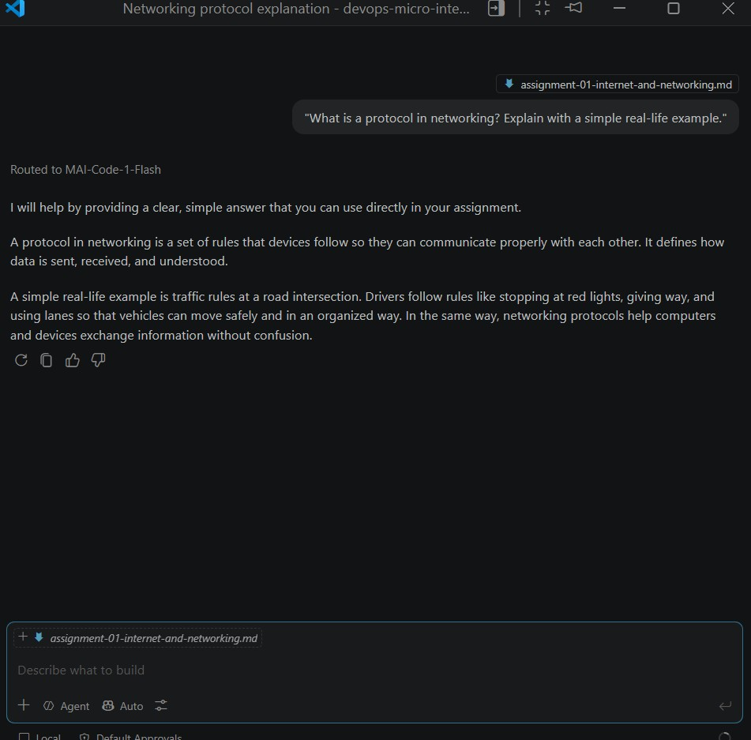
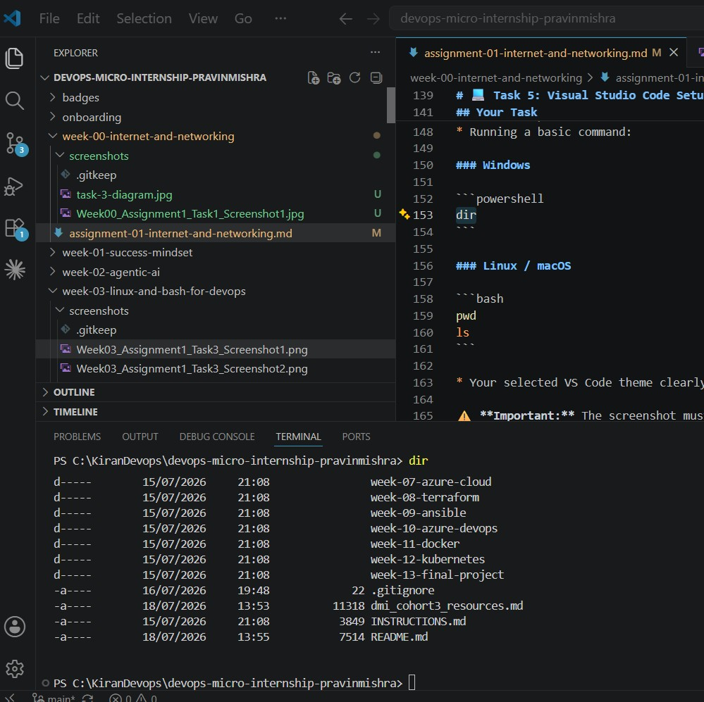

# Week 00 - Internet and Networking

Part of the DevOps Micro Internship (DMI) Cohort 3 with Agentic AI

---

# 🧑‍💻 Task 1: Using ChatGPT as Your Learning Assistant

## Scenario

You're new to DevOps and will frequently encounter technical questions. ChatGPT can be your learning companion.

## Your Task

Write a clear ChatGPT prompt to help you understand:

> "What is a protocol in networking? Explain with a simple real-life example."

Take a screenshot of your interaction showing:

* Your detailed prompt (with clear expectations)
* ChatGPT's simplified response with an example

## Screenshot



---

## What I Learned (2–3 lines)

I learned that a protocol is a set of rules that helps devices communicate in a consistent way. A simple real-life example is how people follow traffic rules at a road intersection to avoid confusion. In networking, protocols help data move safely and in the correct order between systems.

---

# 🌐 Task 2: Internet and Networking

## Scenario

Your friend is launching an online bookstore named **EpicReads**.

He asked you to explain how users globally can access his website hosted in Finland.

## Your Task

Write a short explanation (**100–150 words**) that includes:

* Packet Switching
* IP Address
* TCP/IP
* HTTP/HTTPS

💡 **Tip:** You may use ChatGPT (as demonstrated in Task 1) to refine your explanation.

## Answer

When a user in another country opens EpicReads, their browser sends a request to the server in Finland over the internet. The data is broken into small packets and transmitted using packet switching, which allows each packet to travel through the fastest available route. Every device involved uses an IP address to identify the sender and receiver. TCP/IP is the core communication suite that ensures packets are delivered reliably, in the correct order, and without loss. Once the packets reach the server, the browser and server use HTTP or HTTPS to exchange the website data. HTTPS adds encryption, making the connection more secure for users.

---

# 🏗️ Task 3: Application Architecture & Stack

## Scenario

EpicReads bookstore has two application versions:

### Two-Tier Application

* Frontend
* Database

### Three-Tier Application

* Frontend
* Backend
* Database

## Your Task

* Draw simple diagrams (hand-drawn or tool-based such as draw.io)
* Label each layer clearly
* List at least two common technologies or tools used for each layer
* Submit a screenshot or photo clearly showing your own drawing

## Diagram Screenshot / Photo


---

## Technologies Used

### Frontend

* HTML/CSS for structuring and styling the user interface
* React for building interactive web pages

### Backend

* Node.js with Express for handling application logic and APIs
* Python with Flask for building lightweight backend services

### Database

* MySQL for relational data storage
* PostgreSQL for robust and scalable relational database management

---

# 🌍 Task 4: Domain Name & DNS (Basic Concepts)

## Scenario

Your friend's bookstore **EpicReads** is currently accessible through:

```text
52.172.142.222:3000
```

He purchased the domain:

```text
epicreads.com
```

## Your Task

In **50–100 words**, explain in your own words:

1. What is DNS (Domain Name System)?
2. Which DNS record type should be used to connect the domain to the given IP, and why?

## Answer

DNS is the system that translates human-friendly domain names like epicreads.com into IP addresses so browsers can find the correct server on the internet. It works like an address book for the web. To connect the domain to the given IP address, an A record should be used because it maps a domain name directly to an IPv4 address. This is the correct record type when the website is hosted on a single server IP such as 52.172.142.222. If the service were on a different port, the domain would also need port handling in the application setup.

---

# 💻 Task 5: Visual Studio Code Setup (Hands-on)

## Your Task

Install Visual Studio Code (if not already installed).

Take a screenshot of your VS Code environment showing:

* Terminal open inside VS Code
* Running a basic command:

### Windows

```powershell
dir
```

### Linux / macOS

```bash
pwd
ls
```

* Your selected VS Code theme clearly visible

⚠️ **Important:** The screenshot must show your username or another identifiable detail to confirm it is your environment.

## Screenshot



---

# 🔗 Task 6: Publish Your Assignment as a LinkedIn Post

## Objective

Publishing on LinkedIn helps you:

* Build your professional online presence
* Reinforce your learning
* Document your DevOps journey publicly

## Your Task

Summarize your answers from Tasks 1–5 into a LinkedIn post.

Clearly structure your post into the following sections:

* ChatGPT
* Internet & Networking
* App Architecture
* DNS
* VS Code Setup

Add the following credit note at the end of your post:

> **P.S. This post is a part of DevOps Micro Internship with Agentic AI Cohort-3 by Pravin Mishra. You can start your DevOps journey by joining this Discord community: https://discord.pravinmishra.com/**

---

## LinkedIn Post URL

Paste your LinkedIn post URL here:

```text
https://www.linkedin.com/in/kirangandhichitturi/
```

---

## LinkedIn Post Backup Copy

Paste the full text of your LinkedIn post here:

I completed my Week 0 assignment on internet and networking as part of the DevOps Micro Internship with Agentic AI. I learned the basics of protocols, packet switching, IP addressing, DNS, and how application architecture works in real-world systems. I also set up Visual Studio Code and practiced using it for everyday development tasks.

This assignment helped me understand how websites are delivered across the internet and why networking concepts are important for DevOps. I now have a stronger foundation in how applications communicate, how domains are resolved, and how tools like VS Code support development workflows.

#DMIByPravinMishra #AgenticAI #DevOps #Networking #LearningInPublic

P.S. This post is a part of DevOps Micro Internship with Agentic AI Cohort-3 by Pravin Mishra. You can start your DevOps journey by joining this Discord community: https://discord.pravinmishra.com/

---

# Reflection – Week 0

### What did you find easy?

I found the basic networking concepts easy to understand because they are closely related to everyday experiences like sending messages or traveling data through different routes.

---

### What was difficult?

The most difficult part was explaining the relationship between DNS, IP addresses, and the internet flow in a clear and concise way.

---

### What will you improve next week?

I will improve my ability to explain technical concepts more clearly and practice using more structured notes while learning new DevOps topics.

---

## 📌 About DMI & CloudAdvisory

DevOps Micro Internship (DMI) is a project-based DevOps program run by Pravin Mishra (The CloudAdvisory) focused on real-world execution, systems thinking, and career readiness.

It helps learners build strong DevOps foundations with hands-on experience.


## 📌 Resources

- 🌐 **DMI Official Website:** https://pravinmishra.com/dmi  
- 🎓 **DevOps for Beginners (Udemy):** https://www.udemy.com/course/devops-for-beginners-docker-k8s-cloud-cicd-4-projects/  
- 🎓 **Ultimate Agentic AI DevOps with Clude Code** https://www.udemy.com/course/ultimate-agentic-ai-devops-with-claude-code/?referralCode=448389767BC96284087B
- 🎓 **DevOps with Claude Code: Terraform, EKS, ArgoCD & Helm** https://www.udemy.com/course/devops-with-claude-code-terraform-eks-argocd-helm/?referralCode=1C5B734505D65A010FA3
- ▶️ **YouTube Playlist (DMI Cohort 3):** https://www.youtube.com/playlist?list=PLFeSNDtI4Cho  
- 🔗 **Pravin Mishra (LinkedIn):** https://www.linkedin.com/in/pravin-mishra-aws-trainer/  
- 🏢 **CloudAdvisory (LinkedIn):** https://www.linkedin.com/company/thecloudadvisory/

---

*This submission is part of DevOps Micro Internship (DMI) Cohort 3 — Agentic AI Track*