# Assignment 3 — Production Maintenance Drill (OPS Checklist)

Part of the DevOps Micro Internship (DMI) Cohort 3 with Agentic AI

---

## Purpose

In this assignment, you will treat your already deployed React application (on Ubuntu VM with Nginx) as a live production system. You will perform structured operational checks covering network validation, service health, log analysis, resource monitoring, configuration verification, and incident simulation with recovery — mirroring real on-call DevOps responsibilities.

---

# Task 1 — Server Access & Networking Validation

## Goal

Verify that the deployed React application is reachable from the browser and confirm basic network connectivity of the Ubuntu VM.

### Evidence

#### Screenshot 1 — Browser showing the React app with your Full Name visible on the UI

- 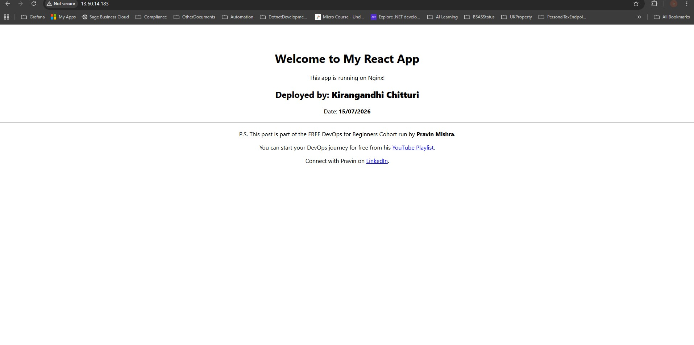

---

#### Screenshot 2 — Output of `ip a`

- 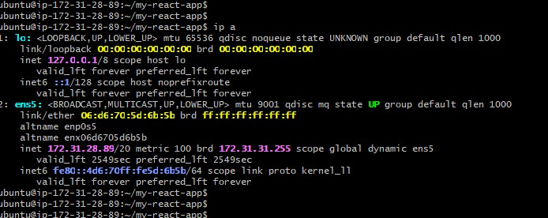

---

#### Screenshot 3 — Output of `sudo ss -tulpen`

- 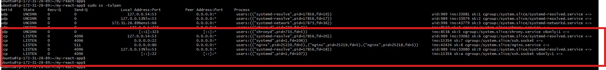

---

#### Screenshot 4 — Output of `sudo ufw status`

- 

---

### Notes

Answer the following in your own words:

**1. What proves Nginx is listening on 0.0.0.0:80?**

Nginx is clearly the service listening on port 80. In the sudo ss -tulpen output, the entry showing tcp LISTEN 0.0.0.0:80 … nginx indicates that the web server is bound to every network interface on the machine rather than just the local loopback address. Because it’s listening on 0.0.0.0, it can receive HTTP requests from any external IP, not only from the host itself. The presence of the nginx process name beside the port makes it explicit that Nginx is the application occupying and managing that port, rather than some other background service.

---

**2. What proves SSH is active on port 22?**

The ss -tulpen output also shows an entry like tcp LISTEN 0.0.0.0:22 … sshd, which indicates that the SSH daemon is actively listening on port 22. Because it’s bound to 0.0.0.0, it’s accepting connections on every network interface, allowing remote access to the machine using commands such as ssh ubuntu@<public‑ip>
---

**3. Did you find any unexpected open ports? Explain briefly.**

No unusual or unintended ports appeared in the scan. Besides the expected services — Nginx on port 80 and SSH on port 22 — the only other listeners were chronyd and systemd‑resolved, both restricted to local loopback addresses (127.0.0.1, 127.0.0.53, 127.0.0.54). Since these are not exposed externally, it confirms that only the web server and SSH are reachable from outside the system.
---

# Task 2 — Service Health & Systemd Validation (Nginx)

## Goal

Verify that Nginx is properly installed, running, enabled at boot, and safely configured.

### Evidence

#### Screenshot 1 — Output of `systemctl status nginx --no-pager`

- 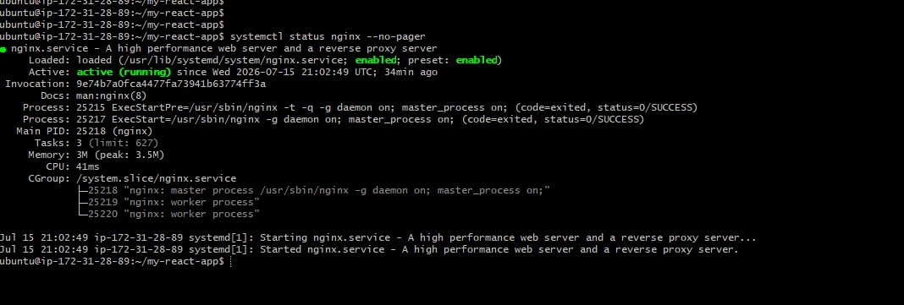

---

#### Screenshot 2 — Output of `sudo nginx -t`

- 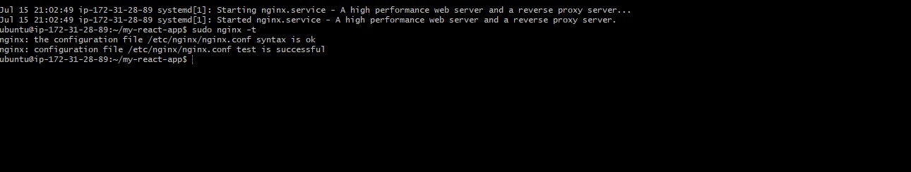

---

#### Screenshot 3 — Output of `sudo ss -lptn '( sport = :80 )'`

- 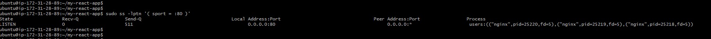

---

### Notes

Answer the following in your own words:

**1. What happens if Nginx fails to restart in production?**

If Nginx doesn’t come back up after a restart, the site immediately goes offline because nothing is left listening on port 80 to handle HTTP requests. Visitors would see timeouts or connection errors. This is particularly dangerous during deployments or configuration updates, since a failed restart can take the entire service down until someone manually investigates and corrects the issue.

---

**2. What's your basic rollback plan?**

Before applying any configuration changes, the safest step is to run sudo nginx -t to verify the configuration syntax. If a restart fails, the next move is to inspect the service using systemctl status nginx --no-pager and review recent logs with sudo journalctl -u nginx --no-pager -n 50 to identify the exact problem.

If the issue stems from a faulty configuration edit, the solution is to restore the previous working configuration—either from a backup or version control—then run sudo nginx -t again and restart the service. Keeping a known‑good copy of the config before making changes makes rollback quick and avoids troubleshooting under pressure.
---

# Task 3 — Logs & Request Trace

## Goal

Verify real traffic flow and analyze logs to understand system behavior and errors.

### Evidence

#### Screenshot 1 — Output of `sudo tail -n 30 /var/log/nginx/access.log`

- 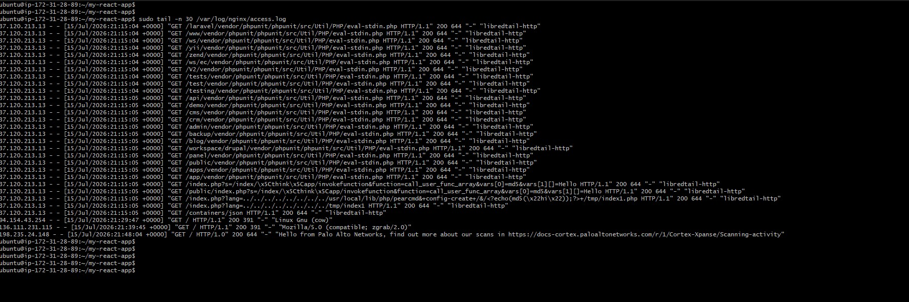

---

#### Screenshot 2 — Output of `sudo tail -n 30 /var/log/nginx/error.log`

- 

---

#### Screenshot 3 — Output of `sudo journalctl -u nginx --no-pager -n 50`

- 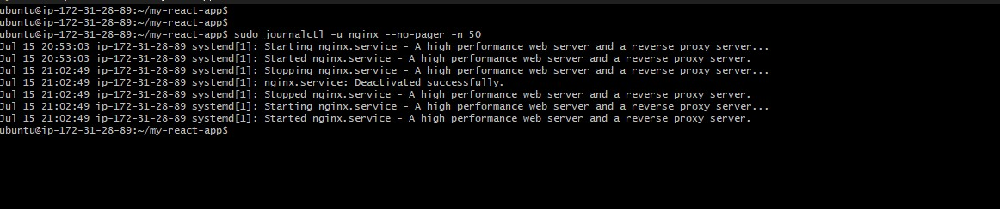

---

### Notes

Answer the following in your own words:

**1. Were there any errors in the logs?**

- If yes, mention 1–2 example error lines from the logs and explain what each one means in simple terms.
- If no, explain what it means if the error log is empty or shows no recent errors during your check.

No issues appeared in either the Nginx error log or the journalctl output. The error log didn’t produce any entries at all, and the journalctl records only show normal lifecycle messages such as Started, Stopped, Reloaded, and Deactivated successfully. There were no failure messages or abnormal exit statuses anywhere in the logs.

---

**2. If there were no errors, what does that indicate about the system?**

Having an empty error log and a clean journal history suggests that Nginx hasn’t run into configuration problems, runtime faults, or failed restarts during the period covered by those logs. It’s a good sign for the server’s current health, but it only reflects the timeframe you checked. Future issues can still arise due to new traffic patterns, configuration changes, or system updates, so log reviews should be done regularly rather than treated as a one‑time confirmation.

---

**3. Based on the access logs, were your curl requests visible in the log entries? What does that prove about traffic flow?**

Yes — the curl request showed up in access.log as a GET / from the server’s own public IP, returning a 200 OK with the user agent curl/8.18.0. This confirms the entire request path is functioning correctly: the request left the client, reached Nginx, was processed successfully, and was recorded in the logs. That proves there’s no break anywhere in the end‑to‑end flow.
---

# Task 4 — System Resource Health Check (Capacity Red Flags)

## Goal

Assess server capacity and detect potential performance or failure risks.

### Evidence

#### Screenshot 1 — Output of `uptime`

- 

---

#### Screenshot 2 — Output of `free -h`

- 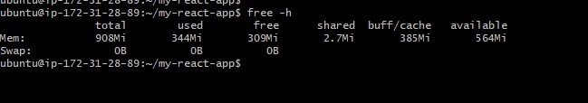

---

#### Screenshot 3 — Output of `df -h`

- 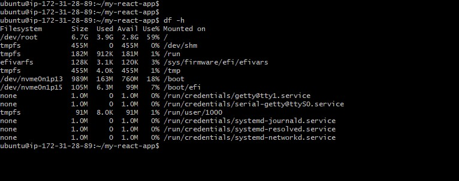

---

#### Screenshot 4 — Output of `sudo du -sh /var/* | sort -h`

- 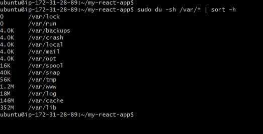

---

### Notes

Answer the following in your own words:

**1. Which resource looks most critical right now? (CPU/load, memory, or disk) Explain why.**

All three system resources are currently in a healthy state: CPU usage is low, memory has plenty of free capacity with no swap activity, and disk usage sits at a safe 61%. If one resource deserves closer long‑term monitoring, it would be disk usage. Disk space tends to fill gradually through logs, cached packages, and application data, and it often reaches a critical point without obvious early warning signs — unlike CPU or memory issues, which usually cause noticeable slowdowns before becoming severe.

---

**2. What happens if disk becomes 100% full in a production server?**

A completely full disk can cause multiple cascading failures. Logging stops entirely, which is dangerous because incidents often require fresh logs to diagnose what’s happening. Applications that rely on temporary file creation — including package managers, build tools, and many services — may crash or refuse to run. If a database is hosted locally, it may reject writes or even risk corruption. In extreme cases, the operating system itself can become unstable, and essential actions like logging in over SSH may fail because the system has no space left to operate

---

# Task 5 — Configuration & Deployment Verification

## Goal

Ensure the correct React build is deployed and Nginx is serving it properly.

### Evidence

#### Screenshot 1 — Output of `ls -lah /var/www/html | head -n 20`

- 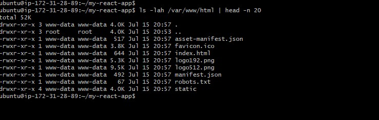

---

#### Screenshot 2 — Output of `grep -R "Deployed by" -n /var/www/html 2>/dev/null | head`

- 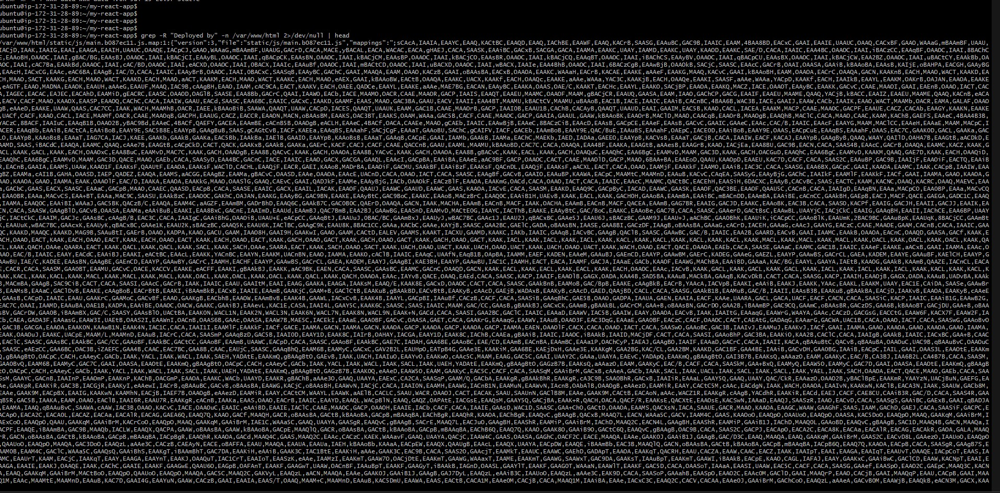

---

#### Screenshot 3 — Output of `grep -n "try_files" /etc/nginx/sites-available/default`

- 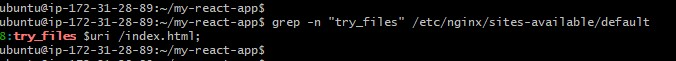

---

### Notes

Answer the following in your own words:

**1. How do you confirm that the correct version of the application is deployed?**

Deployment wasn’t validated with a single command — it was confirmed through several independent checks:

Directory inspection showed that /var/www/html contained a real production build from Create React App: index.html, the static/ directory with compiled JS and CSS bundles, and the usual CRA metadata files. All files were owned by www-data, matching the user that Nginx’s worker processes run under.

Build signature check using grep -R "Deployed by" verified that the custom identifier was actually embedded in the compiled JavaScript bundle. The matching source map confirmed that the deployed build was the exact one produced from the source code, not an outdated or generic artifact.

SPA routing validation via grep -n "try_files" confirmed that the Nginx configuration correctly routes all unmatched paths back to index.html, ensuring the single‑page application handles deep links and non‑root routes properly.

Finally, this was matched against the earlier curl test from Task 3, which showed the server returning the same index.html content over HTTP. This tied the on‑disk build directly to what Nginx is serving to real clients, completing the end‑to‑end verification.

---

# Task 6 — Nginx Configuration Failure Simulation

## Goal

Simulate a real-world Nginx misconfiguration and recover the service safely.

### Evidence

#### Screenshot 1 — Output of `sudo nginx -t` showing the syntax error (broken config)

- 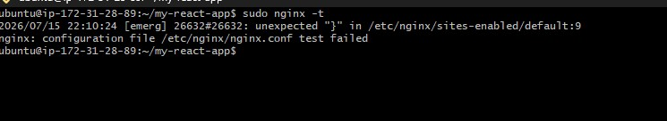

---

#### Screenshot 2 — Output of `sudo nginx -t` showing syntax ok (fixed config)

- 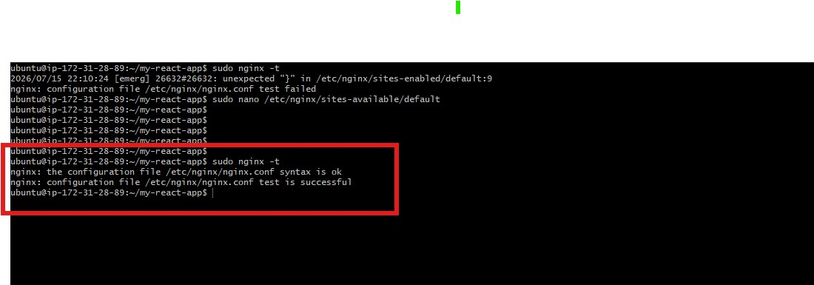

---

#### Screenshot 3 — Output of `curl -I http://<public-ip>` confirming recovery (200 OK)

- 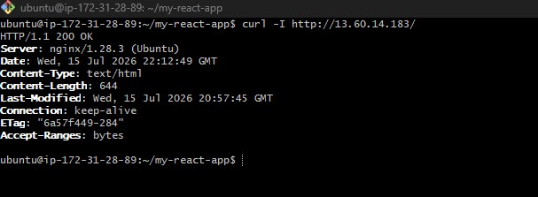

---

### Notes

Answer the following in your own words:

**1. What caused the configuration failure?**

The issue came from two missing semicolons in /etc/nginx/sites-available/default. One was deliberately removed from the try_files $uri /index.html; directive as part of the exercise, and the other was missing from the error_page 404 /index.html; line. Either missing semicolon on its own would break Nginx’s ability to parse the server block, resulting in a syntax error.

---

**2. How did you fix the issue?**

The configuration file was reopened and both semicolons were restored. After that, sudo nginx -t was run to verify the syntax was valid. Only once the test reported syntax is ok and test is successful was systemctl restart nginx executed. A final external curl -I request confirmed that the application was being served correctly again.

---

**3. How can you avoid this kind of issue in real production systems?**

Always run nginx -t after any configuration change, before restarting or reloading the service.

Keep Nginx configuration files under version control so you can instantly revert to a known‑good state instead of manually fixing mistakes.

Use a staging environment to test configuration changes before they reach production.

Where possible, integrate automated config validation into your deployment pipeline so broken configs are caught in CI and never deployed to the live server.

---

# Task 7 — Web Application Failure Simulation

## Goal

Simulate missing deployment content and recover the application safely.

### Evidence

#### Screenshot 1 — Output of `curl -I http://<public-ip>` showing failure (non-200 response)

- 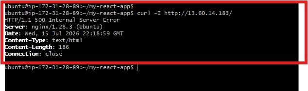

---

#### Screenshot 2 — Output of `curl -I http://<public-ip>` confirming recovery (200 OK)

- 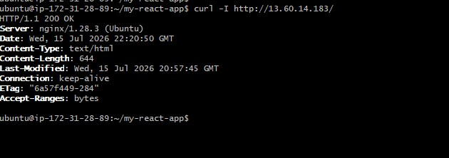

---

### Notes

Answer the following in your own words:

**1. What caused the application to break in this scenario?**

The failure happened because the web root directory at /var/www/html — the exact location Nginx serves files from — was emptied. Nginx itself was still running normally, but with no application files and no fallback page available, it had nothing to return and responded with a 500 Internal Server Error instead of loading the React app.

---

**2. How did you fix the issue and restore the application?**

A full backup of the previous deployment had already been saved in html_backup, so recovery was straightforward. The empty directory was removed, and the backup was moved back into /var/www/html. Nginx was restarted to ensure it served the restored files cleanly. A final curl -I check confirmed the fix by returning 200 OK with the same metadata (Content-Length, Last-Modified, ETag) as before, proving the exact original build was successfully restored.

---

**3. What steps would you take to prevent this kind of issue in real production systems?**

Automated backups before every deployment, so any release can be rolled back instantly.

Versioned deployment directories with a symlink like /var/www/current that switches atomically to the new build instead of overwriting the live directory.

CI/CD validation checks that confirm essential files (like index.html) exist and are non‑empty before marking a deployment successful.

Post‑deployment health monitoring that immediately verifies the live site returns a healthy 200 response, catching issues within seconds.

---

# Task 8 — Security & Reliability Review

## Goal

Review and reflect on the security and reliability practices applied during this assignment.

### Security & Reliability Notes

Answer the following in your own words:

**1. Why is SSH key-based authentication more secure than sharing passwords?**

SSH keys provide cryptographic authentication, which is far harder to brute‑force or guess than a human‑created password. Keys never travel over the network in plain form, and they can be protected with passphrases and stored securely. Passwords can be reused, leaked, or shared accidentally, while SSH keys are unique per user and can be revoked individually without affecting others. This makes key‑based access significantly safer than relying on shared credentials.

---

**2. Why should only required ports be open on a production server?**

Every open port represents a potential entry point for attackers. Limiting exposure to only the ports your application actually needs reduces the attack surface and prevents unauthorized access to internal services. Closing unnecessary ports also simplifies monitoring and makes it easier to spot suspicious activity. This principle of minimal exposure is a core part of production hardening.

---

**3. Why is it important for Nginx to be enabled on boot?**

If Nginx isn’t configured to start automatically, the server could come online after a reboot but fail to serve any traffic until someone manually starts the service. Enabling Nginx at boot ensures the site recovers automatically after maintenance, crashes, or unexpected restarts. This supports high availability and reduces downtime. It’s a basic requirement for reliable service continuity.

---

**4. What are the risks of sharing secrets, keys, or credentials publicly?**

Exposing secrets allows attackers to impersonate your services, access private systems, steal data, or deploy malicious workloads. Once leaked, secrets can be harvested by automated scanners within seconds. Even temporary exposure can lead to long‑term compromise. Publicly shared credentials often require full rotation of keys, tokens, and infrastructure to recover safely. This is why secret hygiene is critical.

---

**5. Why should cloud resources be stopped or terminated when they are no longer needed?**

Unused cloud resources continue to generate costs, sometimes significantly. Idle VMs, databases, or load balancers can also expand your attack surface and consume quotas that could be used elsewhere. Terminating unneeded resources reduces spending, improves security, and keeps your environment clean and predictable. This is a core practice in cloud cost and security management.

---

# LinkedIn Post (Required)

## Evidence

#### LinkedIn Post URL

Paste your LinkedIn post URL here:

https://lnkd.in/p/ei_SCurq

---

#### Screenshot — Published LinkedIn post

- 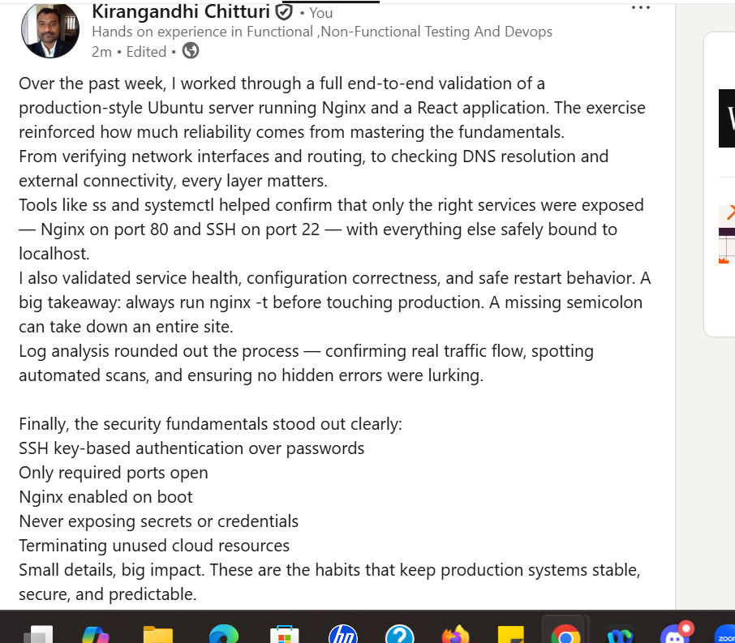
---

# Submission Instructions

- Add all required screenshots in your submission
- Full name must be visible in required screenshots
- Do not expose sensitive information (keys, passwords, account IDs)

---

# Completion Checklist

- [ ] Task 1: Screenshots (browser, ip a, ss -tulpen, ufw status) + Notes answered
- [ ] Task 2: Screenshots (nginx status, nginx -t, ss port 80) + Notes answered
- [ ] Task 3: Screenshots (access log, error log, journalctl) + Notes answered
- [ ] Task 4: Screenshots (uptime, free -h, df -h, du -sh) + Notes answered
- [ ] Task 5: Screenshots (ls html, grep deployed by, grep try_files) + Notes answered
- [ ] Task 6: Screenshots (nginx -t fail, nginx -t pass, curl recovery) + Notes answered
- [ ] Task 7: Screenshots (curl failure, curl recovery) + Notes answered
- [ ] Task 8: Security & Reliability Notes answered
- [ ] LinkedIn post published and URL submitted
- [ ] Full Name visible in all required screenshots
- [ ] No sensitive data exposed

---

## 📌 About DMI & CloudAdvisory

DevOps Micro Internship (DMI) is a project-based DevOps program run by Pravin Mishra (The CloudAdvisory) focused on real-world execution, systems thinking, and career readiness.

It helps learners build strong DevOps foundations with hands-on experience.

---

## 📌 Resources

- 🌐 DMI Official Website: https://pravinmishra.com/dmi  
- 🎓 DevOps for Beginners (Udemy): https://www.udemy.com/course/devops-for-beginners-docker-k8s-cloud-cicd-4-projects/  
- 🎓 Agentic AI DevOps with Claude Code: https://www.udemy.com/course/ultimate-agentic-ai-devops-with-claude-code/  
- 🎓 DevOps with Claude Code: Terraform, EKS, ArgoCD & Helm: https://www.udemy.com/course/devops-with-claude-code-terraform-eks-argocd-helm/  
- ▶️ YouTube Playlist: https://www.youtube.com/playlist?list=PLFeSNDtI4Cho  
- 🔗 Pravin Mishra (LinkedIn): https://www.linkedin.com/in/pravin-mishra-aws-trainer/  
- 🏢 CloudAdvisory (LinkedIn): https://www.linkedin.com/company/thecloudadvisory/

---

*This submission is part of DevOps Micro Internship (DMI) Cohort 3 — Agentic AI Track.*