# Assignment 5 — Bash Script Automation Drill (OPS Checklist)

Part of the DevOps Micro Internship (DMI) Cohort 3 with Agentic AI

---

## Purpose

In this assignment, you will practice Bash scripting by building a series of small automation scripts covering environment setup, variables, arrays, loops, file conditionals, if-else logic, and functions. These scripts form the foundation of real-world Linux automation used in DevOps, cloud, and production support environments.

---

# Task 1 — Bash Environment & Workspace Setup

## Goal

Verify that Bash is available on your system and create a clean workspace for this assignment.

### Evidence

#### Screenshot 1 — Output of `echo $SHELL` and `bash --version`

- 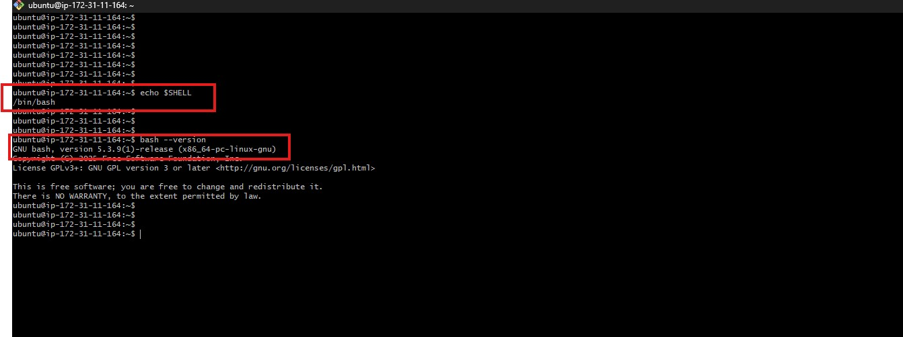

---

#### Screenshot 2 — Output of `pwd` and `ls -lah` showing the scripts directory

- 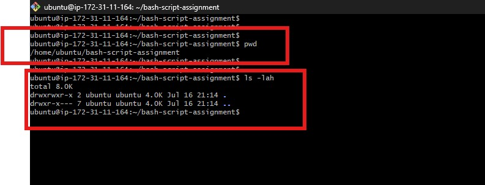

---

### Notes

Answer the following in your own words:

**1. What is Bash?**

Bash is a command-line shell and scripting language used mainly on Linux and Unix systems. It allows users to run commands and automate tasks through scripts.

- It stands for Bourne Again SHell.
- It is the default shell on most Linux systems.
- It supports variables, loops, functions, and conditionals.
- It is widely used in DevOps, system administration, and automation.

---

**2. What is the difference between shell and Bash?**

A shell is a general term for a command interpreter, while Bash is one specific type of shell.

- A shell is any program that accepts user commands and interacts with the operating system.
- Bash is a popular Unix/Linux shell implementation.
- Other examples of shells include Zsh, Fish, PowerShell, and sh.

---

**3. Why is it important to confirm the Bash version before writing scripts?**

Checking the Bash version helps ensure that your script will work correctly in the target environment.

- Different Bash versions support different features.
- Older versions may not support newer syntax or commands.
- This improves compatibility across servers, containers, and CI/CD systems.
- It helps prevent script errors and unexpected behavior.

---

# Task 2 — Your First Bash Script

## Goal

Create your first Bash script, make it executable, and run it from the terminal.

### Evidence

#### Screenshot 1 — Content of `first-script.sh`

- 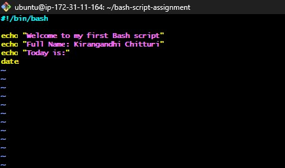

---

#### Screenshot 2 — Output of `./first-script.sh`

- 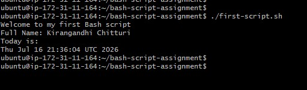

---

#### Screenshot 3 — Output of `ls -l first-script.sh` showing executable permission

- 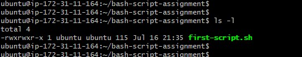

---

### Notes

Answer the following in your own words:

**1. What is the purpose of `#!/bin/bash`?**

`#!/bin/bash` tells the operating system which interpreter to use to run the script. In this case, it tells the system to use Bash so the commands inside the script are executed correctly.

---

**2. Why do we use `chmod +x` before running a script?**

We use `chmod +x` to make the script executable, which means it can be run directly as a program. Without execute permission, the shell will not allow the script to run with `./script.sh`.

---

**3. What is the difference between running a script using `./script.sh` and `bash script.sh`?**

`./script.sh` runs the file directly, so it must have execute permission and the shebang line must point to the correct interpreter. `bash script.sh` runs the script through the Bash interpreter explicitly, even if the file is not marked as executable.

---

# Task 3 — Variables: User Information Script

## Goal

Use variables to store and display user-related information.

### Evidence

#### Screenshot 1 — Content of `user-info.sh`

- 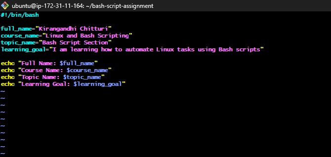

---

#### Screenshot 2 — Output of `./user-info.sh`

- 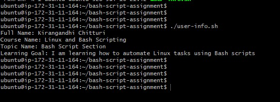

---

### Notes

Answer the following in your own words:

**1. What is a variable in Bash?**

A variable in Bash is a named storage location used to hold data such as text, numbers, or file paths. It helps make scripts easier to read and reuse.

---

**2. Why should we avoid spaces around the `=` sign when creating variables?**

Bash expects the variable assignment to be written without spaces because `name = value` is interpreted as a command and its arguments rather than a variable assignment.

---

**3. How do you access the value stored inside a Bash variable?**

You access the value by prefixing the variable name with `$`. For example, `$name` prints the value stored in the variable `name`.

---

# Task 4 — Arrays & Loops: Tools Checklist Script

## Goal

Use arrays and loops to print a checklist of tools used in Bash scripting.

### Evidence

#### Screenshot 1 — Content of `tools-checklist.sh`

- 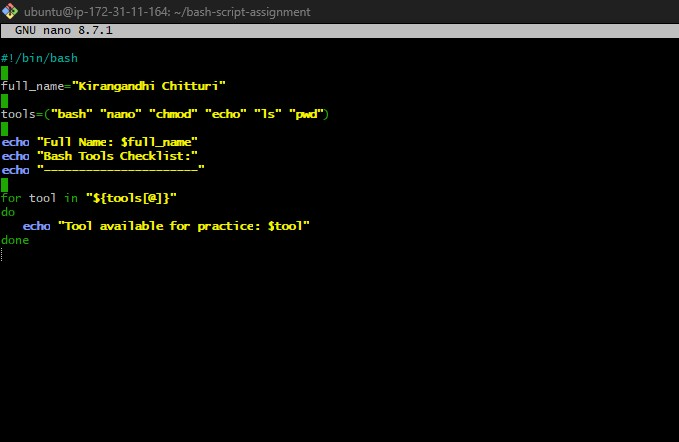

---

#### Screenshot 2 — Output of `./tools-checklist.sh`

- 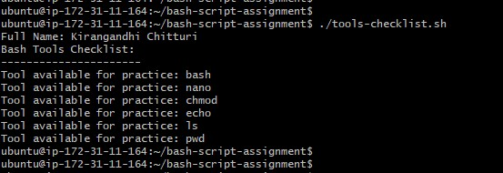

---

### Notes

Answer the following in your own words:

**1. What is an array in Bash?**

An array is a collection of values stored under one variable name. In Bash, arrays allow you to keep multiple related items such as tool names or file names together.

---

**2. Why are arrays useful in scripts?**

Arrays are useful because they let you store and process multiple values efficiently. This makes scripts cleaner and easier to manage when working with lists.

---

**3. What does `"${tools[@]}"` mean?**

`${tools[@]}` expands to all elements of the `tools` array. It is commonly used when you want to iterate over or print every item in the array.

---

**4. What is the purpose of the `for` loop in this script?**

The `for` loop repeats a block of code for each item in the array. In this script, it is used to print each tool from the list one by one.

---

# Task 5 — Loops: Number Counter Script

## Goal

Use loops to repeat a task multiple times.

### Evidence

#### Screenshot 1 — Content of `counter.sh`

- 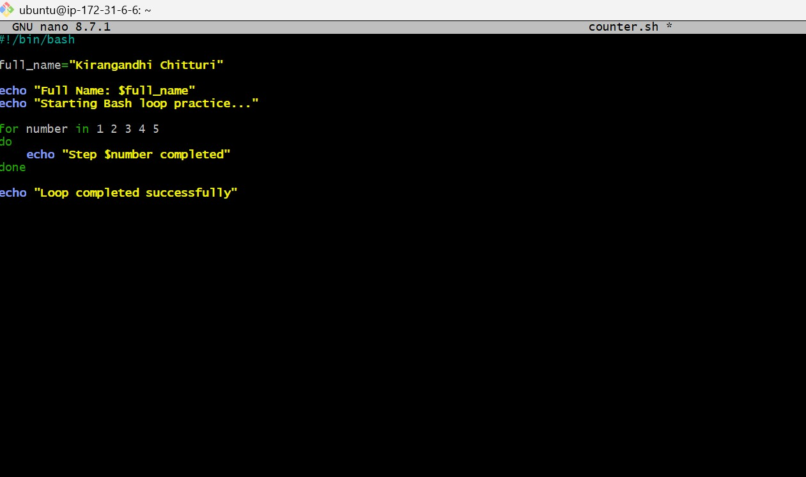

---

#### Screenshot 2 — Output of `./counter.sh`

- 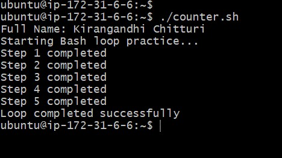

---

### Notes

Answer the following in your own words:

**1. What is a loop?**

A loop is a programming structure that repeats a set of instructions multiple times until a condition is met or a defined number of iterations is completed.

---

**2. Why do we use loops in Bash scripting?**

Loops are used to automate repetitive tasks without writing the same code many times. They save effort and make scripts shorter and easier to maintain.

---

**3. How many times did the loop run in your script?**

The loop ran as many times as the value defined in the script, such as 5 times if the condition was set for 5 iterations.

---

**4. What would you change if you wanted the loop to run 10 times?**

I would change the loop range or count from the current value to 10 so the loop executes 10 iterations.

---

# Task 6 — Files & Conditionals: File Validation Script

## Goal

Use file checks and conditionals to verify whether files and directories exist.

### Evidence

#### Screenshot 1 — Output of `ls -lah ../test-folder`

- 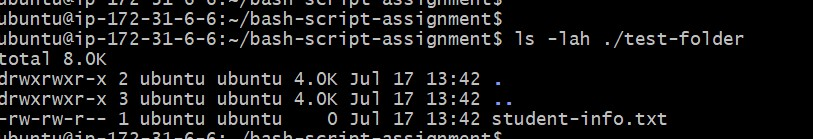

---

#### Screenshot 2 — Content of `file-check.sh`

- 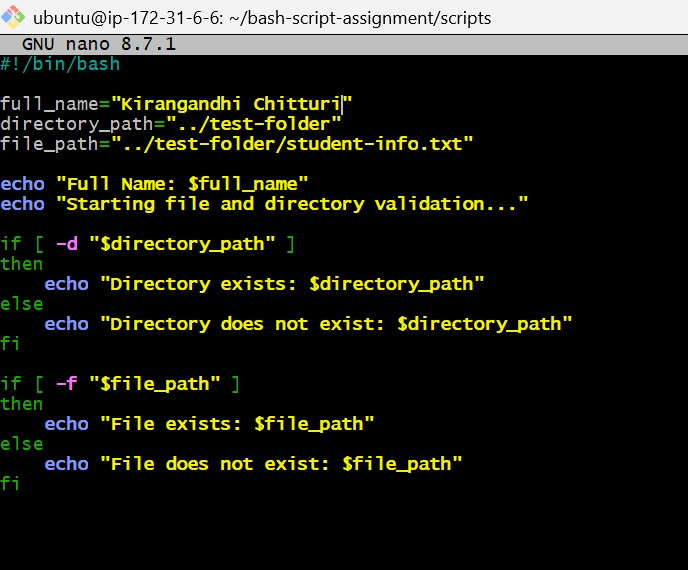

---

#### Screenshot 3 — Output of `./file-check.sh`

- 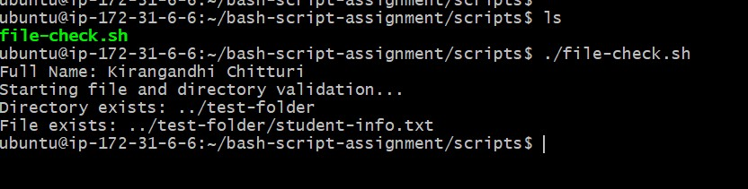

---

### Notes

Answer the following in your own words:

**1. What does `-d` check in Bash?**

`-d` checks whether a given path is a directory and whether it exists.

---

**2. What does `-f` check in Bash?**

`-f` checks whether a given path is a regular file and whether it exists.

---

**3. Why should file and directory paths be stored in variables?**

Storing paths in variables makes the script easier to read, update, and reuse. It also reduces repetition and helps avoid mistakes.

---

**4. What happens if the file does not exist?**

If the file does not exist, the script usually prints an error message or executes the `else` block to indicate that the file is missing.

---

# Task 7 — Conditionals: Pass or Retry Script

## Goal

Use if-else conditionals to make decisions based on a variable value.

### Evidence

#### Screenshot 1 — Content of `score-check.sh` with `score=85`

- 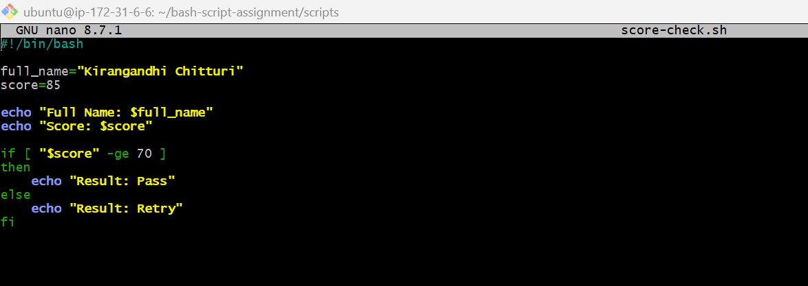

---

#### Screenshot 2 — Output showing `Result: Pass`

- 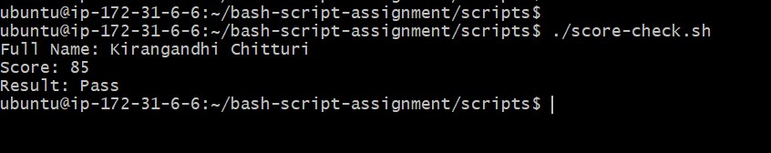

---

#### Screenshot 3 — Content of `score-check.sh` with `score=55`

- 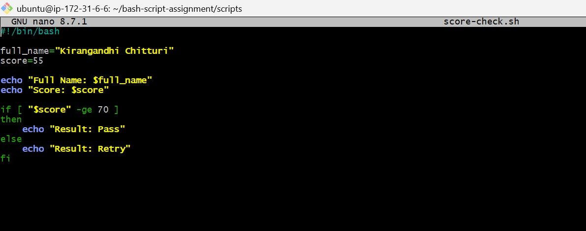

---

#### Screenshot 4 — Output showing `Result: Retry`

- 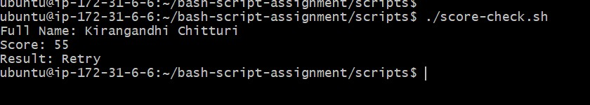

---

### Notes

Answer the following in your own words:

**1. What is the purpose of if-else in Bash?**

`if-else` is used to make decisions in a script. It allows the script to run different commands depending on whether a condition is true or false.

---

**2. What does `-ge` mean?**

`-ge` means greater than or equal to. It is used in comparisons to check whether one value is at least as large as another.

---

**3. Why should conditions be tested with different values?**

Testing with different values helps confirm that the script behaves correctly for both true and false cases. This makes the logic more reliable.

---

**4. How can conditionals help in automation scripts?**

Conditionals help automation scripts respond to different situations, such as checking whether a file exists, whether a service is running, or whether a task passed or failed.

---

# Task 8 — Functions: Final Bash Automation Script

## Goal

Create a final Bash script using functions to organize reusable code.

### Evidence

#### Screenshot 1 — Content of `final-automation.sh`

- 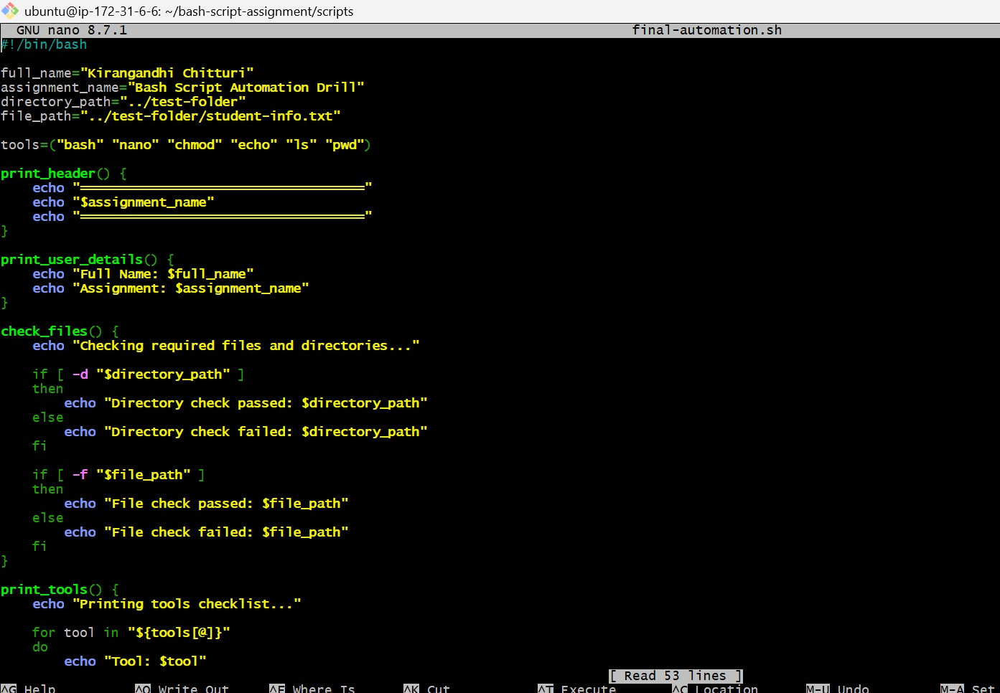

---

#### Screenshot 2 — Output of `./final-automation.sh`

- 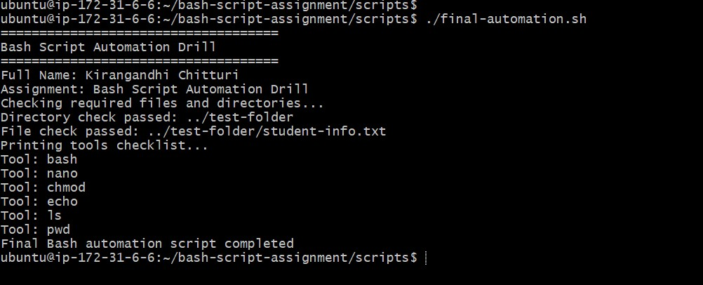

---

#### Screenshot 3 — Output of `ls -lah` showing all created scripts

- 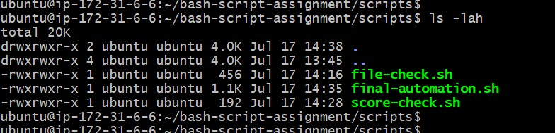

---

### Notes

Answer the following in your own words:

**1. What is a function in Bash?**

A function is a named block of code that can be called repeatedly in a script. It helps organize logic into reusable parts.

---

**2. Why are functions useful in scripts?**

Functions are useful because they reduce repetition, make scripts easier to read, and allow the same code to be reused in multiple places.

---

**3. Which functions did you create in this script?**

The functions I created were used to organize the script tasks, such as displaying information, checking files, and handling the final automation flow.

---

**4. How does this final script combine variables, arrays, loops, conditionals, files, and functions?**

The final script combines all these concepts by using variables to store data, arrays to hold lists, loops to process items, conditionals to make decisions, file checks to verify paths, and functions to structure the code into reusable blocks.

---

# LinkedIn Post (Required)

## Evidence

#### LinkedIn Post URL

Paste your LinkedIn post URL here:

`Add your URL here`

---

#### Screenshot — Published LinkedIn post

- 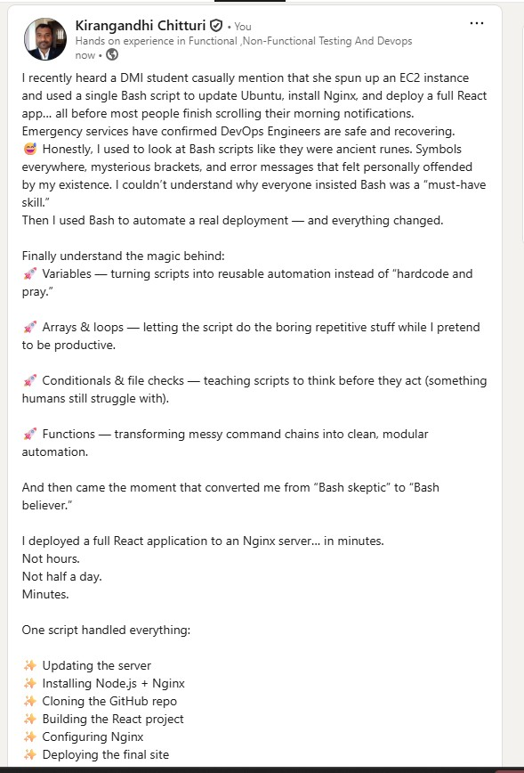

---

# Submission Instructions

- Add all required screenshots in your submission
- Full name must be visible in required screenshots
- All script files must be created and run successfully
- Required notes must be answered clearly for every task
- Do not expose sensitive information (keys, passwords, credentials)

---

# Completion Checklist

- [ ] Task 1: Environment setup verified, workspace created (Screenshots 1–2, Notes answered)
- [ ] Task 2: First script created, executed, permissions verified (Screenshots 1–3, Notes answered)
- [ ] Task 3: Variables script created and run (Screenshots 1–2, Notes answered)
- [ ] Task 4: Arrays and loops script created and run (Screenshots 1–2, Notes answered)
- [ ] Task 5: Counter loop script created and run (Screenshots 1–2, Notes answered)
- [ ] Task 6: File validation script created and run (Screenshots 1–3, Notes answered)
- [ ] Task 7: Pass/Retry conditional script tested with both values (Screenshots 1–4, Notes answered)
- [ ] Task 8: Final automation script created and run (Screenshots 1–3, Notes answered)
- [ ] All scripts run without errors
- [ ] Full Name visible in all required screenshots
- [ ] LinkedIn post published and URL submitted
- [ ] No sensitive data exposed

---

## 📌 About DMI & CloudAdvisory

DevOps Micro Internship (DMI) is a project-based DevOps program run by Pravin Mishra (The CloudAdvisory) focused on real-world execution, systems thinking, and career readiness.

It helps learners build strong DevOps foundations with hands-on experience.

---

## 📌 Resources

- 🌐 DMI Official Website: https://pravinmishra.com/dmi  
- 🎓 DevOps for Beginners (Udemy): https://www.udemy.com/course/devops-for-beginners-docker-k8s-cloud-cicd-4-projects/  
- 🎓 Agentic AI DevOps with Claude Code: https://www.udemy.com/course/ultimate-agentic-ai-devops-with-claude-code/  
- 🎓 DevOps with Claude Code: Terraform, EKS, ArgoCD & Helm: https://www.udemy.com/course/devops-with-claude-code-terraform-eks-argocd-helm/  
- ▶️ YouTube Playlist: https://www.youtube.com/playlist?list=PLFeSNDtI4Cho  
- 🔗 Pravin Mishra (LinkedIn): https://www.linkedin.com/in/pravin-mishra-aws-trainer/  
- 🏢 CloudAdvisory (LinkedIn): https://www.linkedin.com/company/thecloudadvisory/

---

*This submission is part of DevOps Micro Internship (DMI) Cohort 3 — Agentic AI Track.*