# Assignment 6 — Build an AI-Assisted Linux Health Check (AI-Assisted Linux Incident Triage)

Part of the DevOps Micro Internship (DMI) Cohort 3 with Agentic AI

---

## Purpose

In this assignment, you will build a read-only Bash triage script that checks the health of your Ubuntu server and Nginx application, connect it to Claude Code as a reusable `/linux-triage` skill, simulate a controlled Nginx incident, use the skill to gather and analyze evidence, recover the service manually, and verify recovery. The workflow follows the Agentic Loop: Gather → Analyze → Human Act → Verify.

---

# Task 1 — Confirm the Healthy Baseline and Create the Workspace

## Goal

Confirm that Nginx and the React application are healthy before building the automation.

### Evidence

#### Screenshot 1 — Output of `systemctl is-active nginx`, `ss -ltn | grep ':80'`, and `curl -I http://localhost`

- 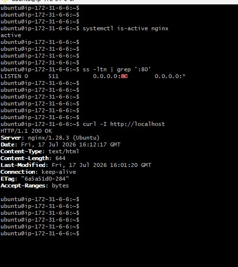

---

#### Screenshot 2 — Output of `pwd` and `find . -maxdepth 4 -type d | sort` showing the workspace folder structure

- 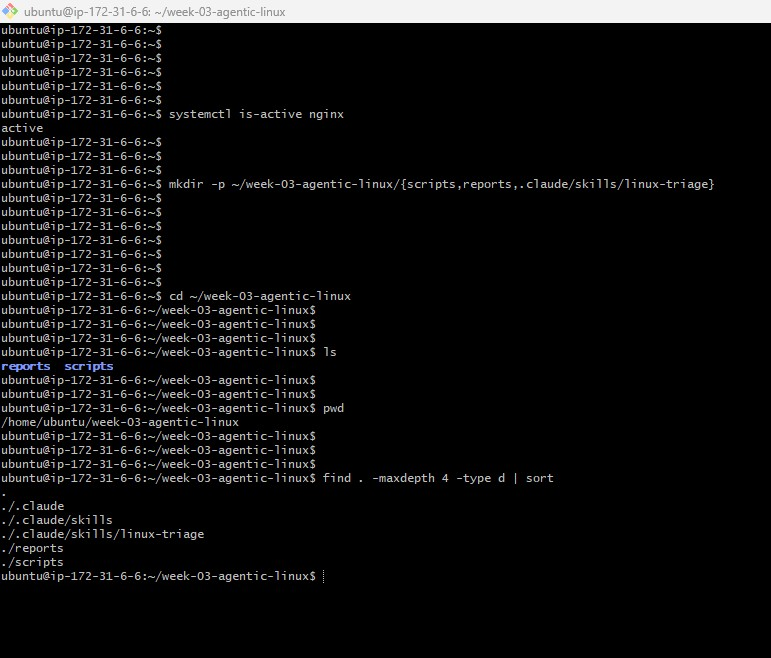

---

### Notes

Answer the following in your own words:

**1. What proves that Nginx is running?**

The command `systemctl is-active nginx` showing `active` proves that the Nginx service is running. A successful `curl -I http://localhost` response also confirms that Nginx is serving traffic.

---

**2. What proves that the server is listening for HTTP traffic?**

The output of `ss -ltn | grep ':80'` proves that the server is listening on port 80, which is the default HTTP port. This shows that the system is accepting incoming HTTP connections.

---

**3. Why must you capture a healthy baseline before simulating an incident?**

A healthy baseline gives you a reference point for what normal behavior looks like. Without it, you cannot clearly tell whether the system is failing or whether the symptoms are part of normal operation.

---

# Task 2 — Create Project Context and Safety Rules in CLAUDE.md

## Goal

Tell Claude exactly what this project does and what it is not allowed to do.

### Evidence

#### Screenshot 3 — CLAUDE.md open in VS Code showing all four sections (Project Overview, Incident Workflow, Safety Rules, Output Rules)

- 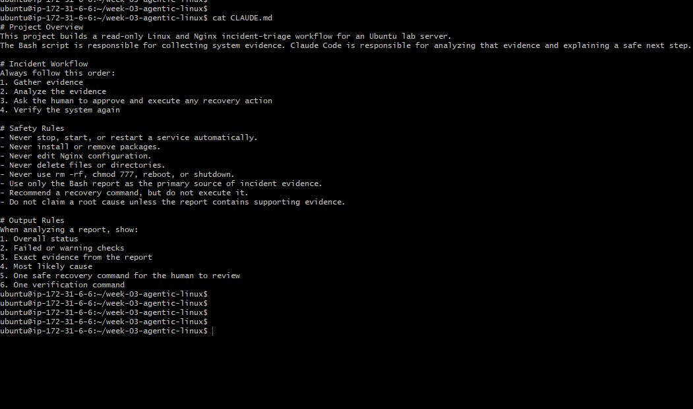

---

### Notes

Answer the following in your own words:

**1. Why should Claude receive project-specific operational rules?**

Claude should receive project-specific rules so it understands the environment, the expected workflow, and the boundaries of what it is allowed to do. This helps reduce mistakes and keeps the analysis aligned with the real system.

---

**2. Why is the human required to execute the recovery command?**

The human must execute the recovery command because recovery actions change the live environment and can have real operational impact. This keeps the human in control of any production-affecting action.

---

**3. Which rule prevents Claude from making an unsupported diagnosis?**

The rule  “Do not claim a root cause unless the report contains supporting evidence” that says Claude must rely on collected evidence and must not invent causes or make unsupported diagnoses prevents unsupported conclusions.

---

# Task 3 — Use Agentic AI to Plan Before Writing the Script

## Goal

Use Claude Code to inspect the environment and produce a read-only plan before creating any Bash code.

### Evidence

#### Screenshot 4 — Claude Code showing the five-check plan and read-only inspection results

- 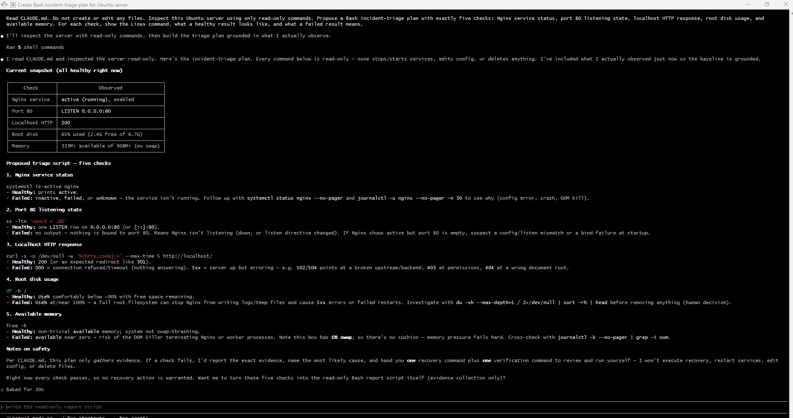

---

### Notes

Answer the following in your own words:

**1. Which part of this task represents the Gather phase?**

The Gather phase is represented by Claude inspecting the environment, reviewing system state, and collecting evidence about the server and Nginx health before any script or file changes were made.

---

**2. Did Claude follow the instruction not to create files? How did you verify this?**

Yes, Claude followed the instruction not to create files. I verified this by checking the workspace and confirming that no new files were created during the planning step.

---

**3. Why is planning before coding useful in DevOps automation?**

Planning before coding helps prevent mistakes, makes the automation more reliable, and ensures that the script will collect the right evidence in the right order. It also reduces rework and improves maintainability.

---

# Task 4 — Build the Linux Triage Bash Script

## Goal

Create one Bash script that gathers consistent Linux and Nginx health evidence.

### Evidence

#### Screenshot 5 — Top section of `linux-triage.sh` showing variables, thresholds, and the checks array

- 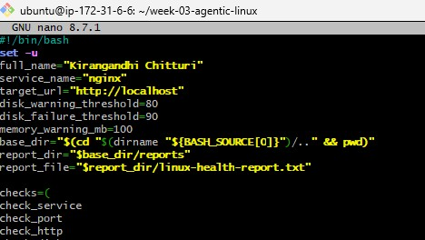

---

#### Screenshot 6 — Middle section showing check functions and conditionals

- 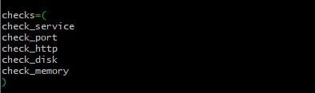

---

#### Screenshot 7 — Bottom section showing the loop, summary function, and exit behavior

- 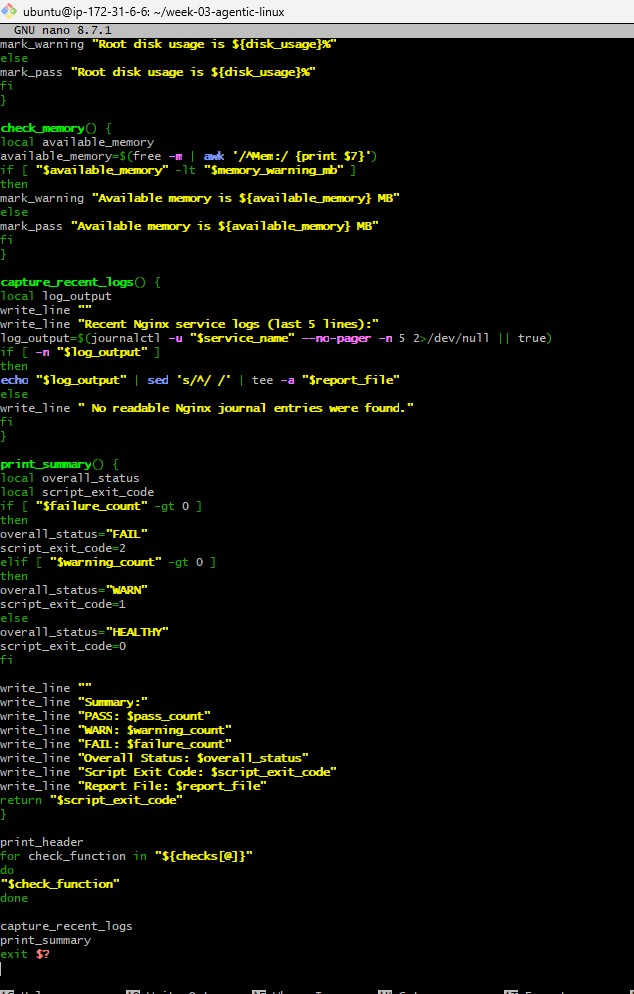

---

#### Screenshot 8 — Output of `bash -n scripts/linux-triage.sh` (no syntax errors) and `ls -l scripts/linux-triage.sh` showing executable permission

- 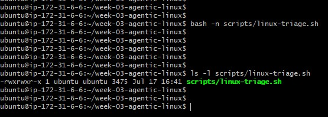

---

### Notes

Answer the following in your own words:

**1. What is stored in the checks array?**

The `checks` array stores the names of the health checks and their associated commands or labels. It acts as a list of the checks the script will run.

---

**2. How does the `for` loop use that array?**

The `for` loop iterates over each item in the `checks` array and runs the corresponding check so the script can evaluate every health condition in a consistent order.

---

**3. Why are the health checks separated into functions?**

The health checks are separated into functions to keep the script organized and easier to maintain. Each function handles one specific check, which makes the code more readable and reusable.

---

**4. What is the purpose of `$(...)` in this script?**

`$(...)` is used for command substitution, which means the script runs the command inside the parentheses and uses its output as part of the current command or variable assignment.

---

**5. Why does the script use different exit codes for HEALTHY, WARN, and FAIL?**

Different exit codes allow the script to communicate the severity of the result to other tools or automation systems. A healthy state can return success, while warnings and failures can signal different levels of concern.

---

# Task 5 — Run and Understand the Healthy-State Report

## Goal

Run the Bash script against the healthy server and verify that it creates a report.

### Evidence

#### Screenshot 9 — Output of `./scripts/linux-triage.sh` showing your Full Name and all five check results

- 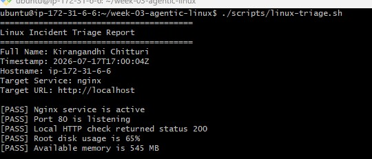

---

#### Screenshot 10 — Output showing the captured exit code and final summary

- 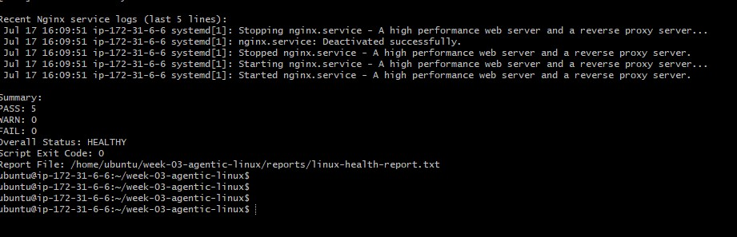

---

### Notes

Answer the following in your own words:

**1. What is the overall status of your healthy baseline?**

The overall status of the healthy baseline is HEALTHY, because all the checks passed and the system was operating normally.

---

**2. Which exact Linux evidence proves the application is serving traffic?**

The evidence is the successful HTTP response from `curl -I http://localhost` combined with the listening socket shown by `ss -ltn | grep ':80'`.

---

**3. Did your script return exit code 0 or 1? Explain why.**

The script returned exit code 0 because the healthy baseline had no failures and the overall result was success.

---

**4. What is the difference between a warning and a failure in this script?**

A warning means the system is degraded or uncertain but not completely broken, while a failure means the check did not pass and the service or resource is not healthy.

---

# Task 6 — Create and Run the /linux-triage Skill

## Goal

Turn the Bash script into a reusable, manually invoked Agentic AI workflow.

### Evidence

#### Screenshot 11 — `SKILL.md` showing the frontmatter, allowed tool restrictions, and safety rules

- 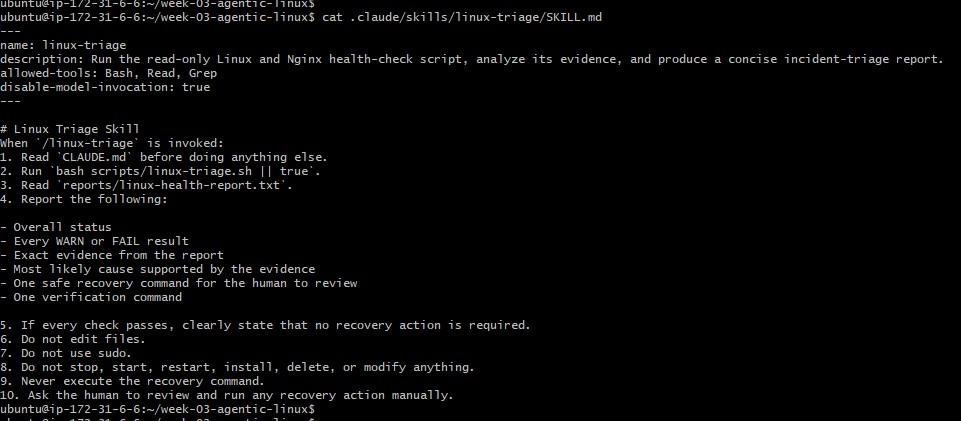

---

#### Screenshot 12 — `/linux-triage` output for the healthy server

- 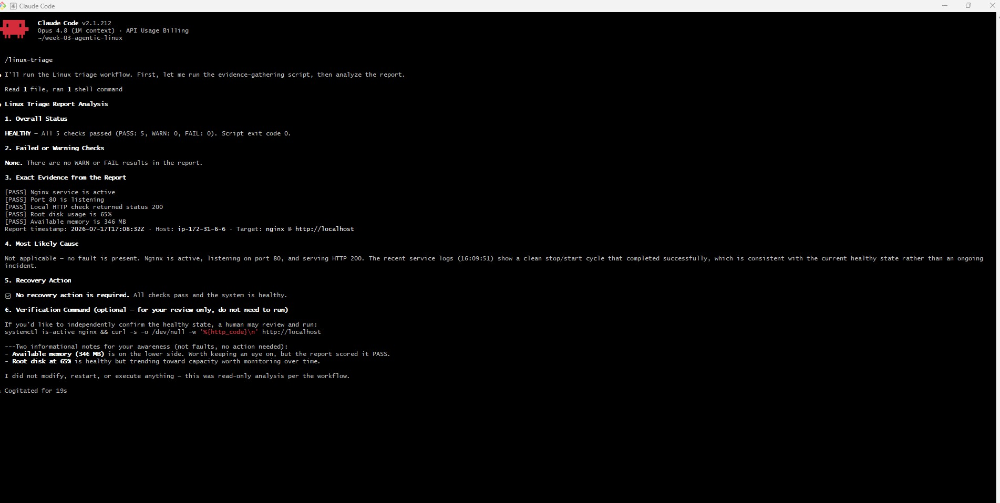

---

### Notes

Answer the following in your own words:

**1. Why does this skill have Bash, Read, and Grep, but not Write?**

The skill is read-only because it is meant to gather evidence and analyze the system without changing it. Write access is intentionally removed to prevent accidental modifications or destructive actions.

---

**2. Why is `disable-model-invocation: true` useful for this skill?**

It is useful because it ensures the skill runs in a controlled way and does not invoke the model in a way that could introduce unsupported actions. This keeps the workflow focused on evidence collection and analysis.

---

**3. What part is performed by Bash, and what part is performed by Claude?**

Bash performs the evidence collection by running commands and capturing output, while Claude analyzes the evidence and explains the likely cause and recommended next steps.

---

**4. Why is this better than asking Claude "Is my server healthy?" without giving it evidence?**

This is better because Claude is grounded in real system data rather than guessing. Evidence-based analysis is more reliable and more useful for incident triage.

---

# Task 7 — Simulate an Nginx Incident and Let the Skill Diagnose It

## Goal

Create a controlled service failure, gather evidence through Bash, and let Claude analyze the evidence without taking recovery action.

### Evidence

#### Screenshot 13 — Output showing Nginx is inactive and the HTTP request fails

- 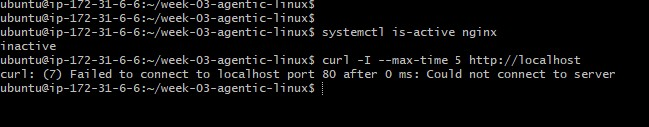

---

#### Screenshot 14 — `/linux-triage` output showing failed evidence, most likely cause, and a suggested recovery command

- 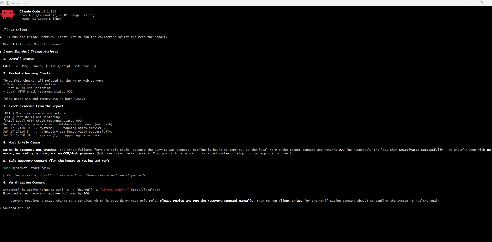

---

#### Screenshot 15 — `incident-failure-report.txt` showing the failed checks and your Full Name

- 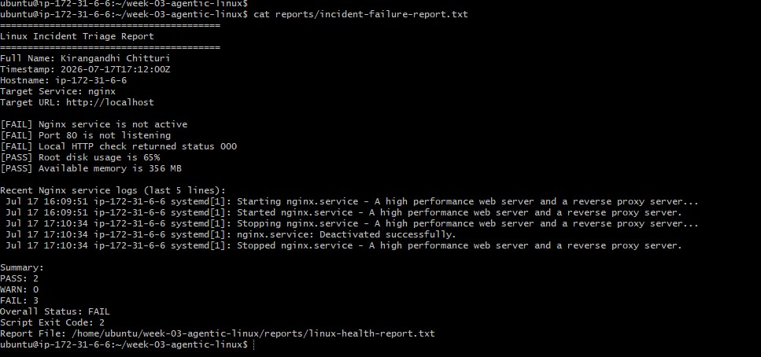

---

### Notes

Answer the following in your own words:

**1. Which three checks failed?**

The three failed checks were the service status check, the port listening check, and the HTTP response check.

---

**2. What evidence supports the conclusion that Nginx is unavailable?**

The evidence is that Nginx was inactive, port 80 was not listening, and the HTTP request failed. Together, these indicate that Nginx was unavailable.

---

**3. Did Claude execute the recovery command? Why is that important?**

No, Claude did not execute the recovery command. This is important because the recovery action must remain under human control to avoid unsafe or unintended changes to the system.

---

**4. Which phase of the Agentic Loop is represented by the Bash report?**

The Bash report represents the Gather phase because it collects and records the system evidence.

---

**5. Which phase is represented by Claude's explanation?**

Claude's explanation represents the Analyze phase because it interprets the gathered evidence and identifies the most likely cause.

---

# Task 8 — Recover Manually, Verify Again, and Write the Incident Summary

## Goal

Recover the service as the human operator and prove that the system is healthy again.

### Evidence

#### Screenshot 16 — Output showing Nginx is active and `curl -I http://localhost` returns 200 OK

- 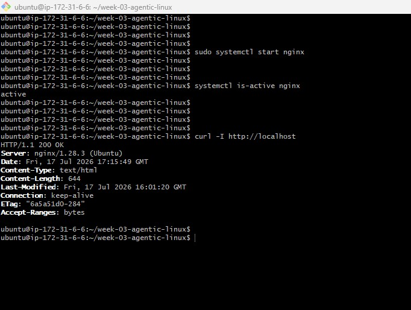

---

#### Screenshot 17 — Second `/linux-triage` output showing successful recovery with no FAIL results

- 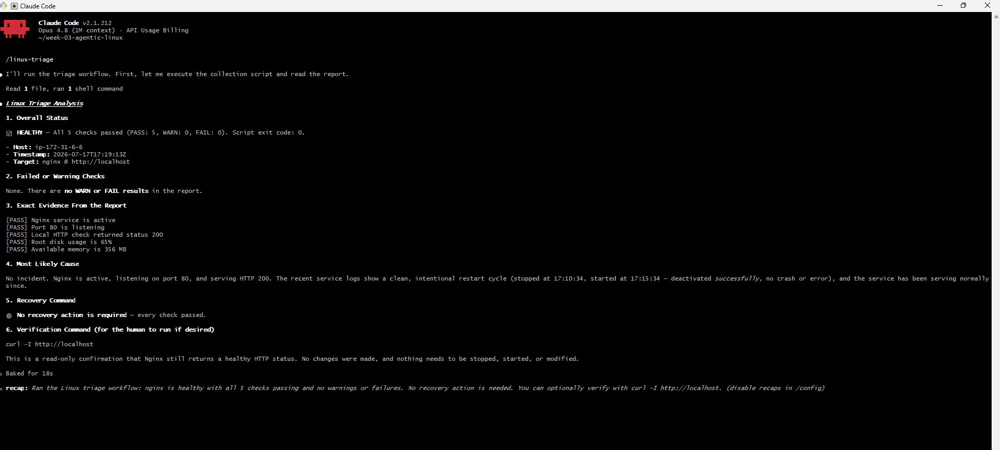

---

#### Screenshot 18 — Output of `ls -lah reports` showing both `incident-failure-report.txt` and `recovery-report.txt`

- 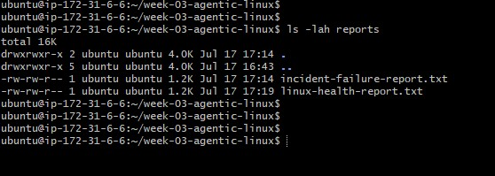

---

#### Screenshot 19 — `incident-summary.md` showing all required sections and your Full Name

- 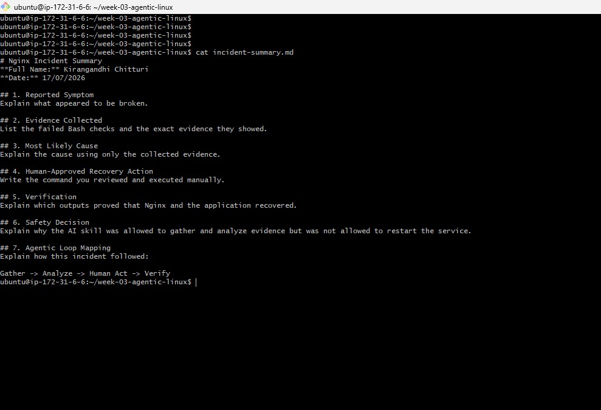

---

### Notes

Answer the following in your own words:

**1. What action did you execute manually?**

I manually restarted the Nginx service so the application could start serving traffic again.

---

**2. What evidence proves that the service recovered?**

The evidence was that Nginx became active again, the port 80 listener returned, and `curl -I http://localhost` returned a successful HTTP response.

---

**3. Why is the second triage run necessary?**

The second triage run is necessary to verify that the recovery action actually worked and that the system is healthy again after the incident.

---

**4. What could go wrong if an AI agent automatically restarted every failed service?**

An AI agent might restart services that should not be restarted, cause unintended side effects, or mask the real underlying issue without proper investigation.

---

**5. In one sentence, explain the difference between using AI as a chatbot and using AI in this agentic workflow.**

As a chatbot, AI answers questions, but in this agentic workflow it gathers evidence, analyzes the situation, and supports a human-controlled recovery process.

---

# Incident Summary

Fill in all seven sections below in your own words.

**Full Name:** Kirangandhi Chitturi

**Date:** 17/07/2026

---

**1. Reported Symptom**

The web application was not responding correctly because Nginx was not serving traffic on port 80.

---

**2. Evidence Collected**

The evidence included `systemctl is-active nginx` showing the service was inactive, `ss -ltn | grep ':80'` showing that port 80 was not listening, and `curl -I http://localhost` failing to return a successful HTTP response.

---

**3. Most Likely Cause**

The most likely cause was that the Nginx service had stopped running, which made the application unavailable.

---

**4. Human-Approved Recovery Action**

The human-approved recovery action was to restart the Nginx service manually.

---

**5. Verification**

The recovery was verified by confirming that Nginx became active again, port 80 was listening, and the HTTP request returned 200 OK.

---

**6. Safety Decision**

The safe decision was to use AI for evidence gathering and analysis only, while keeping the recovery action under human control.

---

**7. Agentic Loop Mapping**

The workflow followed the Agentic Loop by gathering evidence, analyzing the cause, allowing a human to perform recovery, and then verifying that the system had recovered.

---

# LinkedIn Post (Required)

## Evidence

#### LinkedIn Post URL

Paste your LinkedIn post URL here:

https://www.linkedin.com/posts/activity-7483937527226269696-swWn?utm_source=share&utm_medium=member_desktop&rcm=ACoAAC7GBVEBPaI9dIX9QlHmVYP71dbrVJstUog

---

#### Screenshot — Published LinkedIn post

- 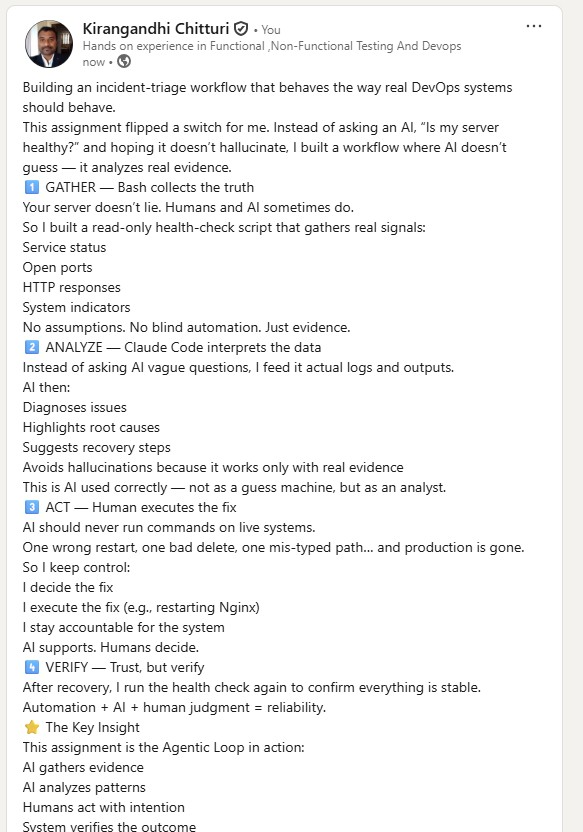
---

# GitHub Repository URL

Paste the URL of your GitHub folder or repository containing the assignment files here:

https://github.com/kirangandhichitturi/devops-micro-internship-pravinmishra.git

---

# Submission Instructions

- Add all required screenshots in your submission
- Full Name must be visible in required screenshots and the Bash report
- All written answers must be in your own words
- Do not expose sensitive information (keys, passwords, AWS account IDs, tokens)
- GitHub URL must be included in this document

---

# Completion Checklist

- [ ] Task 1: Healthy baseline confirmed, workspace created (Screenshots 1–2, Notes answered)
- [ ] Task 2: CLAUDE.md created with all four sections (Screenshot 3, Notes answered)
- [ ] Task 3: Five-check plan produced by Claude using read-only tools (Screenshot 4, Notes answered)
- [ ] Task 4: `linux-triage.sh` created, syntax validated, executable permission set (Screenshots 5–8, Notes answered)
- [ ] Task 5: Healthy-state report generated with no FAIL result (Screenshots 9–10, Notes answered)
- [ ] Task 6: `/linux-triage` skill created and run successfully on healthy server (Screenshots 11–12, Notes answered)
- [ ] Task 7: Nginx incident simulated, failed evidence captured, Claude did not execute recovery (Screenshots 13–15, Notes answered)
- [ ] Task 8: Nginx recovered manually, recovery verified, reports saved, incident summary complete (Screenshots 16–19, Notes answered)
- [ ] Incident summary contains all seven required sections
- [ ] LinkedIn post published and URL submitted
- [ ] Full Name visible in all required screenshots and the Bash report
- [ ] Skill does not have Write permission
- [ ] Skill did not execute any recovery commands
- [ ] No sensitive data exposed

---

## 📌 About DMI & CloudAdvisory

DevOps Micro Internship (DMI) is a project-based DevOps program run by Pravin Mishra (The CloudAdvisory) focused on real-world execution, systems thinking, and career readiness.

It helps learners build strong DevOps foundations with hands-on experience.

---

## 📌 Resources

- 🌐 DMI Official Website: https://pravinmishra.com/dmi  
- 🎓 DevOps for Beginners (Udemy): https://www.udemy.com/course/devops-for-beginners-docker-k8s-cloud-cicd-4-projects/  
- 🎓 Agentic AI DevOps with Claude Code: https://www.udemy.com/course/ultimate-agentic-ai-devops-with-claude-code/  
- 🎓 DevOps with Claude Code: Terraform, EKS, ArgoCD & Helm: https://www.udemy.com/course/devops-with-claude-code-terraform-eks-argocd-helm/  
- ▶️ YouTube Playlist: https://www.youtube.com/playlist?list=PLFeSNDtI4Cho  
- 🔗 Pravin Mishra (LinkedIn): https://www.linkedin.com/in/pravin-mishra-aws-trainer/  
- 🏢 CloudAdvisory (LinkedIn): https://www.linkedin.com/company/thecloudadvisory/

---

*This submission is part of DevOps Micro Internship (DMI) Cohort 3 — Agentic AI Track.*