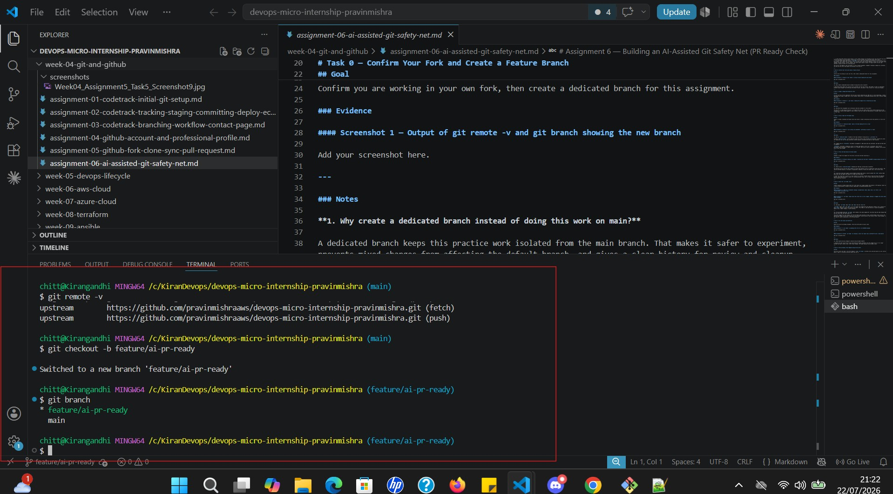
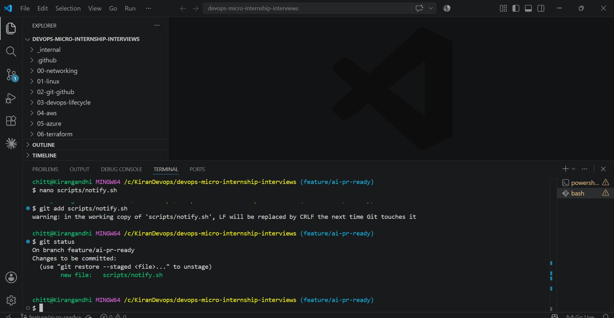
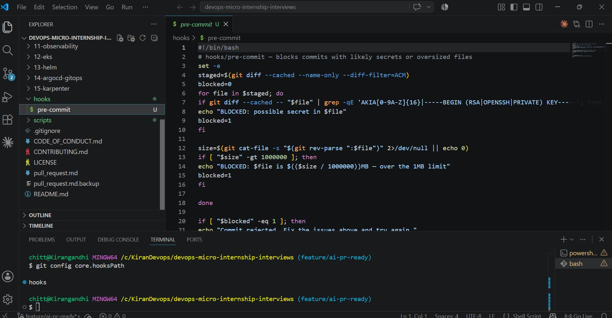
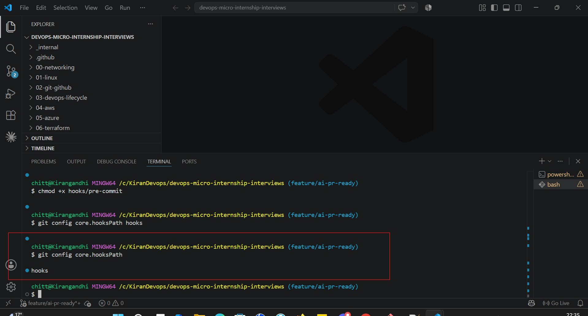
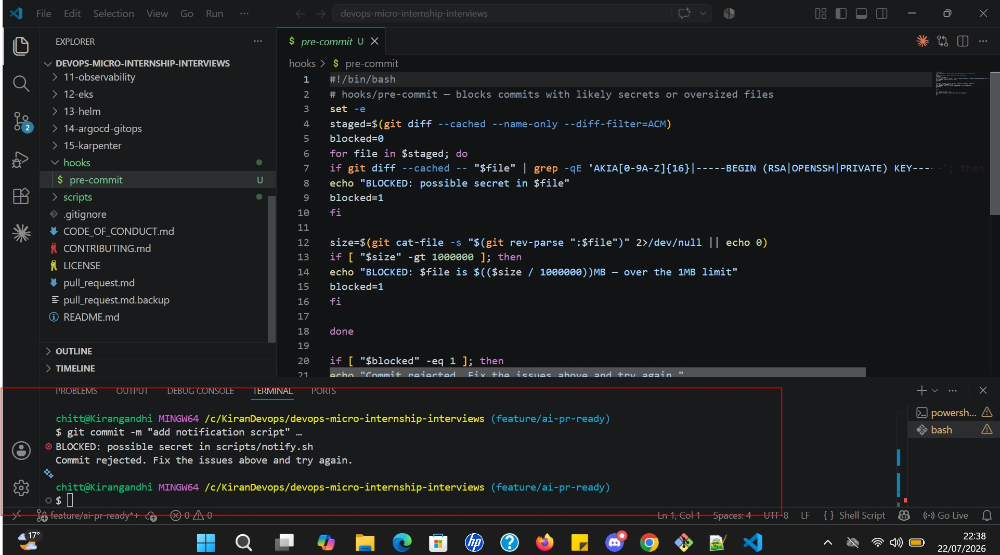

# Assignment 6 — Building an AI-Assisted Git Safety Net (PR Ready Check)

Part of the DevOps Micro Internship (DMI) Cohort 3 with Agentic AI

---

## Purpose

In Week 2 you built Claude Code hooks that block a dangerous action *before* it happens (`PreToolUse`), and a restricted skill that could look but not touch (`allowed-tools` without `Write`). In this assignment you will discover that Git has the exact same idea, decades older: a **pre-commit hook** that blocks a commit before it's created.

You will build both halves of a real "PR Ready" workflow:

1. A **Git hook that follows fixed rules** — scans staged changes for hardcoded secrets and oversized files and refuses the commit. No AI involved, no guessing, just a rule that gives the same answer every time.
2. A **restricted Claude Code skill** (`/pr-ready`) that reads your staged diff and drafts a Pull Request title, description, and a short list of things worth a second look — the kind of judgment a fixed rule can't make (mixed changes, missing context, unclear intent). The skill never commits, pushes, or opens the PR. You do that yourself, using its draft as a starting point.

This mirrors the Agentic Loop from Week 3's Linux triage assignment: **Gather → Analyze → Human Act → Verify**. The hook and the skill both gather and analyze; only you act.

---

# Task 0 — Confirm Your Fork and Create a Feature Branch

## Goal

Confirm you are working in your own fork, then create a dedicated branch for this assignment.

### Evidence

#### Screenshot 1 — Output of git remote -v and git branch showing the new branch

---

### Notes

**1. Why create a dedicated branch instead of doing this work on main?**

A dedicated branch keeps this practice work isolated from the main branch. That makes it safer to experiment, prevents mixed changes from affecting the default branch, and gives a clear history for review and cleanup.

---

# Task 1 — Stage a Change With Realistic Risk

## Goal

On your own fork of this repository (the one you've been submitting your DMI work in since onboarding), create a new branch and stage a change that a real reviewer should catch: a hardcoded-looking secret and a leftover debug statement.

### Evidence

#### Screenshot 1 — Output of  `git status` showing the staged file on feature/ai-pr-ready

---

### Notes

**1. Why does this assignment use an obviously fake key instead of a real one?**

The fake key is used because the goal is to demonstrate how the safety check works without exposing any real credential. A clearly fake example is safe, ethical, and still shows the same pattern a reviewer would look for in real code.

---

# Task 2 — Write a Real Git Pre-Commit Hook

## Goal

Create a tracked, shareable pre-commit hook that blocks a commit containing secret-like patterns or files over 1MB.

### Evidence

#### Screenshot 2 — `hooks/pre-commit` open in VS Code showing the full script

---

#### Screenshot 3 — Output of `git config core.hooksPath` confirming it points to `hooks`

---

### Notes

**1. Why is `hooks/pre-commit` tracked in the repo instead of living only in `.git/hooks/`?**

Tracking `hooks/pre-commit` in the repository makes the safety check portable and shareable. Anyone who clones the repository can use the same protection without manually recreating the hook on their machine.

---

**2. Compare this to `PreToolUse` from Week 2 Assignment 6. What does each one intercept, and what do they have in common?**

`PreToolUse` intercepts a dangerous action in Claude Code before a tool call is executed, while the Git pre-commit hook intercepts a commit before it is created. Both work as early safeguards, stopping risky actions before they cause damage.

---

# Task 3 — Prove the Hook Blocks the Risky Commit

## Goal

Attempt to commit the staged file from Task 1 and show the hook rejecting it.

### Evidence

#### Screenshot 4 — Terminal showing `git commit` rejected with the hook's "BLOCKED" message naming the exact file

---

### Notes

**1. Which line in `hooks/pre-commit` matched your fake key, and why did it match?**

The matching rule was the one that looked for secret-like patterns such as an AWS-style access key prefix. The fake key matched because it followed a recognizable credential format and looked like a real secret token.

---

**2. Could this hook have caught a poorly-named variable that stores a secret without the `AKIA` prefix? What does that tell you about the limits of a fixed rule like this?**

A fixed rule could miss a secret if it was stored in an unusual variable name or did not follow the expected pattern. That shows the hook is useful for catching obvious cases, but it cannot understand every possible secret-handling situation.

---

# Task 4 — Build the `/pr-ready` Skill

## Goal

Create a manually invoked Claude Code skill that reads your staged changes and produces a PR-readiness report and a draft PR description — without writing, committing, or pushing anything itself.

### Evidence

#### Screenshot 5 — `SKILL.md` frontmatter showing `allowed-tools: Bash, Read, Grep` (no `Write`) and `disable-model-invocation: true`

Add your screenshot here.

---

#### Screenshot 6 — `/pr-ready` output while the risky file is still staged, showing it flagged the secret and/or debug statement

Add your screenshot here.

---

### Notes

**1. Why does `/pr-ready` have `Bash` and `Read` but not `Write`?**

`/pr-ready` needs `Bash` and `Read` so it can inspect the staged diff and repository context, but it should not have `Write` because it must only analyze and report. This keeps it safe and ensures it cannot accidentally modify files, commit changes, or push anything.

---

**2. The pre-commit hook and `/pr-ready` both looked at the same staged diff. Did they flag the same things? What did one catch that the other didn't?**

They both flagged the risky change, but the pre-commit hook focused on fixed, pattern-based issues such as the secret-like string. The AI skill could also raise broader review concerns like unclear intent, mixed changes, or the need for better explanation in the PR description.

---

# Task 5 — Fix the Issues and Re-Verify

## Goal

Remove the secret and debug statement, then prove both gates now pass clean.

### Evidence

#### Screenshot 7 — `git commit` succeeding after the fix (no BLOCKED message)

Add your screenshot here.

---

#### Screenshot 8 — Second `/pr-ready` run showing a clean risk report and a drafted PR title + description

Add your screenshot here.

---

### Notes

**1. What exactly did you change to satisfy the pre-commit hook?**

I removed the fake secret-like string and deleted the debug statement from the staged file so it no longer matched the hook's safety rules. After those changes, the commit passed the pre-commit check.

---

# Task 6 — Push and Open a Pull Request Using the AI Draft

## Goal

Push your branch and open a real Pull Request, using `/pr-ready`'s drafted title and description as your starting point — read it critically and edit before you use it.

**Important:** Open this Pull Request with base repository set to **your own fork** — not the shared upstream `pravinmishraaws/devops-micro-internship-pravinmishra` repository. This assignment's hook and skill files are your own practice work, not a change meant for the shared class repo.

### Evidence

#### Screenshot 9 — Your Pull Request showing the base repository is your own fork, plus the title and description, with the `/pr-ready` draft visible for comparison (paste it in the PR conversation or your notes below)

Add your screenshot here.

---

#### PR Link

Add your PR URL here...

---

### Notes

**1. What, if anything, did you edit in the AI's drafted PR description before using it? Why?**

I would refine the AI draft by making the summary more specific and clearer for reviewers. This ensures the PR description accurately reflects the change, explains the purpose, and avoids vague or generic wording.

---

**2. If you had blindly copy-pasted the AI's draft without reading it, what could go wrong?**

Blindly copying the draft could introduce inaccurate details, omit important context, or make the PR less clear to reviewers. A human review helps ensure the description is accurate and useful.

---

**3. Why does this PR need to target your own fork instead of the shared upstream repository?**

This PR should target the learner's own fork because the hook and skill work are practice changes for personal learning, not contributions intended for the shared class repository. Using the fork keeps the work isolated and avoids polluting the shared upstream project.

---

# Task 7 — Map the Workflow to the Agentic Loop

## Goal

Explain this assignment's workflow using the same Gather → Analyze → Human Act → Verify structure from Week 3.

### Notes

**1. Which step(s) represent Gather?**

The Gather step is represented by inspecting the staged diff, reading the repository state, and collecting the changes that need review.

---

**2. Which step(s) represent Analyze?**

The Analyze step is represented by checking the change for risky patterns, evaluating whether it is PR-ready, and deciding what should be improved before the change is committed.

---

**3. Which step is Human Act, and why must a human — not Claude — run `git commit`, `git push`, and open the PR?**

Human Act is the step where the user runs `git commit`, `git push`, and opens the PR. A human must do this because these actions make permanent repository changes and involve real decisions about review, intent, and project ownership.

---

**4. Which step is Verify?**

Verify is the step where the hook and the `/pr-ready` skill are re-run after the issues are fixed, and where the final PR is checked to ensure the work is correct and safe.

---

**5. In one or two sentences: why do you need *both* the fixed-rule pre-commit hook and the AI skill? Isn't one enough?**

Both are needed because the hook gives fast, consistent protection against obvious risks, while the AI skill adds contextual review that a fixed rule cannot provide. One is better for enforcement, and the other is better for judgment and explanation.

---

# Task 8 — LinkedIn Post

## Goal

Publish a LinkedIn post summarizing what you built and what you learned about combining fixed-rule safety checks with AI-assisted review.

### Evidence

#### LinkedIn Post URL

Add your LinkedIn post URL here...

---

## Key Learnings

Add 3-5 bullet points on what you learned this week.

- Fixed-rule safety checks can block obvious security issues before they reach commit history.
- AI-assisted review is useful for context, clarity, and PR-quality feedback.
- Human review is still essential before committing, pushing, or opening a pull request.
- Branching and isolated work make experiments safer and easier to manage.

---

# Submission Instructions

- Ensure `hooks/pre-commit` and `.claude/skills/pr-ready/SKILL.md` are committed to your GitHub repository
- Add all required screenshots to your submission
- All written answers must be in your own words
- Do not use a real secret or credential anywhere in your submission — the fake key in Task 1 is intentional and must stay clearly fake
- Open your Pull Request against your own fork, not the shared upstream repository
- Push your final changes to your forked repository
- Include your PR link and LinkedIn post URL

---

## GitHub Repository URL

Paste your forked repository URL here:

`Add your URL here`

---

# Completion Checklist

- [ ] Branch `feature/ai-pr-ready` created with a staged file containing a fake secret and a debug statement
- [ ] `hooks/pre-commit` created and tracked in the repo (not only in `.git/hooks/`)
- [ ] `core.hooksPath` configured to point at `hooks/`
- [ ] Pre-commit hook shown blocking the risky commit
- [ ] `.claude/skills/pr-ready/SKILL.md` created with correct `allowed-tools` (no `Write`) and `disable-model-invocation: true`
- [ ] `/pr-ready` run against the risky diff and shown flagging issues
- [ ] Risky file fixed; `git commit` succeeds cleanly
- [ ] `/pr-ready` re-run showing a clean report and drafted PR title/description
- [ ] Pull Request opened using the AI draft as a starting point, with your own fork as the base repository (not upstream), PR link included
- [ ] Agentic Loop mapping (Task 7) completed in your own words
- [ ] LinkedIn post published and URL submitted
- [ ] All required screenshots added
- [ ] GitHub repository URL provided

---

## 📌 About DMI & CloudAdvisory

DevOps Micro Internship (DMI) is a project-based DevOps program run by Pravin Mishra (The CloudAdvisory) focused on real-world execution, systems thinking, and career readiness.

It helps learners build strong DevOps foundations with hands-on experience.

---

## 📌 Resources

- 🌐 DMI Official Website: https://pravinmishra.com/dmi  
- 🎓 DevOps for Beginners (Udemy): https://www.udemy.com/course/devops-for-beginners-docker-k8s-cloud-cicd-4-projects/  
- 🎓 Agentic AI DevOps with Claude Code: https://www.udemy.com/course/ultimate-agentic-ai-devops-with-claude-code/  
- 🎓 DevOps with Claude Code: Terraform, EKS, ArgoCD & Helm: https://www.udemy.com/course/devops-with-claude-code-terraform-eks-argocd-helm/  
- ▶️ YouTube Playlist: https://www.youtube.com/playlist?list=PLFeSNDtI4Cho  
- 🔗 Pravin Mishra (LinkedIn): https://www.linkedin.com/in/pravin-mishra-aws-trainer/  
- 🏢 CloudAdvisory (LinkedIn): https://www.linkedin.com/company/thecloudadvisory/

---

*This submission is part of DevOps Micro Internship (DMI) Cohort 3 — Agentic AI Track.*
