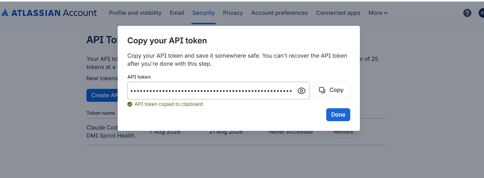
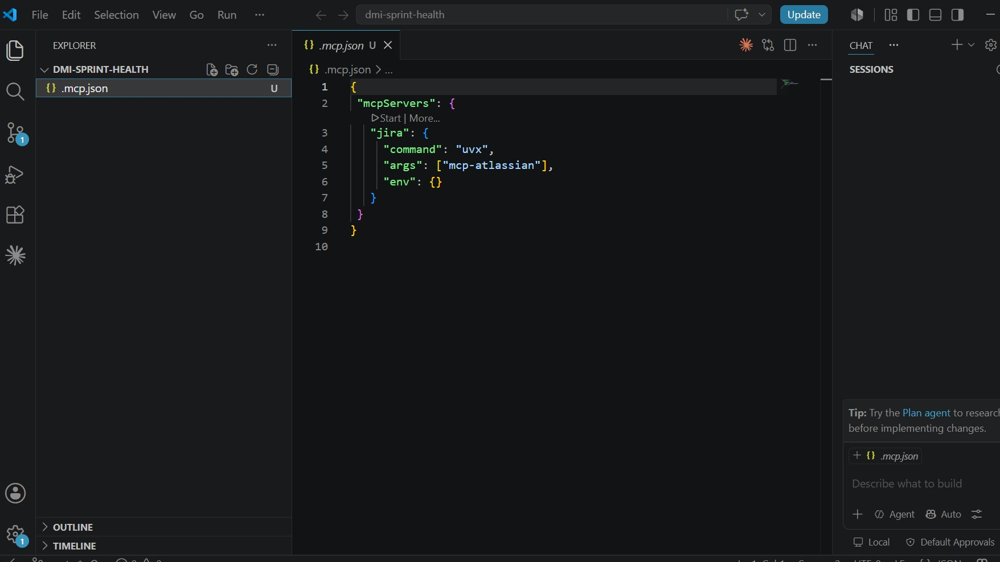
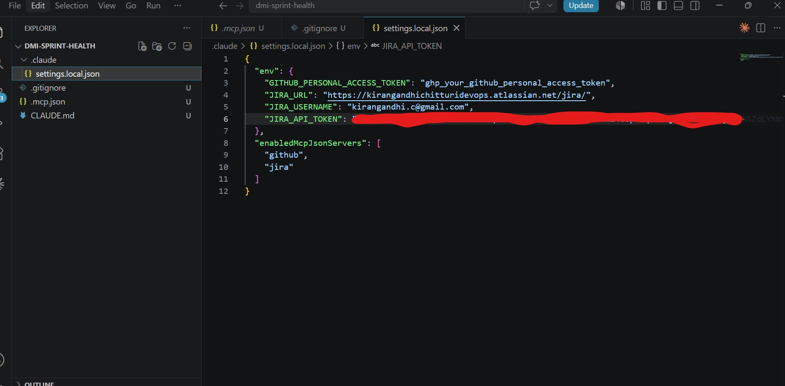
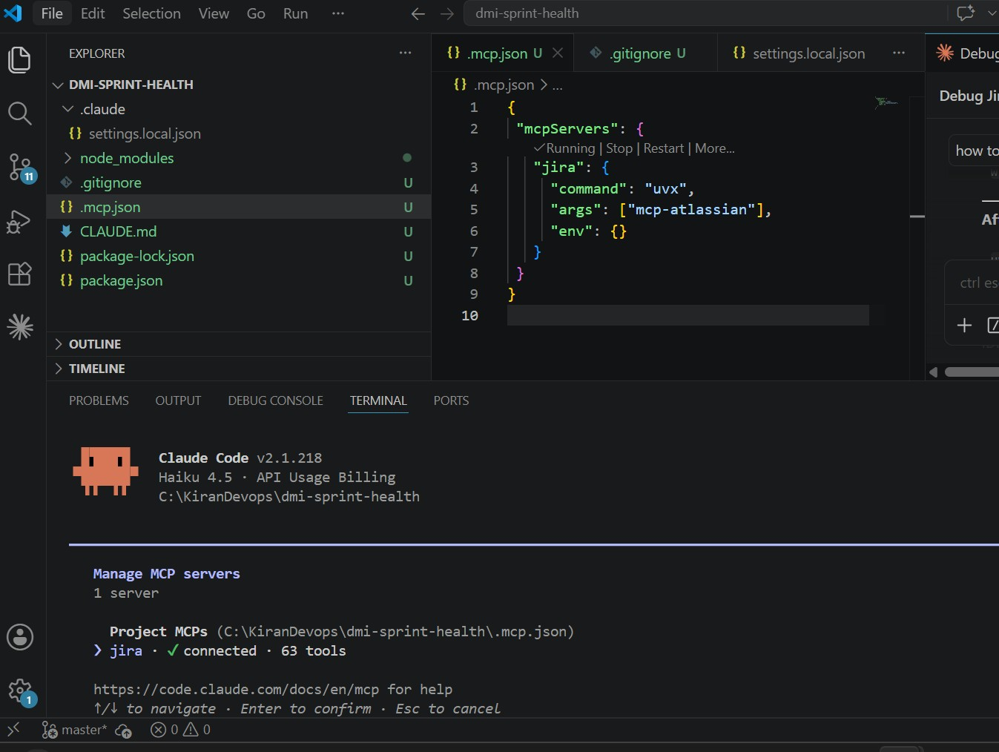
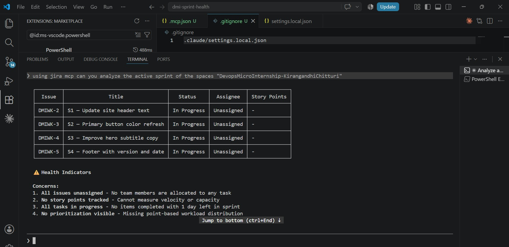
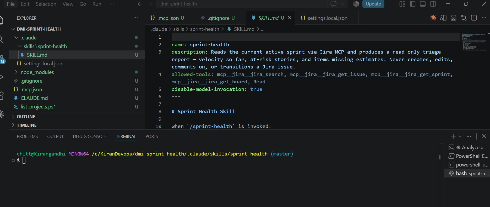
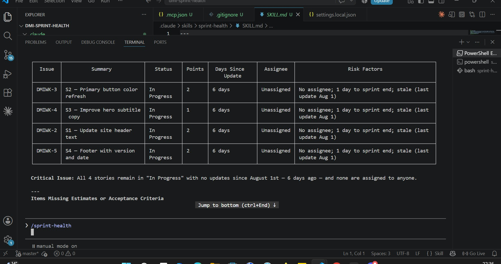
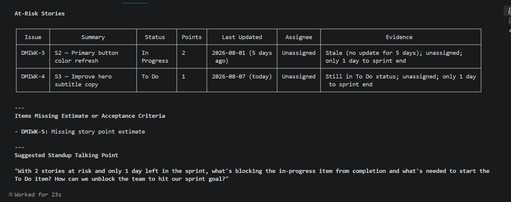

# Assignment 5 — AI-Assisted Sprint Health Report via Jira MCP

Part of the DevOps Micro Internship (DMI) Cohort 3 with Agentic AI

---

## Purpose

In this assignment, you will connect Claude Code to your Jira board through an MCP server, the same way you connected it to GitHub in Week 2, and build a read-only `/sprint-health` skill. The skill reads your current sprint through Jira's API and reports sprint velocity, stories at risk of missing the sprint, and items missing an estimate — but it must never create, edit, comment on, or transition a single ticket itself. You will prove that boundary holds by making a real change on the board yourself and confirming the skill only ever reports, never acts.

---

# Task 1 — Create a Jira API Token

## Goal

Generate an API token from your Atlassian account that the MCP server will use to authenticate with your Jira site. Do not screenshot the token value itself.

### Evidence

#### Screenshot 1 — Jira API token creation confirmation page showing the token name, with the token value not visible

### Notes You Must Write (Very Important):

Why does the MCP server need your site URL and account email in addition to the token?

Jira's REST API authenticates using Basic Auth, which requires a username (your email) and a secret (the API token) together — the token alone doesn't identify which Atlassian account it belongs to or which Jira site to connect to, since Atlassian hosts many separate instances (your-site.atlassian.net is yours specifically, distinct from anyone else's). The token proves "this really is you," the email says "on behalf of this specific account," and the URL says "talk to this specific Jira instance, not some other one."
---

# Task 2 — Create .mcp.json at the Project Root

## Goal

Create or update `.mcp.json` at your project root with a Jira MCP server block, following the same shape as the GitHub MCP server you configured in Week 2.

### Evidence

#### Screenshot 2 — `.mcp.json` open in VS Code showing the Jira server configuration

### Notes You Must Write (Very Important):

Compare this jira block to the github block from Week 2 Assignment 5. The GitHub server ran via npx (a Node.js package); this one runs via uvx (a Python package) — what stays exactly the same shape despite that difference, and why doesn't Claude Code care which language a given MCP server is written in?

Answer : shape of the MCP server block stays identical because Claude Code only cares about the protocol contract, not the language or runtime behind it
---

# Task 3 — Add Your Credentials to settings.local.json

## Goal

Add your Jira site URL, account email, and API token to `.claude/settings.local.json`, and confirm that file is listed in `.gitignore` so it is never committed.

### Evidence

#### Screenshot 3 — `settings.local.json` open in VS Code showing the `env` section, with the actual token value blurred or covered

### Notes You Must Write (Very Important):

Why must JIRA_API_TOKEN live in settings.local.json and never in .mcp.json?

Your JIRA_API_TOKEN must live in settings.local.json because .mcp.json is a client‑side protocol manifest, not a secrets store.  
Putting secrets in .mcp.json would expose them to your editor, your repo, and any MCP client — which is a security disaster.

---

# Task 4 — Verify the Connection with /mcp

## Goal

Restart Claude Code and confirm the Jira MCP server shows as connected.

### Evidence

#### Screenshot 4 — `/mcp` output showing `jira: connected`

---

# Task 5 — Run a Live Query to Prove Real Board Data

## Goal

Ask Claude to list the issues in your current active sprint through the Jira MCP connection, and confirm the result matches what you see on your live board in the browser.

### Evidence

#### Screenshot 5 — Claude's response showing the live sprint issue list retrieved via Jira MCP

### Notes You Must Write (Very Important):

How did you confirm this was real board data and not something Claude guessed?

This task verifies that the Jira MCP server can successfully retrieve live data from the Jira project instead of generating or guessing information.
When the prompt is submitted, Claude sends the request to the Jira MCP server. The MCP server authenticates with Jira using the configured site URL, account email, and API token, then queries the Jira REST API for the active sprint. Jira returns the sprint data, and Claude formats it into a readable report.
The returned information includes the sprint details, all issues in the sprint, their status, assignees, story points, priorities, and an overall sprint summary.
Because the data is retrieved directly from Jira, the response reflects the current state of the project.

---

# Task 6 — Build the /sprint-health Skill

## Goal

Create a `/sprint-health` skill restricted to read-only Jira tools plus `Read`, with no issue-mutating tools and no `Write`. Run it and confirm it produces a report covering sprint velocity, at-risk stories, and items missing an estimate.

### Evidence

#### Screenshot 6 — `SKILL.md` frontmatter showing `allowed-tools` limited to read-only Jira tools plus `Read`, with `disable-model-invocation: true`

#### Screenshot 7 — `/sprint-health` output showing the full triage report against your real sprint

### Notes You Must Write (Very Important):

1. Which Jira MCP tools does this skill's allowed-tools list include, and which mutating tools (create issue, update issue, transition issue, add comment) does it deliberately exclude?

In this skill, only Jira read tools are allowed:
mcp__jira__jira_search
mcp__jira__jira_get_issue
mcp__jira__jira_get_sprint
mcp__jira__jira_get_board
Read

These tools can retrieve information but cannot modify the Jira project.

2. Why does a Scrum Master need this restriction more than almost any other role in this course?

A Scrum Master typically has broad visibility across the whole team's work — sprints, boards, backlogs, multiple projects — because their job is to observe process health, spot blockers, and coach the team, not to do the team's work for them. That combination (wide visibility + facilitation authority) is exactly what makes write access risky in this role, for a few reasons:

Ownership boundary. Scrum values team self-organization. If a Scrum Master (or an AI acting through their account) can silently create, edit, or transition issues, it blurs the line between "facilitating the process" and "directing the work" — which undermines the team's ownership of their own backlog and status.
Trust and audit integrity. Because the Scrum Master's tool would touch many issues across many contributors, an unintended or hallucinated write (e.g., mis-transitioning a ticket, editing the wrong issue) has a much larger blast radius than the same mistake made by, say, a single developer editing their own ticket.
Role clarity. The Scrum Master's actual authority is process facilitation — running standups, removing impediments, coaching — not backlog management. Giving them (or their assistant) unrestricted write access to Jira invites scope creep where the AI starts making product/process decisions (re-prioritizing, closing issues, adding comments as if from the team) that should stay with the people actually doing the work.
Human-in-the-loop for status changes. Sprint and issue state changes are meaningful signals the whole team relies on. Keeping those actions manual (or requiring explicit human confirmation) ensures a person is deliberately making that call rather than an automated tool doing it as a side effect of "just checking sprint status."

So read-only tools let the Scrum Master (and their AI assistant) get everything they need for facilitation — sprint state, board state, issue details, search — without the assistant ever being in a position to alter the artifacts the team is trusted to manage themselves.

---

# Task 7 — Prove the Skill Never Mutates the Board

## Goal

Manually update one ticket on your board in the browser (for example, move a story to "Done" or add a missing estimate), then run `/sprint-health` again and confirm the new report reflects your change — proving the skill only ever reads live state and never wrote to the board itself.

### Evidence

#### Screenshot 8 — Second `/sprint-health` run showing the report now reflects your manual board change

### Notes You Must Write (Very Important):

Map this assignment to Gather → Analyze → Human Act → Verify from Week 3 Assignment 6. Which step did you perform manually in the browser, and why must that step stay human?

Human Act Phase:
Task 7 explicitly requires you to manually update one ticket on the board in your browser — e.g., move a story to Done, add a missing estimate, or transition an issue. This is the human decision-making step.

Verify Phase:
Running /sprint-health again confirms the board state changed and proves the skill only ever reads live state; it didn't write anything itself (the change came from your manual action).

Why This Step Must Stay Human

The manual ticket update must stay human-controlled because:

1. Ownership boundary — Scrum values team self-organization. If a Scrum Master's AI assistant could silently transition issues or update estimates, it blurs the line between facilitating process and directing the work.
2. Product decisions — Changing sprint commitments, closing stories, or adding estimates are product/team decisions, not analysis outputs. The AI should inform decisions, not make them.
3. Audit trail & intent — A human-made change signals deliberate choice. An automated write could mask errors or hallucinations and is much harder to audit.
4. Blast radius — Scrum Masters have broad visibility across many tickets. Accidental AI mutations could affect the entire team's backlog.

Just like Week 3's Nginx restart had to stay human-controlled to avoid unsafe automated recovery, board state changes must stay human-owned to preserve team accountability.
---

# Submission Instructions

Complete all tasks in sequence.

Your submission must include:
- All 8 required screenshots
- All the required notes

---

# Completion Checklist

- [ ] Task 1: Jira API token created, value never screenshotted (Screenshot 1)
- [ ] Task 2: `.mcp.json` has the Jira server block (Screenshot 2)
- [ ] Task 3: Credentials stored in `settings.local.json`, token blurred, file gitignored (Screenshot 3)
- [ ] Task 4: `/mcp` shows the Jira server connected (Screenshot 4)
- [ ] Task 5: Live query returned real sprint data, verified against the browser (Screenshot 5)
- [ ] Task 6: `/sprint-health` skill created with correct read-only `allowed-tools`, and produced a full report (Screenshots 6–7)
- [ ] Task 7: A manual board change was reflected in a second `/sprint-health` run (Screenshot 8)
- [ ] Skill never created, edited, transitioned, or commented on any issue
- [ ] Reflection answered (Notes)
- [ ] No API token value exposed

---

## 📌 About DMI & CloudAdvisory

DevOps Micro Internship (DMI) is a project-based DevOps program run by Pravin Mishra (The CloudAdvisory) focused on real-world execution, systems thinking, and career readiness.

It helps learners build strong DevOps foundations with hands-on experience.

---

## 📌 Resources

- 🌐 DMI Official Website: https://dmi.pravinmishra.com?utm_source=github&utm_medium=readme  
- 🎓 University: https://university.pravinmishra.com?utm_source=github&utm_medium=readme  
- 💬 Discord Community: https://discord.pravinmishra.com?utm_source=github&utm_medium=readme  
- 📝 Blog: https://dmi.pravinmishra.com/blog?utm_source=github&utm_medium=readme  
- ▶️ YouTube Playlist: https://www.youtube.com/playlist?list=PLFeSNDtI4Cho  
- 🔗 Pravin Mishra (LinkedIn): https://www.linkedin.com/in/pravin-mishra-aws-trainer/  
- 🏢 CloudAdvisory (LinkedIn): https://www.linkedin.com/company/thecloudadvisory/

---

*This submission is part of DevOps Micro Internship (DMI) Cohort 3 — Agentic AI Track.*
