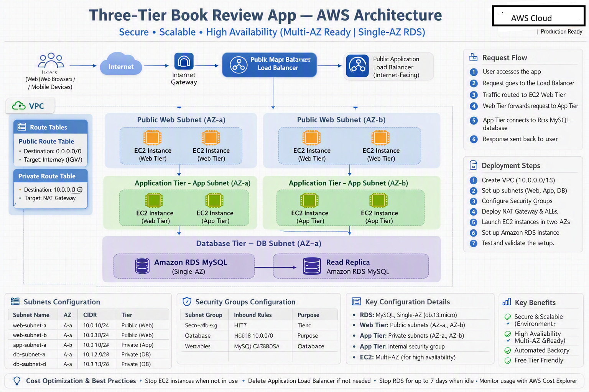
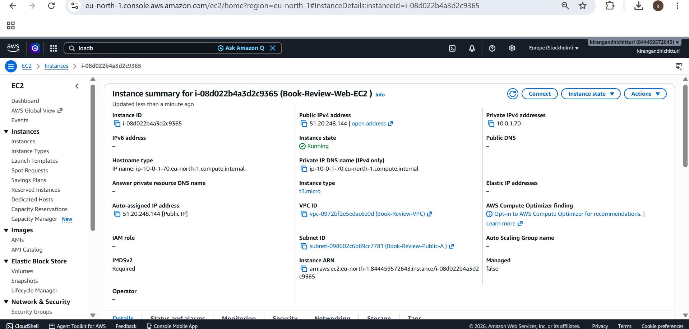
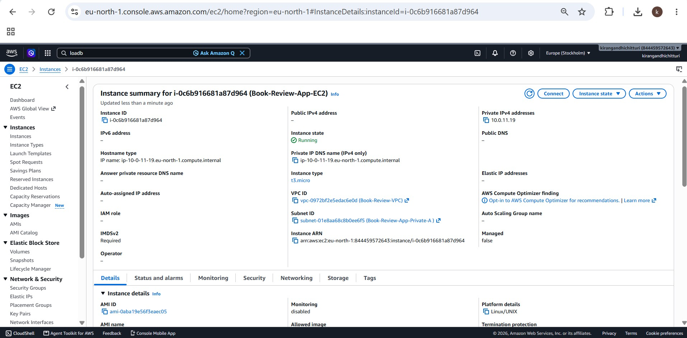
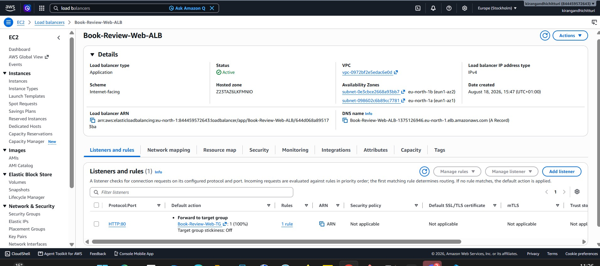
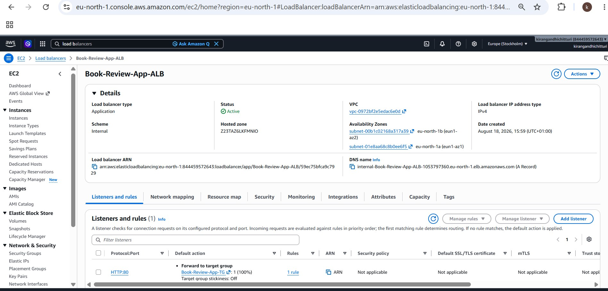
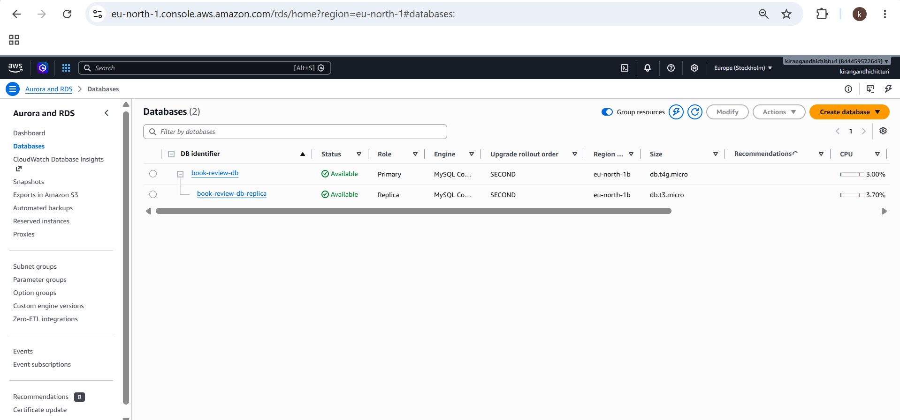
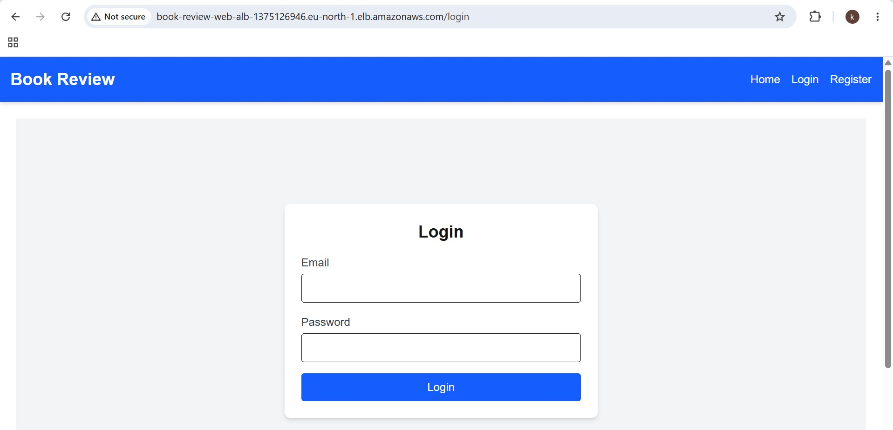
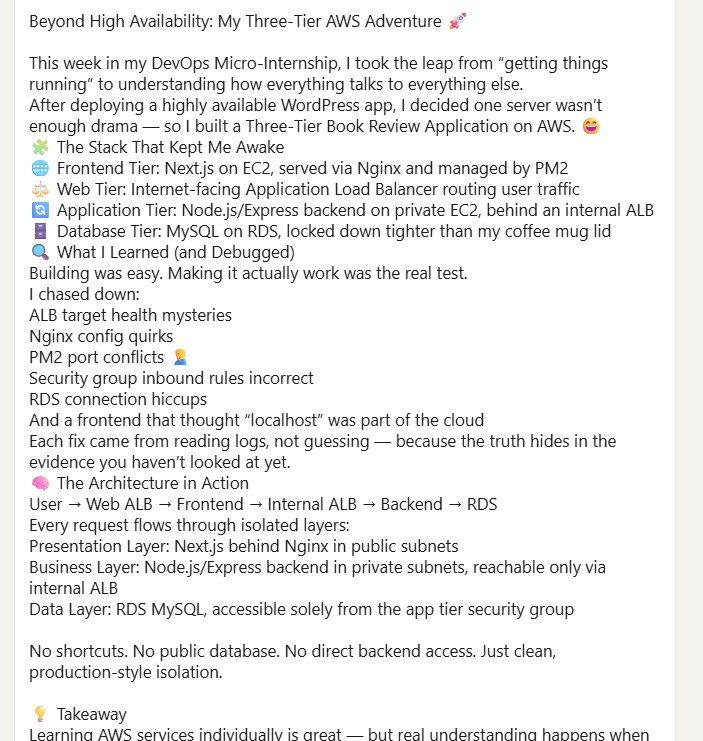

# Assignment 6 — Capstone Assignment — Deploy Book Review App (Three-Tier Architecture) on AWS

Part of the DevOps Micro Internship (DMI) Cohort 3 with Agentic AI

---

## Purpose

This is the most important assignment of the course. You will deploy the Book Review App in a fully production-style three-tier architecture on AWS: a Next.js Web Tier behind Nginx and a public ALB, a private Node.js/Express App Tier behind an internal ALB, and a private Multi-AZ MySQL RDS database with a read replica. You are expected to design, deploy, isolate, debug, and document the result independently.

---

# Task 1 — Architecture Diagram

## Goal

Create an architecture diagram showing the custom VPC (10.0.0.0/16), the six subnets across two Availability Zones (two public Web Tier, two private App Tier, two private Database Tier), the public ALB, Web Tier EC2/Nginx, internal ALB, private App Tier EC2, private Multi-AZ RDS with its read replica, and the permitted traffic flow.

### Evidence

#### Diagram image or link

- 
---

# Task 2 — AWS Region & Services Used

## Goal

Record the AWS Region used and list every AWS service used across networking, compute, load balancing, security, and the database.

### Notes

VPC (Virtual Private Cloud) Subnets (6 total: 2 public, 4 private) Internet Gateway Route Tables (Public + Private) EC2 Instances (2: Web Tier + App Tier) Application Load Balancer (2: Public + Internal) Security Groups (5: web-alb-sg, web-sg, internal-alb-sg, app-sg, db-sg) RDS MySQL (Single-AZ) NAT Gateway 
---

# Task 3 — Public Entry Point

## Goal

Confirm the Book Review App loads through the public ALB DNS name.

### Evidence

#### Public ALB DNS

Paste your public ALB DNS name here:

http://Book-Review-Web-ALB-1375126946.eu-north-1.elb.amazonaws.com
---

# Task 4 — Evidence Screenshots

## Goal

Capture visual proof of every tier and load balancer.

### Evidence

#### Web EC2

- 
---

#### App EC2

- 

---

#### Public ALB

- 
---

#### Internal ALB

- 
---

#### RDS + Replica

- 
---

#### App UI proof

- 
---

# Task 5 — Summary

## Goal

Summarize what worked in the final deployment, the issues encountered and how each was fixed, and the tools or sources used to research and debug.

### Notes

Once the traffic flow was mapped correctly, the three tiers integrated seamlessly. A browser request first hits the public Application Load Balancer, which forwards it to Nginx on the web server. Nginx serves the Next.js frontend for standard page loads and proxies all /api/ calls to the internal load balancer, which routes them to the Express backend on port 3001. The backend communicates securely with the Multi‑AZ RDS MySQL instance over SSL. On initial startup, the backend automatically created its schema and seeded sample data, giving the app real content from the outset.

The network isolation proved solid during testing. The application servers have no public IPs, the internal load balancer resolves only within the VPC, and the database accepts traffic solely from the app‑tier security group. Browser traces confirmed that every external request reached only the public load balancer — nothing else was exposed.

The security group chaining uses group references instead of IP ranges, ensuring continuity even when instances are replaced. The web‑tier group includes both the public load balancer and the web server, requiring a rule that allows port 80 from itself for load‑balancer‑to‑instance traffic. The same logic applies to the app‑tier group and its internal load balancer.

Issues and Fixes
The frontend’s client‑side rendering dictated the build sequence. Every Next.js page uses "use client", meaning all API calls run in the browser. Consequently, NEXT_PUBLIC_API_URL must resolve to a hostname accessible from the browser — the internal load balancer does not qualify. Pointing it there would break the app entirely. The fix was to reference the public load balancer and let Nginx proxy /api/ requests to the internal ALB. Because Next.js embeds NEXT_PUBLIC_ variables at build time, the public load balancer had to exist before the frontend build could succeed.

After a reload, Nginx briefly returned 404 on API routes before recovering. This happens because Nginx resolves upstream hostnames when worker processes start; a request during reload can miss the new configuration. Retrying confirmed the route was correct. It’s a useful lesson: load‑balancer IPs rotate, and without a resolver directive, Nginx may hold stale addresses indefinitely.

The repository included a committed .env file with default credentials — a database password and JWT_SECRET="mysecretkey". These exposed values could allow anyone to forge valid tokens. I replaced them with secure credentials and generated a random 32‑byte JWT secret using openssl.

A read replica cannot be created if automated backups are disabled. Initially, I set backup retention to zero to reduce cost, which blocked replication. Setting retention to one day resolved the issue.

Accessing the private app servers required an indirect route. Since the app subnets have no inbound internet path, I copied the key pair to the web server and connected through it. This works but is poor practice because a private key resides on a public host. The correct approach is AWS Systems Manager Session Manager, which eliminates SSH access and port 22 rules entirely.

The NAT Gateway needs an Elastic IP, which seemed to conflict with the “no Elastic IPs” guideline. I interpreted that rule as applying to EC2 instances, ensuring inbound traffic flows through load balancers only. No instance in this architecture uses an Elastic IP; the NAT Gateway’s address is required for outbound connectivity from private tiers.

Tools and References
AWS CLI v2 — used to build and inspect resources, providing repeatable commands and clearer error messages than the console.

AWS Documentation — referenced for read‑replica backup requirements and ALB scheme behavior.

Application Source Code — reviewing frontend/src/services/api.js, frontend/src/app/page.js, and backend/src/server.js clarified client‑side API calls, port configuration, and Sequelize sync behavior, preventing deployment errors.

Claude — assisted with architectural reasoning and debugging.

Linux Utilities — systemctl, journalctl, getent, and curl at each hop helped isolate failures precisely instead of guessing.

# LinkedIn Post (Required)

## Goal

Publish a LinkedIn post sharing the capstone deployment, including the public ALB DNS (or a redacted screenshot), three to five lines on what you built and why it is production-style, and one proof screenshot.

## Evidence

#### LinkedIn Post URL

Paste your LinkedIn post URL here:

https://lnkd.in/p/eSjNqyZ8

---

#### Screenshot of LinkedIn post

- 
---

# Submission Instructions

- Add all required screenshots and links in your submission
- Do not expose passwords, RDS credentials, connection strings, private keys, or account IDs

---

# Completion Checklist

- [ ] Task 1: Architecture diagram completed
- [ ] Task 2: AWS Region and services documented
- [ ] Task 3: Public ALB DNS confirmed working
- [ ] Task 4: All six evidence screenshots captured (Web Tier, App Tier, both ALBs, RDS + replica, app UI)
- [ ] Task 5: Deployment summary completed (what worked, issues/fixes, tools/sources)
- [ ] LinkedIn post published and URL submitted
- [ ] App Tier and Database Tier confirmed not publicly accessible
- [ ] No sensitive data exposed

---

## 📌 About DMI & CloudAdvisory

DevOps Micro Internship (DMI) is a project-based DevOps program run by Pravin Mishra (The CloudAdvisory) focused on real-world execution, systems thinking, and career readiness.

It helps learners build strong DevOps foundations with hands-on experience.

---

## 📌 Resources

- 🌐 DMI Official Website: https://dmi.pravinmishra.com?utm_source=github&utm_medium=readme  
- 🎓 University: https://university.pravinmishra.com?utm_source=github&utm_medium=readme  
- 💬 Discord Community: https://discord.pravinmishra.com?utm_source=github&utm_medium=readme  
- 📝 Blog: https://dmi.pravinmishra.com/blog?utm_source=github&utm_medium=readme  
- ▶️ YouTube Playlist: https://www.youtube.com/playlist?list=PLFeSNDtI4Cho  
- 🔗 Pravin Mishra (LinkedIn): https://www.linkedin.com/in/pravin-mishra-aws-trainer/  
- 🏢 CloudAdvisory (LinkedIn): https://www.linkedin.com/company/thecloudadvisory/

---

*This submission is part of DevOps Micro Internship (DMI) Cohort 3 — Agentic AI Track.*