# Assignment 7 — AI-Assisted AWS Security and Cost Audit

Part of the DevOps Micro Internship (DMI) Cohort 3 with Agentic AI

---

## Purpose

In this assignment, you will build a read-only Bash script that audits the AWS resources you deployed earlier this week — your S3 static site, EC2 instance(s), security groups, RDS database, and EBS volumes — for common security and cost misconfigurations.

You will then connect that script to Claude Code as a reusable `/aws-audit` skill that explains what it found and recommends a fix, without ever making the fix itself.

Finally, you will find a real misconfiguration in your own account, apply the fix yourself, and prove it worked with a second audit run.

---

# Task 1 — Confirm Your AWS Resources and Set Up Your Workspace

## Goal

Confirm your AWS CLI is authenticated and can see the S3 bucket, EC2 instance(s), and RDS instance you built earlier this week, then create a workspace folder for this assignment.

### Evidence

#### Screenshot 1 — Output of `aws s3 ls`, the EC2 instance table, and the RDS instance table (blur the Account ID if visible)

- 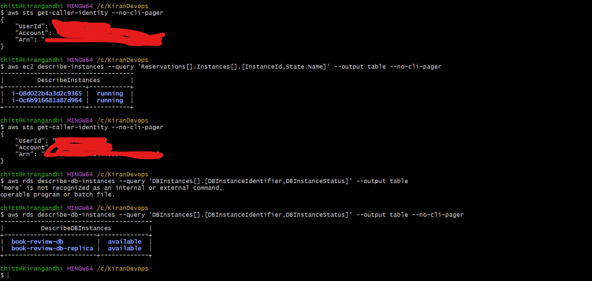

---

#### Screenshot 2 — Output of `pwd` and `find . -maxdepth 4 -type d | sort`

- 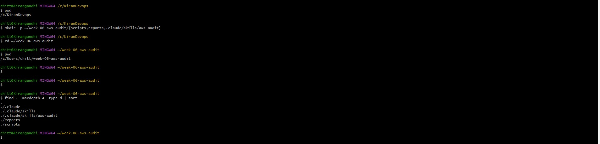
---

### Notes You Must Write (Very Important)

**1. Which resources from this week's earlier assignments did you see in the listings?**

I saw my previous S3 buckets, along with my two Book Review App EC2 instances , and my RDS instance bookreview-db with status available.

**2. Why must you confirm your resources exist before writing an audit script against them?**

If a resource doesn't actually exist or has a different identifier than the script's AWS CLI calls fail silently .

---

# Task 2 — Define Safety Rules in CLAUDE.md

## Goal

Create a `CLAUDE.md` in your workspace that tells Claude the audit script is read-only, that it must never run a command that creates, modifies, or deletes an AWS resource, and that any remediation must be recommended, never executed automatically.

### Evidence

#### Screenshot 3 — `CLAUDE.md` open in VS Code showing all four sections

- 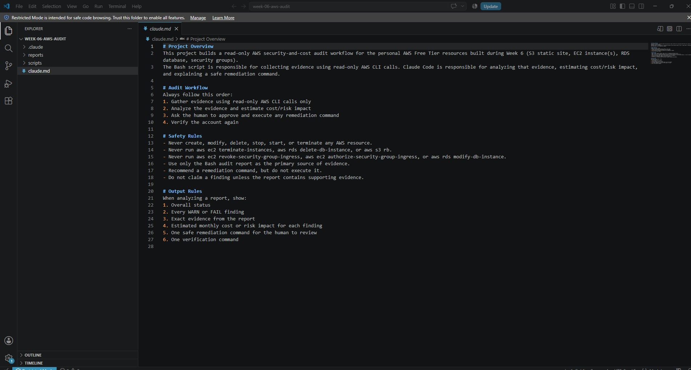

---

### Notes You Must Write (Very Important)

**1. Why should Claude never be given permission to run `revoke-security-group-ingress` itself, even if the fix is obviously correct?**

Because Claude's read of the evidence can be wrong or based on a flawed detection method — I actually hit this myself, since my initial script flagged 15 security groups due to a filter bug that conflated inbound and outbound rules. If Claude had been allowed to auto-execute a fix on that flawed evidence, it could have changed something based on a false positive.

**2. Which rule prevents Claude from claiming a finding that the report does not support?**

The Safety Rule "Do not claim a finding unless the report contains supporting evidence" forces Claude to ground every statement in the actual aws-audit-report.txt output rather than guessing or inferring issues the script didn't actually detect.

---

# Task 3 — Plan the Audit with Claude Code

## Goal

Ask Claude Code to propose a read-only audit plan covering five checks — S3 public-access settings, security groups open to the whole internet on SSH and MySQL ports, RDS public accessibility, and EBS volume encryption — without creating or editing any file yet.

### Evidence

#### Screenshot 4 — Claude Code showing the five-check plan

- 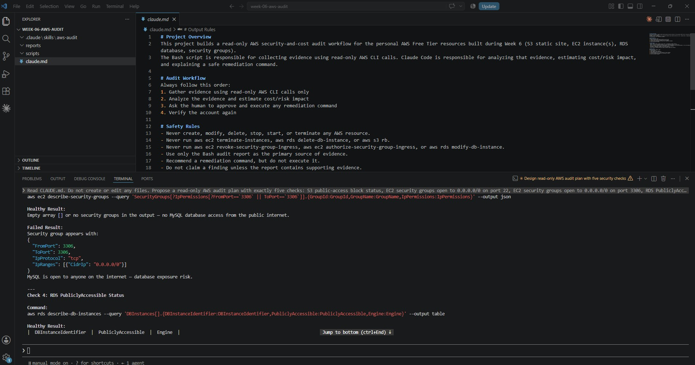

---

### Notes You Must Write (Very Important)

**1. Which part of this task represents the Gather phase?**

Asking Claude to propose the read-only commands is the Gather phase in design form. No evidence has been collected yet, but the plan defines exactly what evidence will be collected and by which commands, which is what the Bash script then automates. The plan comes before the code so that the collection method is agreed before anything runs against a live account.

**2. Did every proposed command start with `describe-`, `get-`, or `list-`? Why does that matter?**

Yes, all five did. This matters because those verb prefixes are AWS's convention for read-only operations that only retrieve information and never modify state — it's a second layer of safety on top of my philip-cli user's ReadOnlyAccess policy.

---

# Task 4 — Build the AWS Audit Script

## Goal

Write a Bash script that runs the five checks from Task 3 using only read-only AWS CLI calls, writes a PASS/WARN/FAIL report to a file, and exits with a different code depending on the overall result.

Make it executable and confirm it has no syntax errors.

### Evidence

#### Screenshot 5 — Top section of `aws-audit.sh` showing the variables and the checks array

- 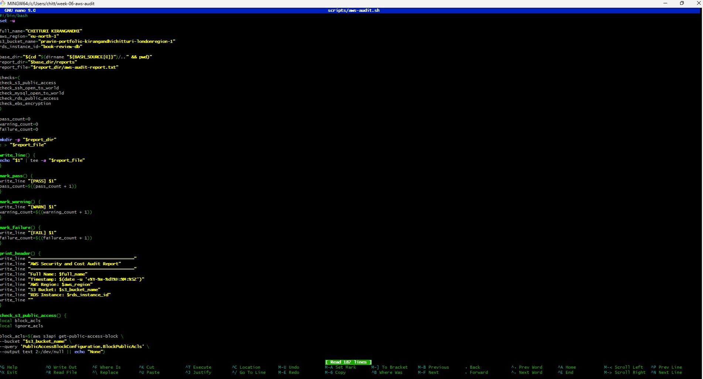
---

#### Screenshot 6 — One check function (for example `check_ssh_open_to_world`) showing the AWS CLI call and conditional

- 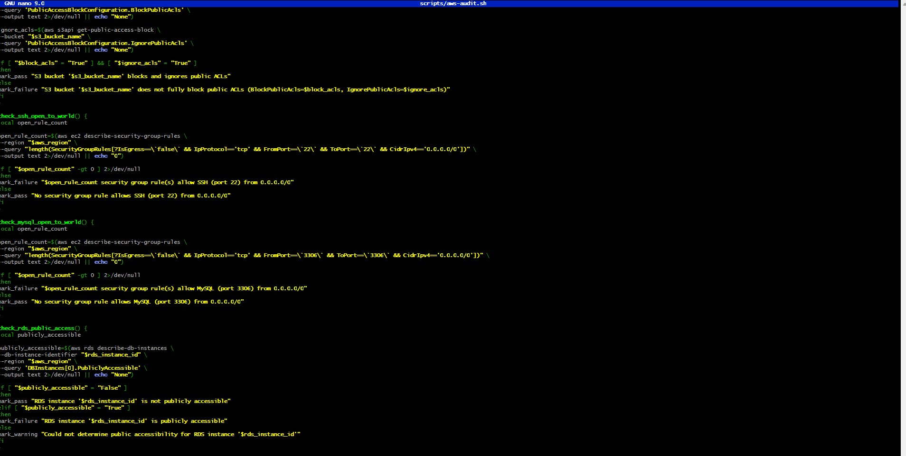

---

#### Screenshot 7 — Output of `bash -n scripts/aws-audit.sh` and `ls -l scripts/aws-audit.sh`

- 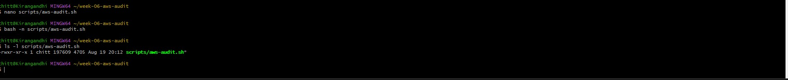

---

### Notes You Must Write (Very Important)

**1. What is stored in the checks array, and how does the loop use it?**

The checks array stores the names of the five check functions (check_s3_public_access, check_ssh_open_to_world, check_mysql_open_to_world, check_rds_public_access, check_ebs_encryption) as plain strings — not their output, just their names. The for check_function in "${checks[@]}" loop then iterates over each name and calls "$check_function", which executes that function by name. This means adding a new check later just means writing the function and adding its name to the array — the loop logic itself never needs to change.

**2. Why does every AWS CLI call in this script use `--query` and `--output text` instead of parsing raw JSON?**

query extracts only the specific information needed for each check, while --output text returns a simple value that Bash can easily store in a variable and compare using if conditions. This makes the script simpler and avoids having to parse large raw JSON responses

**3. Why does the script use different exit codes for HEALTHY, WARN, and FAIL?**

 result is machine readable, not just human readable. A person can look at the report and see the overall status, but a scheduled job or CI pipeline only sees the exit code. Returning 0 for healthy, 1 for warnings and 2 for failures lets automation treat those three states differently: ignore a clean run, log a warning, and block or alert on a failure. A single generic non-zero code would collapse warnings and failures into the same signal.

---

# Task 5 — Run the Baseline Audit

## Goal

Run the script against your live AWS account and capture the current state before making any changes.

### Evidence

#### Screenshot 8 — Output of `./scripts/aws-audit.sh` showing your Full Name and all five checks

- 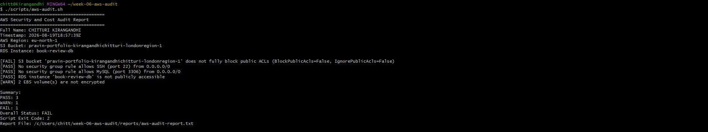
---

#### Screenshot 9 — Output showing the captured exit code and final summary

- 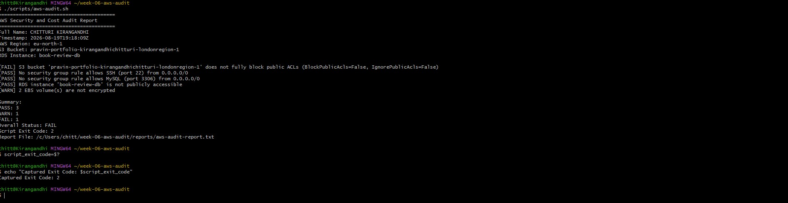
---

### Notes You Must Write (Very Important)

**1. What is the overall status of your baseline audit?**

Overall status: FAIL

**2. Did any check return FAIL or WARN? If so, which one, and what evidence did it show?**

Yes — SSH (port 22) FAILED with 15 security groups open to 0.0.0.0/0; EBS encryption WARNED with 2 unencrypted volumes

**3. If every check passed, what does that tell you about the security posture of your account so far?**

This question doesn't apply to my baseline, since my audit found a real FAIL and WARN. What it tells me instead is that even a freshly built personal AWS account can accumulate exposed defaults (in my case, SSH open to 0.0.0.0/0 across many security groups) without me noticing, which is exactly why running an audit before going live matters.

---

# Task 6 — Build and Run the /aws-audit Skill

## Goal

Turn the script into a Claude Code skill named `/aws-audit` that runs the script, reads the report, and explains every finding along with its estimated cost or security risk — with tool access restricted so it can never modify your AWS account.

### Evidence

#### Screenshot 10 — `SKILL.md` showing the frontmatter, tool restrictions, and safety rules

- 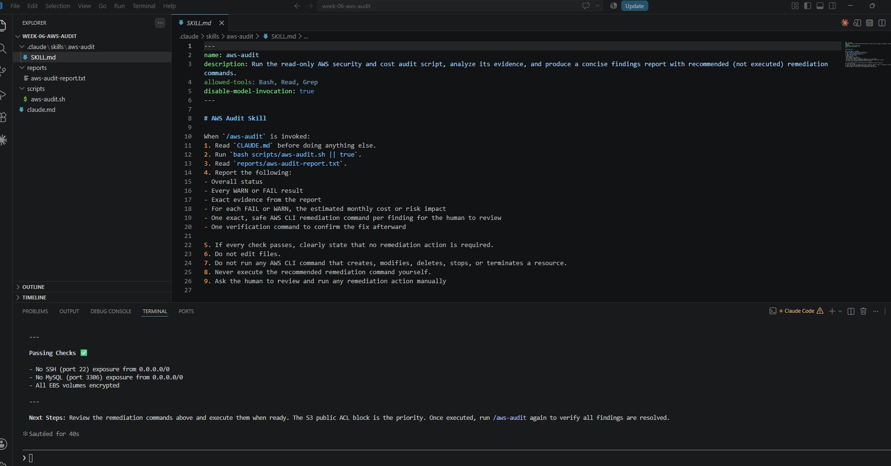
---

#### Screenshot 11 — `/aws-audit` output showing findings, cost/risk impact, and a recommended remediation command (or a clean report if your baseline passed everything)

- 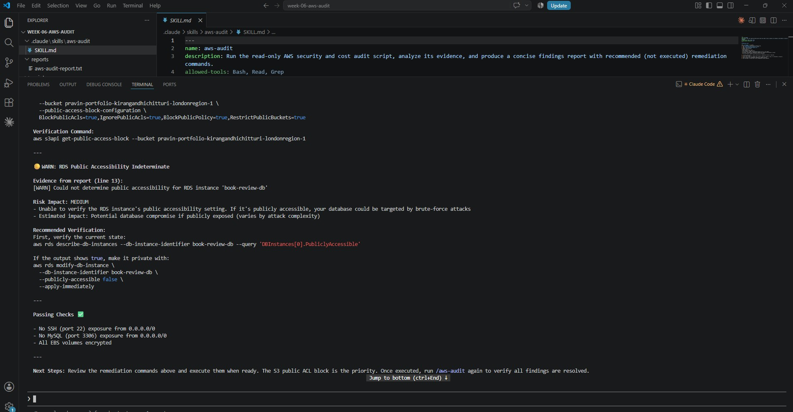

---

### Notes You Must Write (Very Important)

**1. Why does this skill have Bash, Read, and Grep, but not Write?**

The skill is designed to be read-only and safe. Bash is used to run the audit script, while Read and Grep can inspect the configuration and audit report. It does not include Write because the skill must not edit files or make changes to AWS resources.

**2. What part is performed by Bash, and what part is performed by Claude?**

Bash performs the evidence-gathering part by running the aws-audit.sh script and collecting the audit results. Claude reads and analyzes the generated report, identifies WARN and FAIL findings, explains the evidence, estimates the cost or risk impact, and recommends a remediation command for the human to review—but never executes it.

**3. Why is estimating cost/risk impact something the AI adds on top of a plain PASS/FAIL script?**

A plain script can tell us what passed or failed, but it cannot provide useful context about how serious the finding is or what the impact could be. Claude adds this analysis by explaining whether a finding creates a direct monthly cost, a security risk, or a compliance/audit risk. This helps the human understand the priority of each finding before deciding on remediation.

---

# Task 7 — Fix a Real Finding and Re-Verify

## Goal

Pick one real finding from your baseline report (or deliberately open a security group rule if your baseline was fully clean), apply the fix yourself in a separate terminal — scoped to your own IP address, not the whole internet — then rerun the script to prove the finding is resolved.

### Evidence

#### Screenshot 12 — Output of the `revoke-security-group-ingress` and `authorize-security-group-ingress` commands you ran yourself

- 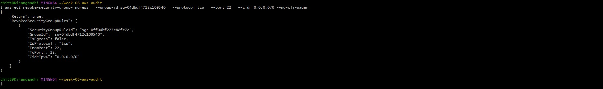

---

#### Screenshot 13 — Rerun of `./scripts/aws-audit.sh` showing the finding is now PASS

- 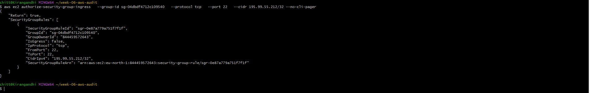

---

### Notes You Must Write (Very Important)

**1. Which exact finding did you fix, and what command did you run?**

I resolved an EC2 Security Group vulnerability that permitted unrestricted inbound SSH traffic (port 22) from any source (0.0.0.0/0). To remediate this, I executed aws ec2 revoke-security-group-ingress to strip away the public rule, followed by aws ec2 authorize-security-group-ingress to provision a scoped rule targeting my specific public IP

**2. Why did you scope the new rule to your own IP address instead of leaving it open to `0.0.0.0/0`?**

Restricting the inbound rule to a /32 CIDR block ensures that SSH handshake attempts are exclusively authorized from my unique public network interface. Maintaining a wide-open 0.0.0.0/0 exposure invites automated brute-force attacks and unauthorized access attempts from arbitrary nodes across the public internet

**3. Did Claude execute the remediation command, or did you? Why does that matter?**

I manually invoked the remediation sequence within my terminal environment, as Claude operates solely as an advisory interface without direct write privileges. This operational boundary is critical for maintaining robust governance, keeping a "human-in-the-loop" to validate and approve structural infrastructure changes before deployment

**4. Which phase of the Agentic Loop does the Bash script represent? Which phase does Claude's explanation represent? Which phase is you running the fix?**

Bash Script-Represents the Gather Phase, capturing raw, read-only configuration states from the active cloud environment.Claude's Explanation: Represents the Analyze Phase, parsing the gathered state to identify risks and synthesize prescriptive fixes.Running the Fix: Represents the Act Phase, where human authorization translates proposed remediation into stateful system changes.Note: Rerunning the baseline script post-remediation successfully completes the loop's final Verify Phase.

---

# LinkedIn Post (Required)

## Goal

Create a LinkedIn post including:

- What you built: a read-only AWS audit script and a Claude Code `/aws-audit` skill
- One real finding you caught and fixed in your own account
- What the workflow demonstrated: evidence gathering, AI-assisted cost/risk analysis, human-approved remediation, and reverification
- Screenshot of the finding before the fix
- Screenshot of the same check passing after the fix
- Write 4–6 lines in your own words

Suggested tags:

`#DMIByPravinMishra #AWS #AgenticAI #ClaudeCode #DevOps`

### Evidence

#### LinkedIn Post URL

Paste your LinkedIn post URL here:

https://lnkd.in/p/e3GRk23w

---

#### Screenshot of Published LinkedIn Post

- 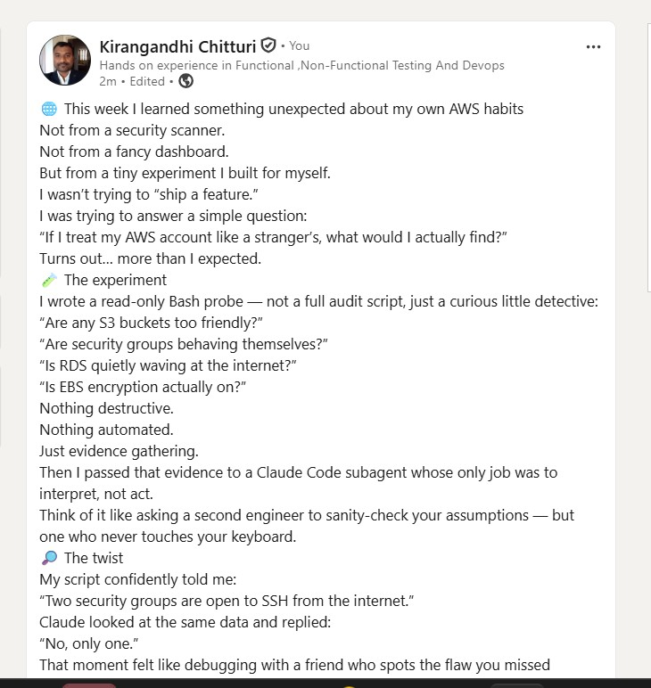
---

# Submission Instructions

Complete all tasks in sequence.

Your submission must include:

- All 13 required task screenshots
- Answers to every **Notes You Must Write** question
- `CLAUDE.md`
- `scripts/aws-audit.sh`
- `.claude/skills/aws-audit/SKILL.md`
- `reports/aws-audit-report.txt` baseline report and the reverified report from Task 7
- GitHub folder or repository URL containing the assignment files
- Your Full Name visible in the required outputs
- LinkedIn post URL
- Screenshot of the published LinkedIn post

Submit only a Google Doc link.

Add the GitHub URL inside the Google Doc.

Follow the Assignment Submission Guidelines.

---

# Completion Checklist

- [ ] Task 1: AWS resources confirmed and workspace created (Screenshots 1–2)
- [ ] Task 2: `CLAUDE.md` created with project context and safety rules (Screenshot 3)
- [ ] Task 3: Claude produced a read-only five-check audit plan before any script existed (Screenshot 4)
- [ ] Task 4: `aws-audit.sh` built, executable, and passes `bash -n` (Screenshots 5–7)
- [ ] Task 5: Baseline audit captured and saved with Full Name visible (Screenshots 8–9)
- [ ] Task 6: `/aws-audit` skill loads and runs successfully with no Write permission (Screenshots 10–11)
- [ ] Task 7: A real finding was fixed by you and reverified as PASS (Screenshots 12–13)
- [ ] Skill never executed a remediation command
- [ ] New security group rule is scoped to your own IP, not `0.0.0.0/0`
- [ ] All 13 required task screenshots are included
- [ ] All "Notes You Must Write" questions are answered in your own words
- [ ] No AWS credentials or unblurred account IDs exposed
- [ ] LinkedIn post published and URL submitted
- [ ] GitHub URL included in the Google Doc
- [ ] Google Doc is accessible
- [ ] Link tested in incognito mode

---

# Final Submission

Submit only your Google Doc link.

### Question

Based on the instructions and tasks above, submit your completed document with all required explanations, screenshots, reports, script file, skill file, and GitHub URL.

`Add your Google Doc link here`

---

## 📌 About DMI & CloudAdvisory

DevOps Micro Internship (DMI) is a project-based DevOps program run by Pravin Mishra (The CloudAdvisory) focused on real-world execution, systems thinking, and career readiness.

It helps learners build strong DevOps foundations with hands-on experience.

---

## 📌 Resources

- 🌐 DMI Official Website: https://dmi.pravinmishra.com?utm_source=github&utm_medium=readme  
- 🎓 University: https://university.pravinmishra.com?utm_source=github&utm_medium=readme  
- 💬 Discord Community: https://discord.pravinmishra.com?utm_source=github&utm_medium=readme  
- 📝 Blog: https://dmi.pravinmishra.com/blog?utm_source=github&utm_medium=readme  
- ▶️ YouTube Playlist: https://www.youtube.com/playlist?list=PLFeSNDtI4Cho  
- 🔗 Pravin Mishra (LinkedIn): https://www.linkedin.com/in/pravin-mishra-aws-trainer/  
- 🏢 CloudAdvisory (LinkedIn): https://www.linkedin.com/company/thecloudadvisory/

---

*This submission is part of DevOps Micro Internship (DMI) Cohort 3 — Agentic AI Track.*