# Assignment 6 — Capstone: Deploy Book Review App (Three-Tier Architecture) on Azure

Part of the DevOps Micro Internship (DMI) Cohort 3 with Agentic AI

---

## Purpose

This is the most important assignment of the course. You will deploy the Book Review App in a production-ready, best-practice-compliant three-tier architecture on Azure: separated presentation, application, and database tiers, least-privilege network access, a controlled public entry point, protected secrets, and availability/monitoring evidence.

---

# Task 1 — Design the Azure Three-Tier Architecture

## Goal

Create an architecture diagram and implementation plan identifying the presentation, application, and database components, the chosen Azure services, the public entry point, and the internal traffic paths.

### Evidence

#### Screenshot 1 — Architecture diagram showing the public entry point, three tiers, network boundaries, and traffic flow

- 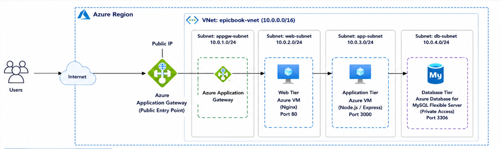

---

#### Screenshot 2 — Written architecture assumptions and selected Azure services

- 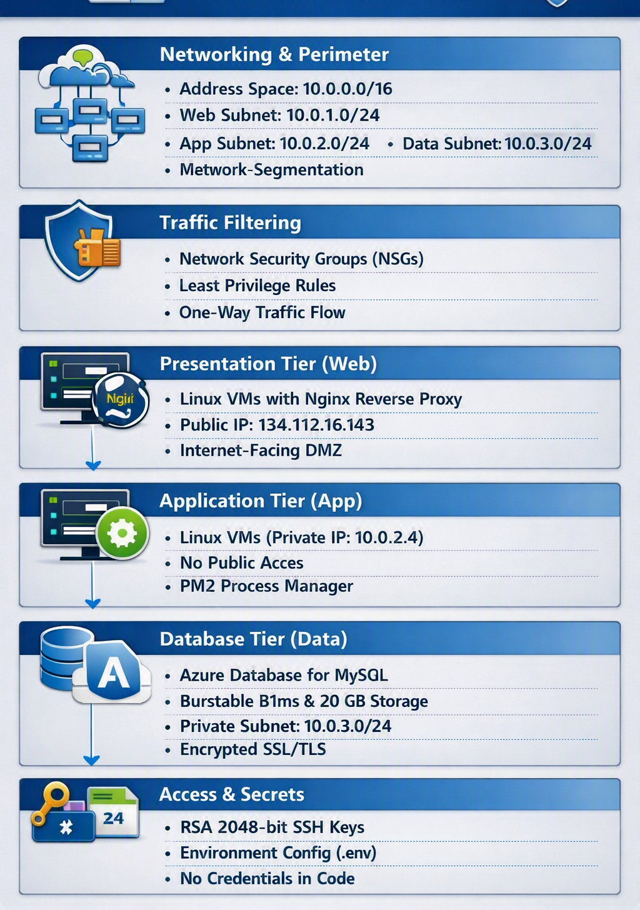

---

# Task 2 — Create the Azure Network Foundation

## Goal

Create a dedicated Resource Group and VNet with separate subnets for the web, application, and database tiers, keeping the application and database tiers without direct public access.

### Evidence

#### Screenshot 3 — Resource Group overview showing the assignment resources

- 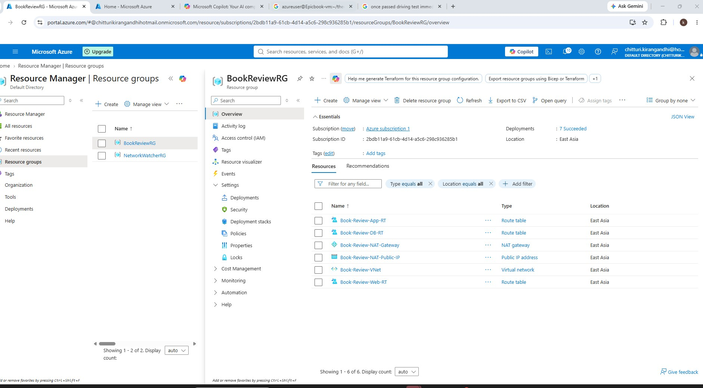

---

#### Screenshot 4 — VNet overview showing the address space and all required subnets

- 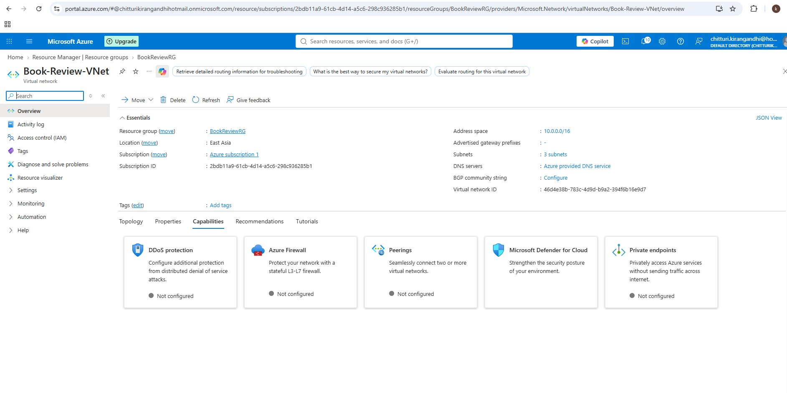

---

#### Screenshot 5 — Route-table or Private DNS evidence where applicable

- 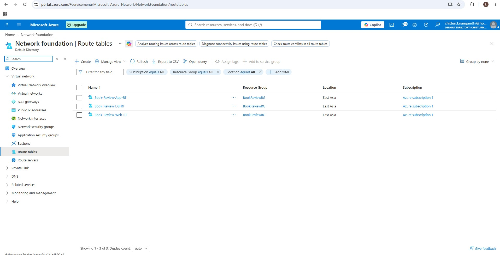
---

# Task 3 — Configure Security and Secret Management

## Goal

Apply least-privilege NSG rules so traffic flows Internet → public entry point → web tier → application tier → database tier, and store credentials in Azure Key Vault or another approved secure mechanism.

### Evidence

#### Screenshot 6 — NSG rules proving least-privilege access between the tiers

- 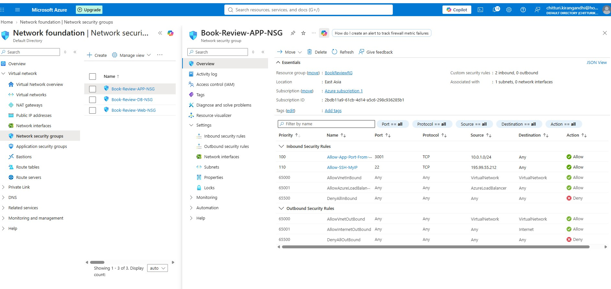
---

#### Screenshot 7 — Key Vault or approved secret-management configuration (without displaying secret values)

- 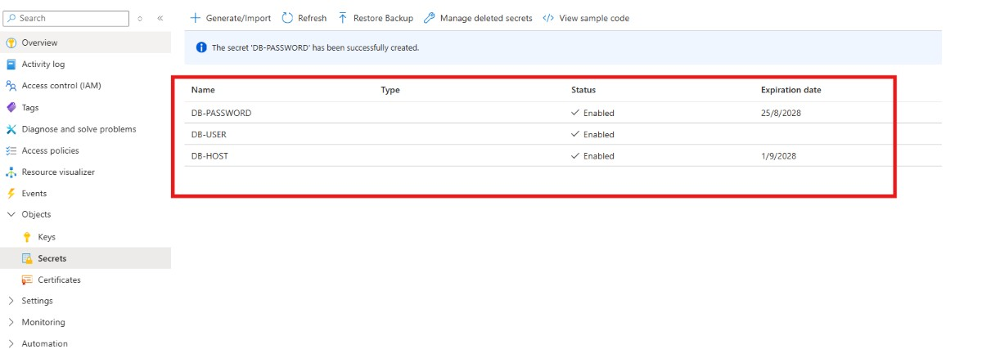
---

# Task 4 — Deploy the Presentation (Web) Tier

## Goal

Deploy the Book Review App presentation layer on the approved web-tier compute service, configured to route requests to the internal application-tier endpoint, and not directly exposed except through the public entry service.

### Evidence

#### Screenshot 8 — Web-tier compute overview showing subnet and availability configuration

- 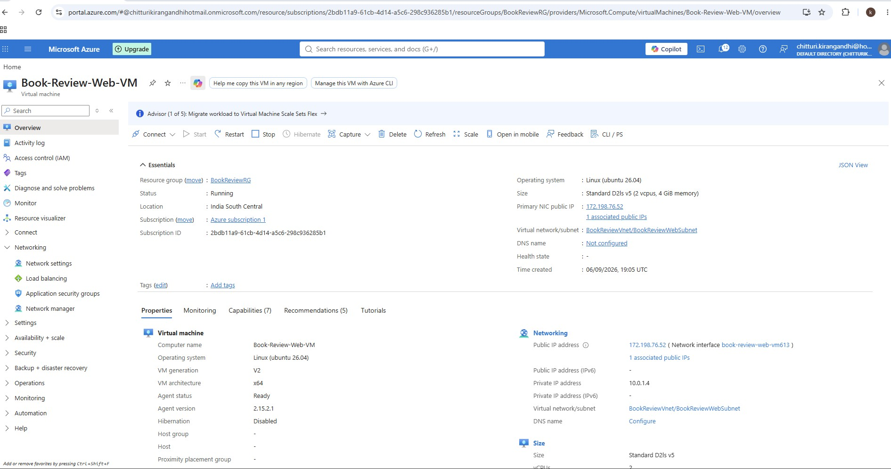

---

#### Screenshot 9 — Terminal or service output proving the presentation layer is running

- 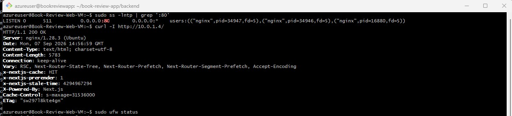

---

# Task 5 — Deploy the Business (Application) Tier

## Goal

Deploy the Book Review App backend privately in the application subnet, configured to use the private database endpoint and secured environment values, reachable only through its internal endpoint.

### Evidence

#### Screenshot 10 — Application-tier compute overview showing private subnet placement

- 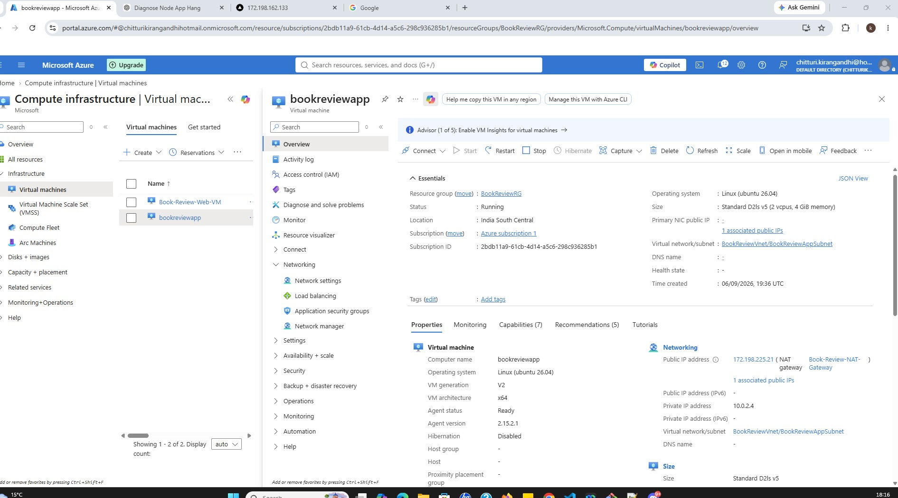

---

#### Screenshot 11 — Backend process, service, or listening-port evidence

- 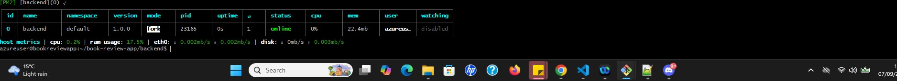

---

#### Screenshot 12 — Internal health-check or API response (without exposing secrets)

- 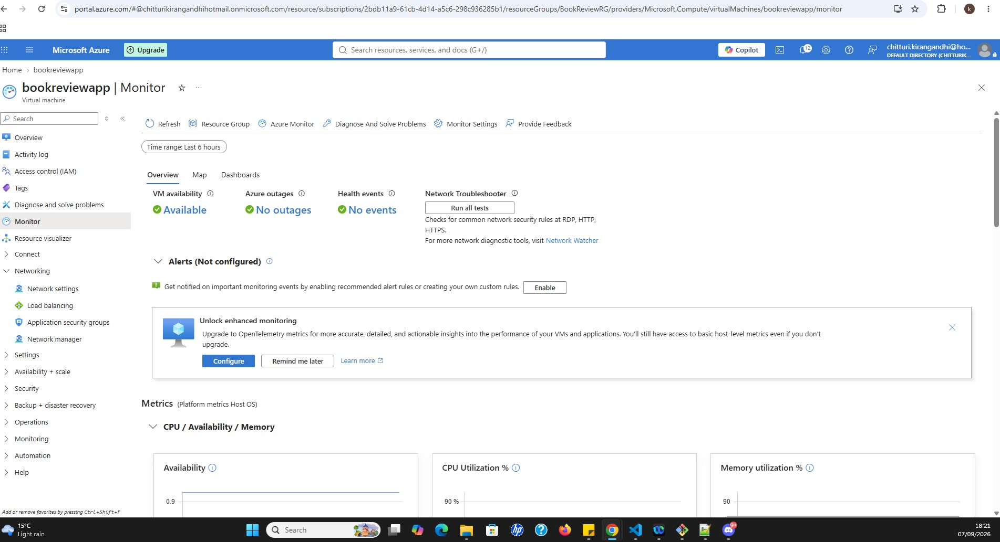

---

# Task 6 — Deploy the Managed Database Tier

## Goal

Create a private Azure managed database (public access disabled), with availability/backup/retention settings, the Book Review App schema imported, and access restricted to the application tier only.

### Evidence

#### Screenshot 13 — Database overview showing private connectivity and public access disabled

- 

---

#### Screenshot 14 — Availability, backup, and retention configuration

- 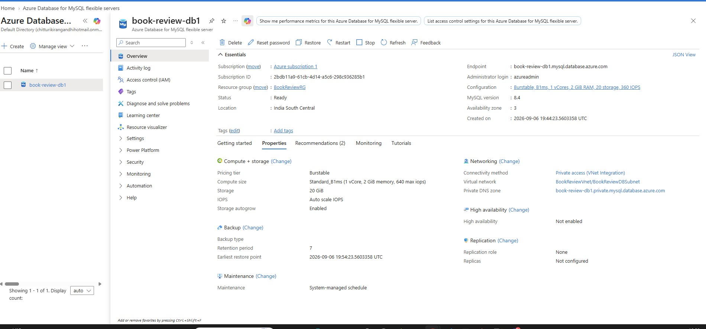
---

#### Screenshot 15 — Successful schema or connectivity verification (without exposing credentials)

- 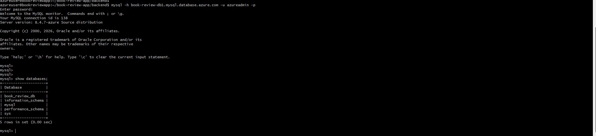
---

# Task 7 — Configure Traffic Management, Availability, and Monitoring

## Goal

Configure the approved public entry service with health probes and backend pools, internal routing for the application tier where required, and enable Azure Monitor/diagnostics/logs/alerts for the key resources.

### Evidence

#### Screenshot 16 — Public entry service showing listener, frontend endpoint, and healthy web targets

- 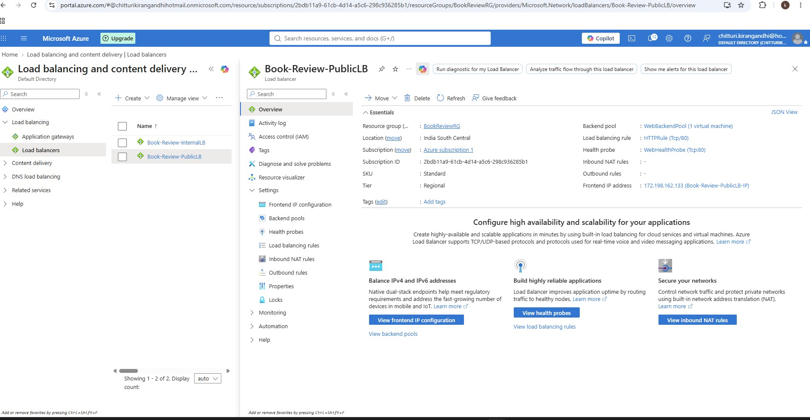
---

#### Screenshot 17 — Internal application-tier load-balancing or routing configuration where applicable

- 
---

#### Screenshot 18 — Azure Monitor, diagnostic settings, logs, metrics, or alert evidence

- 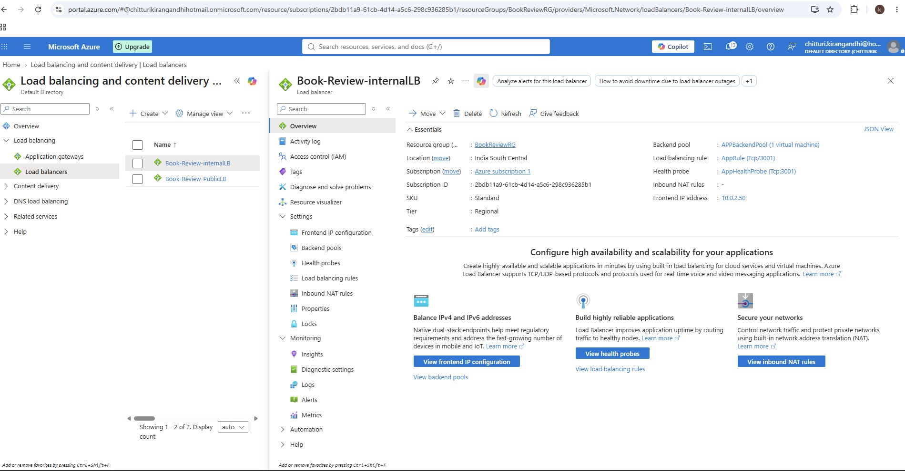
---

# Task 8 — Validate the Production-Style Deployment

## Goal

Confirm the Book Review App works end to end through the public endpoint, with at least one database read and one write, confirm private tiers are not internet-reachable, and complete a safe availability test.

### Evidence

#### Screenshot 19 — Browser showing the Book Review App through the public endpoint

- 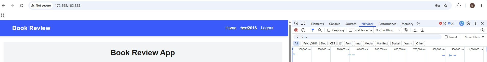
---

#### Screenshot 20 — Proof of successful database-backed read and write operations

- 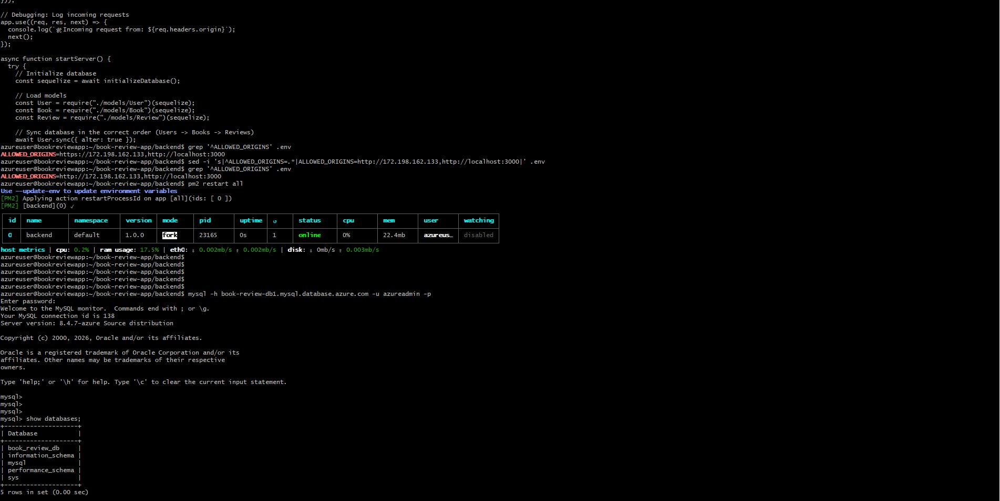
---

#### Screenshot 21 — Evidence that private tiers are not publicly accessible

- 
---

#### Screenshot 22 — Availability-test and healthy-target evidence

- 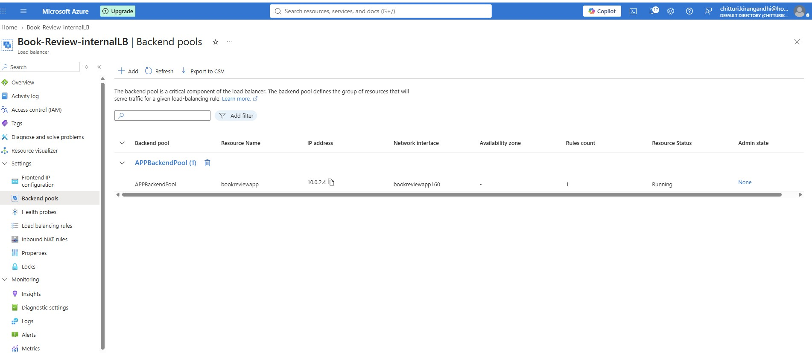
---

#### Public Endpoint

Paste your public endpoint URL here:

http://172.198.162.133/

---

### Notes

Summarize what worked, issues encountered and how they were fixed, and the availability/security/secrets/monitoring/backup choices made.
🚀 Hands-on Azure Project | Three-Tier Application Architecture

I recently completed a hands-on Azure project where I deployed and troubleshot a three-tier Book Review application.

🏗️ Architecture

🌐 Web Tier

• Azure Ubuntu VM

• Next.js frontend

• Nginx reverse proxy

• Public Azure Load Balancer

⚙️ Application Tier

• Private Azure VM

• Node.js / Express API

• Internal Azure Load Balancer

🗄️ Database Tier

• Separate database layer

• Private connectivity

• No direct public exposure

Request flow:

👤 User → Public LB → Nginx → Internal LB → API → Database

The most valuable part of the exercise wasn't just building the environment — it was troubleshooting real issues.

🐛 Issue 1 — Load Balancer routing

The Public Load Balancer was initially forwarding traffic directly to the Next.js application on port 3000, bypassing Nginx.

🔧 Fix: Changed the backend configuration to route traffic through port 80, allowing Nginx to correctly handle frontend and API requests.

🐛 Issue 2 — NSG blocking HTTP

After correcting the Load Balancer, traffic was still timing out.

The Web VM's NSG allowed port 3000 but not port 80.

🔧 Fix: Added an inbound rule for TCP port 80.

🐛 Issue 3 — Browser registration/login returning HTTP 500

Interestingly, the API worked successfully with curl, but browser registration and login failed.

Checking the backend logs revealed:

“CORS policy: Not allowed by server”

The browser was accessing:

http://172.198.162.133

while the backend configuration allowed:

https://172.198.162.133

🔧 Fix: Corrected the ALLOWED_ORIGINS environment variable and restarted the backend.

✅ Browser → Nginx → API communication then worked correctly.

💡 Biggest takeaway

This project reinforced the importance of troubleshooting layer by layer rather than assuming every error is an application-code problem.

I learned to trace requests through:

Load Balancer → NSG → Nginx → API → Environment Variables → Database

This project strengthened my practical skills in:

☁️ Azure

🐧 Linux

🌐 Networking & NSGs

⚖️ Load Balancers

🔀 Nginx

⚙️ Node.js / Express

🗄️ Database architecture

🔐 CORS

🐛 Cloud troubleshooting

Build → Break → Troubleshoot → Learn → Improve. 🚀

#Azure #MicrosoftAzure #CloudComputing #DevOps #ThreeTierArchitecture #AzureNetworking #Linux #Nginx #NodeJS #CloudArchitecture #Troubleshooting
P.S. This post is part of the DevOps Micro Internship (DMI) with Agentic AI — Cohort 3 — by Pravin Mishra. My graded progress is public: https://lnkd.in/e6dYK-Qw

---

# Submission Instructions

- Add all required screenshots and links in your submission
- Do not expose passwords, keys, connection strings, or subscription IDs

---

# Completion Checklist

- [ ] Task 1: Architecture diagram and assumptions documented (Screenshots 1–2)
- [ ] Task 2: Network foundation created with isolated tiers (Screenshots 3–5)
- [ ] Task 3: Least-privilege security and secret management configured (Screenshots 6–7)
- [ ] Task 4: Presentation tier deployed (Screenshots 8–9)
- [ ] Task 5: Application tier deployed privately (Screenshots 10–12)
- [ ] Task 6: Managed database tier deployed privately (Screenshots 13–15)
- [ ] Task 7: Public entry, internal routing, and monitoring configured (Screenshots 16–18)
- [ ] Task 8: End-to-end validation and availability test completed (Screenshots 19–22, Public Endpoint, Notes)
- [ ] No sensitive data exposed

---

## 📌 About DMI & CloudAdvisory

DevOps Micro Internship (DMI) is a project-based DevOps program run by Pravin Mishra (The CloudAdvisory) focused on real-world execution, systems thinking, and career readiness.

It helps learners build strong DevOps foundations with hands-on experience.

---

## 📌 Resources

- 🌐 DMI Official Website: https://dmi.pravinmishra.com?utm_source=github&utm_medium=readme  
- 🎓 University: https://university.pravinmishra.com?utm_source=github&utm_medium=readme  
- 💬 Discord Community: https://discord.pravinmishra.com?utm_source=github&utm_medium=readme  
- 📝 Blog: https://dmi.pravinmishra.com/blog?utm_source=github&utm_medium=readme  
- ▶️ YouTube Playlist: https://www.youtube.com/playlist?list=PLFeSNDtI4Cho  
- 🔗 Pravin Mishra (LinkedIn): https://www.linkedin.com/in/pravin-mishra-aws-trainer/  
- 🏢 CloudAdvisory (LinkedIn): https://www.linkedin.com/company/thecloudadvisory/

---

*This submission is part of DevOps Micro Internship (DMI) Cohort 3 — Agentic AI Track.*
