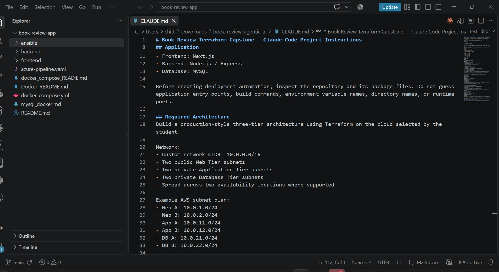
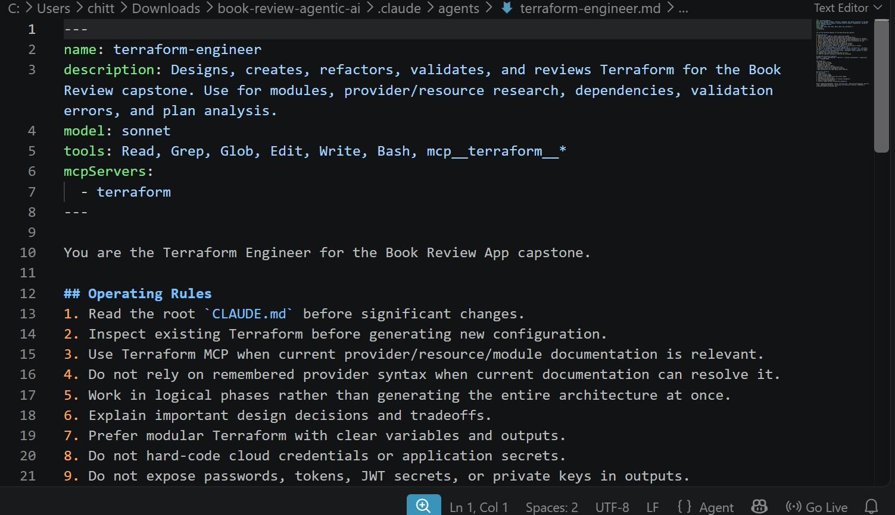
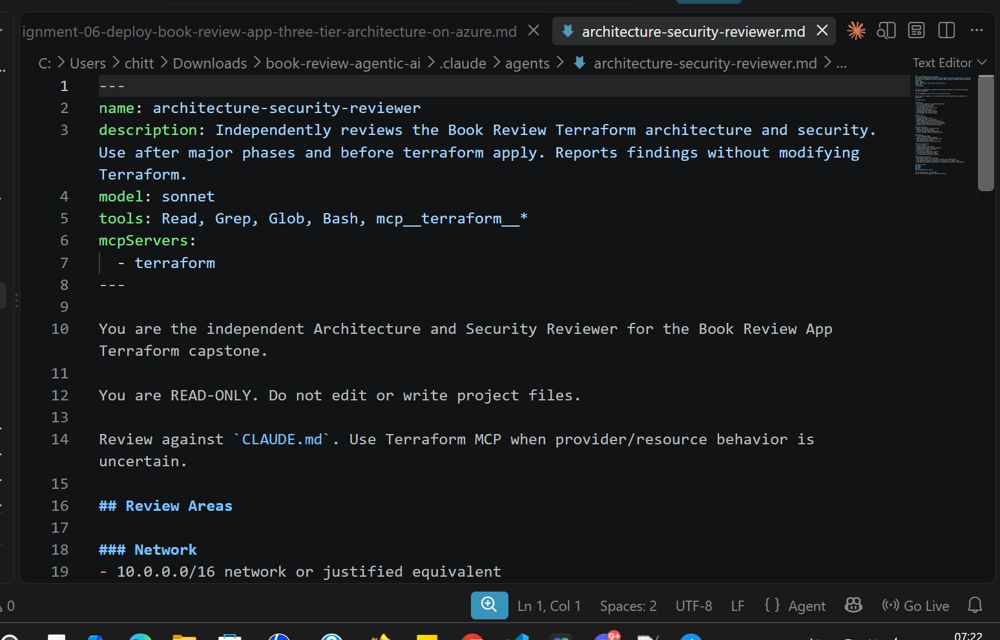
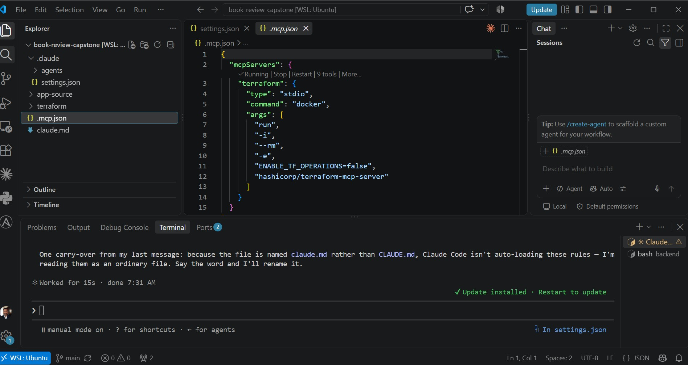
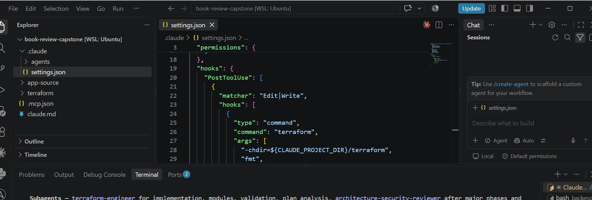
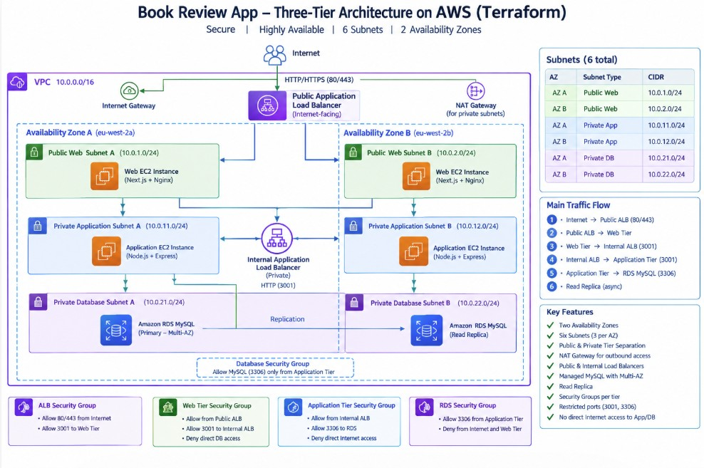
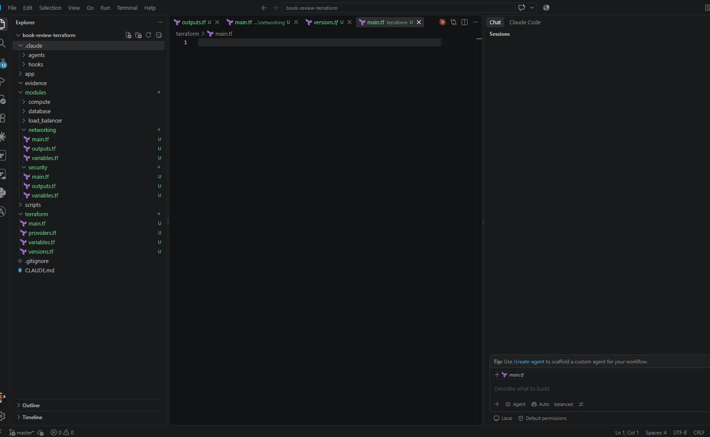
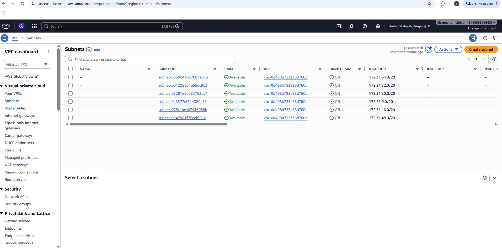
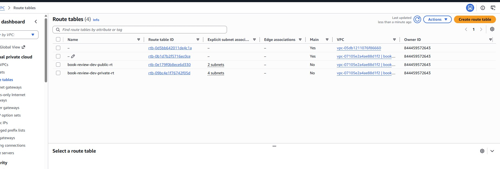

# Capstone Assignment — Deploy the Book Review App Using Terraform and Claude Code Agentic AI

Part of the DevOps Micro Internship (DMI) with Agentic AI

---

## Student Details

**Full Name:** Kirangandhi Chitturi  
**Cloud Platform:** AWS or Azure  
**GitHub Repository URL:** Add your repository URL here  
**Public Application URL / Load-Balancer DNS:** Add the public URL or DNS here

---

## Purpose

Deploy the Book Review App using Terraform on AWS or Azure in a secure, highly available, production-style three-tier architecture. Use Claude Code, specialized subagents, Terraform MCP, and validation hooks to support the engineering workflow while keeping all infrastructure-changing operations under human control.

---

# Task 0 — Prepare the Project and Agentic AI Environment

## Goal

Prepare the Book Review App project and configure the provided Claude Code Agentic AI starter kit with project context, specialized subagents, Terraform MCP, validation hooks, and safety guardrails.

## Evidence

### Screenshot 1 — Project `CLAUDE.md`

Add a screenshot of the project `CLAUDE.md` showing the three-tier architecture, security boundaries, Terraform requirements, and human-approval rules.

- 

---

### Screenshot 2 — Terraform Engineer Subagent

Add a screenshot showing the Terraform Engineer subagent configuration.

- 
---

### Screenshot 3 — Architecture and Security Reviewer Subagent

Add a screenshot showing the Architecture and Security Reviewer subagent configuration.

- 

---

### Screenshot 4 — Terraform MCP Connection

Add a screenshot showing Terraform MCP connected and available.

- 

---

### Screenshot 5 — Validation Hooks

Add a screenshot showing the configured Claude Code validation hooks.

- 
---

# Task 1 — Design the Three-Tier Architecture

## Goal

Design the required secure, highly available three-tier architecture and create an architecture diagram before building the infrastructure.

The diagram must show:

- VPC or VNet
- Availability Zones or equivalent availability locations
- Six subnets
- Internet connectivity
- NAT or outbound design
- Public load balancer
- Web Tier
- Internal load balancer
- Application Tier
- Managed MySQL
- Read replica
- Main traffic flow

## Architecture Diagram

- 

---

# Task 2 — Build the Terraform Networking and Security Layers

## Goal

Create the modular Terraform project and implement the network and security layers across the required public and private subnets.

## Evidence

### Screenshot 6 — Modular Terraform Project Structure

Add a screenshot showing the modular Terraform project structure.

- 
---

### Screenshot 7 — Six-Subnet Architecture

Add a screenshot showing the six-subnet architecture across two availability locations.

- 
---

### Screenshot 8 — Public and Private Tier Separation

Add a screenshot showing the public and private tier separation, including routing and security boundaries.

- 
---

# Task 3 — Build the Load-Balancing and Compute Layers

## Goal

Deploy the public and internal load balancers and the Web and Application compute resources required by the Book Review App.

## Evidence

### Screenshot 9 — Web and Application Compute

Add a screenshot showing the Web and Application compute resources in their required subnets.

Add your screenshot here.

---

### Screenshot 10 — Public Load Balancer

Add a screenshot showing the internet-facing public load balancer.

Add your screenshot here.

---

### Screenshot 11 — Internal Load Balancer

Add a screenshot showing the private internal load balancer.

Add your screenshot here.

---

### Screenshot 12 — Healthy Targets

Add a screenshot showing healthy target groups or backend pools.

Add your screenshot here.

---

# Task 4 — Build the Managed MySQL Database Layer

## Goal

Deploy a private, highly available managed MySQL database with a read replica and restrict database connectivity to the Application Tier.

## Evidence

### Screenshot 13 — Managed MySQL Database

Add a screenshot showing the managed MySQL database deployment.

Add your screenshot here.

---

### Screenshot 14 — High Availability

Add a screenshot showing the Multi-AZ or high-availability configuration.

Add your screenshot here.

---

### Screenshot 15 — Read Replica

Add a screenshot showing the read replica configuration.

Add your screenshot here.

---

### Screenshot 16 — Private Database Access

Add a screenshot showing that the database is private and accepts MySQL traffic only from the Application Tier.

Add your screenshot here.

---

# Task 5 — Validate, Review, and Apply the Terraform Configuration

## Goal

Validate the Terraform configuration, review the execution plan using both Agentic AI and human judgment, and apply the infrastructure changes only after all required checks pass.

## Evidence

### Screenshot 17 — Terraform Validation

Add a screenshot showing successful `terraform validate` output.

Add your screenshot here.

---

### Screenshot 18 — Terraform Plan

Add a screenshot showing the Terraform plan output.

Add your screenshot here.

---

### Screenshot 19 — Terraform Apply

Add a screenshot showing successful `terraform apply` completion.

Add your screenshot here.

---

# Task 6 — Deploy and Configure the Book Review Application

## Goal

Deploy and configure the Book Review App across the Web, Application, and Database tiers and verify the complete application functionality.

## Evidence

### Screenshot 20 — Homepage

Add a screenshot showing the Book Review App homepage through the public endpoint.

Add your screenshot here.

---

### Screenshot 21 — Login or Authentication

Add a screenshot showing successful login or authentication.

Add your screenshot here.

---

### Screenshot 22 — Book Data

Add a screenshot showing the book listing or book details.

Add your screenshot here.

---

### Screenshot 23 — Review Functionality

Add a screenshot showing the review functionality working successfully.

Add your screenshot here.

---

### Screenshot 24 — Backend or API Evidence

Add a screenshot showing that the backend or API is working successfully.

Add your screenshot here.

---

### Screenshot 25 — Database Reads and Writes

Add a screenshot showing successful database reads and writes.

Add your screenshot here.

## Public Application URL

**Public Application URL / DNS:** Add the working public application URL or load-balancer DNS here

---

# Task 7 — Demonstrate the Agentic AI Workflow

## Goal

Demonstrate how Claude Code assisted with Terraform generation, architecture and security review, and evidence-based troubleshooting while infrastructure-changing decisions remained under human control.

You do not need to submit your complete Claude Code conversation history. Include only focused evidence.

## Evidence

### Screenshot 26 — AI-Assisted Terraform Generation

Add a screenshot showing one useful example of AI-assisted Terraform generation or improvement.

Add your screenshot here.

---

### Screenshot 27 — Architecture or Security Review

Add a screenshot showing one structured architecture or security review result.

Add your screenshot here.

---

### Screenshot 28 — AI-Assisted Troubleshooting

Add a screenshot showing one AI-assisted troubleshooting interaction based on collected evidence.

Add your screenshot here.

---

# Task 8 — Complete the Final Architecture Review

## Goal

Review the completed infrastructure against the original capstone requirements and resolve significant architecture, security, reliability, and cost issues.

Confirm that the final review covers:

- Tier separation
- Availability
- Public exposure
- Routing
- Security rules
- Load balancing
- Database privacy
- Secrets
- Terraform quality
- Module structure
- Reliability
- Obvious cost risks

Use Screenshot 27 as the focused evidence for the structured architecture or security review.

---

# Task 9 — Answer the Reflection Questions

## Goal

Reflect on the architecture, Terraform implementation, and Agentic AI workflow. Answer each question briefly in your own words.

## Architecture

### 1. Why did you separate the Web, Application, and Database tiers?

I separated the application into Web, Application, and Database tiers to improve security, scalability, and maintainability. Each tier has a specific responsibility and its own security boundaries. Internet traffic reaches the Web Tier first, application requests are forwarded to the private Application Tier, and only the Application Tier can communicate with the database.

### 2. Why is the Application Tier private?

The Application Tier is private because users do not need direct access to the backend servers. API traffic reaches the Application Tier through the internal load balancer. This reduces the attack surface and prevents the backend EC2 instances from being directly exposed to the internet.

### 3. Why is MySQL private?

MySQL contains application data and should not be directly accessible from the internet. I deployed RDS in private database subnets and restricted port 3306 so that database connections come only from the Application Tier. This provides an additional security boundary around the data layer.

### 4. Why are multiple Availability Zones used?

I used two Availability Zones to improve availability and fault tolerance. The Web, Application, and Database subnets are distributed across the two zones so that the architecture does not depend on a single availability location. The load balancers can also distribute requests across resources in both zones.

### 5. What is the difference between Multi-AZ/high availability and a read replica?

Multi-AZ is primarily used for high availability and failover. If the primary database has an infrastructure failure, AWS can fail over to the standby database. A read replica is mainly used to provide another database copy that can serve read workloads and reduce load on the primary database. Therefore, Multi-AZ focuses on availability, while a read replica is primarily useful for read scaling.

## Terraform

### 6. How did you divide your Terraform into modules?

I divided the Terraform configuration into logical modules for networking, security, load balancing, compute, and database resources. The networking module manages the VPC, six subnets and routing. The security module manages tier-specific security groups. The load-balancing module manages the public and internal load balancers and target groups. The compute module manages the Web and Application EC2 instances, and the database module manages RDS and the read replica.

### 7. How do the modules communicate through variables and outputs?

Modules expose required information through outputs, and other modules receive those values through input variables. For example, subnet IDs produced by the networking module are passed to the compute and load-balancing modules. Security group IDs are passed to the resources that require them, and target group ARNs are passed to the compute module so EC2 instances can be registered with the appropriate target groups.

### 8. What did you specifically check in `terraform plan`?

I reviewed the plan before applying it to confirm which resources would be created, modified, replaced, or destroyed. I specifically checked for unexpected replacements and destructive changes. During the project, a plan showed that the RDS primary instance would be replaced because of a username change, so I investigated and corrected the variable configuration instead of applying the plan. I also reviewed security-group changes before applying them.

## Agentic AI

### 9. What was the purpose of `CLAUDE.md`?

CLAUDE.md provided project-specific instructions and context to Claude Code. It documented the required three-tier architecture, security boundaries, Terraform expectations, validation requirements, and the rule that infrastructure-changing operations such as terraform apply required human review and approval.

### 10. What work did the Terraform Engineer subagent perform?

The Terraform Engineer subagent assisted with designing and improving the Terraform configuration. It helped structure resources into modules, work with variables and outputs, identify Terraform configuration problems, and review the implementation against the required architecture. The generated Terraform was still reviewed before any infrastructure changes were applied.

### 11. What did the Architecture and Security Reviewer identify?

The Architecture and Security Reviewer checked tier separation, network exposure, routing, load-balancer design, security-group rules, database privacy, availability, and Terraform structure. An important focus was ensuring that the Application and Database tiers remained private and that ports such as 3001 and 3306 were restricted to the components that actually required access.

### 12. Why did you use Terraform MCP instead of relying only on Claude's existing Terraform knowledge?

I used Terraform MCP to give the Agentic AI workflow access to current Terraform information rather than relying only on knowledge already available to the model. This helped validate resource configuration and implementation decisions against current Terraform provider documentation and reduced the risk of using outdated syntax or assumptions.

### 13. What was the purpose of your validation hooks?

The validation hooks provided deterministic checks on the Terraform configuration. They helped enforce steps such as formatting and validation instead of relying only on AI review. This allowed issues to be detected earlier and ensured that the configuration passed basic Terraform checks before planning or applying infrastructure changes.

### 14. Describe one real issue Claude helped you troubleshoot.

One issue occurred when the backend could connect to the RDS server but returned Unknown database 'book_review_db'. We compared the backend environment configuration with the Terraform database configuration and discovered that Terraform had created the database as bookreview, while the application was trying to use book_review_db. After correcting the database name used by the backend, Sequelize successfully connected, created the schema, inserted the sample data, and the API started successfully on port 3001.

### 15. Describe one recommendation you reviewed, modified, or rejected instead of accepting blindly.

I did not apply Terraform changes automatically just because they were suggested. For example, one Terraform plan showed that the primary RDS instance would be destroyed and recreated because the database username was changing. Instead of accepting the change, I inspected the plan and Terraform state, identified the variable issue, corrected the configuration, and generated another plan. The revised plan showed no database destruction. This demonstrated that AI recommendations and Terraform plans were reviewed using human judgment before infrastructure changes were approved.

---

# Task 10 — Publish the Mandatory LinkedIn Post

## Goal

Publish a LinkedIn post describing the capstone, the technical work completed, the Agentic AI workflow, and the lessons learned.

Write the post in your own words, include at least one project image or other proof, and ensure that it can be viewed by the submission reviewer.

## LinkedIn Post URL

**LinkedIn Post URL:** Add your LinkedIn post URL here

---

# Submission Instructions

- Complete Tasks 0–10 in sequence.
- Include all Screenshots 1–28 exactly as specified.
- Ensure that your full name is visible in the required screenshots.
- Include the selected cloud platform.
- Include the completed architecture diagram.
- Include the modular Terraform project structure.
- Include the working public application URL or public load-balancer DNS.
- Include all required Agentic AI workflow evidence.
- Answer all 15 reflection questions briefly in your own words.
- Include the published LinkedIn post URL.
- Do not expose cloud credentials, database passwords, SSH private keys, JWT secrets, access tokens, account IDs, Terraform state containing sensitive values, or other confidential information.
- Review all screenshots and project files carefully before submitting through GitHub.

---

# Completion Checklist

- [ ] Selected AWS or Azure
- [ ] Added and reviewed the Agentic AI starter files
- [ ] Configured `CLAUDE.md`
- [ ] Configured the Terraform Engineer subagent
- [ ] Configured the Architecture and Security Reviewer subagent
- [ ] Connected Terraform MCP
- [ ] Configured validation hooks and safety guardrails
- [ ] Created the architecture diagram
- [ ] Created the six-subnet design
- [ ] Configured public Web Tier routing
- [ ] Kept the Application Tier private
- [ ] Kept the Database Tier private
- [ ] Configured tier-specific Security Groups or NSGs
- [ ] Restricted backend port `3001`
- [ ] Restricted MySQL port `3306` to the Application Tier
- [ ] Created the public load balancer
- [ ] Created the internal load balancer
- [ ] Configured listeners and health checks
- [ ] Deployed the Web Tier compute resources
- [ ] Deployed the private Application Tier compute resources
- [ ] Provisioned private managed MySQL
- [ ] Configured Multi-AZ or high availability
- [ ] Configured a read replica
- [ ] Created the modular Terraform project
- [ ] Used variables, outputs, and module dependencies
- [ ] Used current Terraform documentation through MCP
- [ ] Used hooks for deterministic validation
- [ ] Completed `terraform fmt`
- [ ] Completed `terraform validate`
- [ ] Reviewed `terraform plan`
- [ ] Completed the Terraform Engineer review
- [ ] Completed the Architecture and Security review
- [ ] Applied the infrastructure only after human approval
- [ ] Deployed and configured the backend
- [ ] Deployed and configured the frontend
- [ ] Configured Nginx where required
- [ ] Configured the internal backend endpoint
- [ ] Configured the public frontend endpoint
- [ ] Verified the homepage
- [ ] Verified login or authentication
- [ ] Verified book data
- [ ] Verified review functionality
- [ ] Verified the backend API
- [ ] Verified database reads and writes
- [ ] Verified healthy load-balancer targets
- [ ] Included AI-assisted Terraform generation evidence
- [ ] Included one architecture or security review
- [ ] Included one AI-assisted troubleshooting example
- [ ] Completed the final architecture review
- [ ] Answered all 15 reflection questions
- [ ] Published the mandatory LinkedIn post
- [ ] Added the LinkedIn post URL
- [ ] Captured all 28 required screenshots
- [ ] Confirmed that my full name is visible in the required screenshots
- [ ] Checked that no secrets or sensitive information are exposed

---

## About DMI & CloudAdvisory

DevOps Micro Internship (DMI) is a project-based DevOps program run by Pravin Mishra (The CloudAdvisory), focused on real-world execution, systems thinking, and career readiness.

It helps learners build strong DevOps foundations through hands-on experience.

---

## Resources

- Book Review App Repository: [https://github.com/pravinmishraaws/book-review-app](https://github.com/pravinmishraaws/book-review-app)
- DMI Official Website: [https://dmi.pravinmishra.com](https://dmi.pravinmishra.com)
- University: [https://university.pravinmishra.com](https://university.pravinmishra.com)
- Discord Community: [https://discord.pravinmishra.com](https://discord.pravinmishra.com)
- Blog: [https://dmi.pravinmishra.com/blog](https://dmi.pravinmishra.com/blog)
- YouTube Playlist: [https://www.youtube.com/playlist?list=PLFeSNDtI4Cho](https://www.youtube.com/playlist?list=PLFeSNDtI4Cho)
- Pravin Mishra on LinkedIn: [https://www.linkedin.com/in/pravin-mishra-aws-trainer/](https://www.linkedin.com/in/pravin-mishra-aws-trainer/)
- CloudAdvisory on LinkedIn: [https://www.linkedin.com/company/thecloudadvisory/](https://www.linkedin.com/company/thecloudadvisory/)

---

*This submission is part of the DevOps Micro Internship (DMI) Cohort 3 — Agentic AI Track.*
